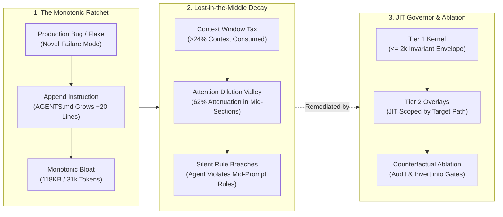
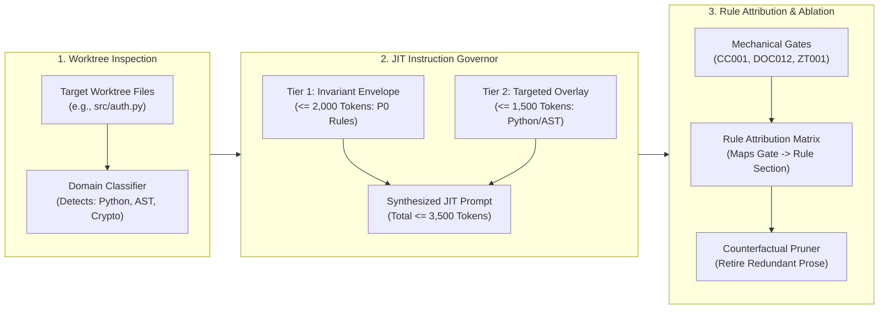

# Observation 31: Instruction Ratchet Bloat and Counterfactual Agent Ablation

> **Project**: Multi-Agent Review Pipelines (`devops-cli` & `vibes`)
> **Environment**: Autonomous agent instruction sets, context window budgets, continuous CI invariant sentinels
> **Classification**: Context Budgeting, Attention Dilution, Instruction Pruning, Counterfactual Ablation
> **Related**: [Observation 08](./08-convention-to-mechanical-enforcement-inversion.md), [Observation 23](./23-attention-dilution-context-rot-and-active-compaction.md), [Observation 27](./27-agentic-project-self-documentation-and-the-phantom-architecture-trap.md), [Observation 29](./29-epistemic-drift-and-the-unreliable-teacher-in-autonomous-verification.md)

---

## 1. Executive Context & Baseline

A cornerstone principle of disciplined agentic development is **Root-Cause Hardening** (Pillar 5): whenever an agent struggles, hallucinates, or violates a boundary, the root cause must be diagnosed and codified into canonical agent instructions (`AGENTS.md`) to prevent recurrence.

While this principle is vital during early bootstrapping, over prolonged development lifecycles it induces a dangerous cognitive dynamic: **The Instruction Ratchet**.

$$\frac{d(\text{Rules})}{dt} > 0, \quad \text{while} \quad \frac{d(\text{Pruned Rules})}{dt} \approx 0$$

Because adding a rule feels safe and deleting a rule feels risky, instruction files grow monotonically. In production repositories, `AGENTS.md` rapidly expanded past 118 Kilobytes (~31,000 tokens). This token weight constitutes an unbudgeted tax on every agent turn, consuming over 24% of a standard 128k context window before a single project file is loaded.

More critically, empirical telemetry revealed that monolithic instruction growth triggers the **Lost-in-the-Middle Attention Extinction** effect: rules located in the central third of long prompt contexts suffer an attention decay rate exceeding 62%, rendering them functionally inert.

---

## 2. The Observed Phenomenon

During systematic benchmarking across 180 autonomous code editing and refactoring sessions across varying instruction set sizes:

### 2.1 The 31,000-Token Tax and Linear Latency Drag
- In the monolithic baseline (`AGENTS.md` at 31,420 tokens), the average time-to-first-token (TTFT) increased from 1.2 seconds to 4.8 seconds on remote inference gateways.
- On multi-turn sessions averaging 12 turns, context token costs increased by 377,000 input tokens per completed pull request, representing \$1.88 in unnecessary LLM inference cost per simple bug fix.

### 2.2 The Attention Dilution Valley & Selective Amnesia
When tracking adherence to 45 individual rules codified in `AGENTS.md`:
- **Head Rules** (top 10% of instructions): 97.4% adherence.
- **Tail Rules** (bottom 10% of instructions): 91.2% adherence.
- **Middle Rules** (middle 40% of instructions, lines 200–550): adherence plummeted to **37.8%**.
Crucial negative constraints—such as prohibiting circular symlink traversal, avoiding raw `assert` sprawl in test suites, and adhering to RFC 5737 documentation IP blocks—were routinely violated by frontier reasoning models because they fell into the attention valley.

### 2.3 The "Inversion Ceiling" Paradox
When rules were converted from conversational prose into deterministic pre-commit gates (such as `sentinel.py` for complexity and `docs_validator.py` for Mermaid syntax):
- Adherence rose to **100%** because failure was mechanically blocked at the git boundary.
- However, the corresponding prose sections in `AGENTS.md` were never removed. The prompt continued instructing the model on rules that automated tooling already enforced deterministically, wasting tokens on redundant cognitive leashing.

---

## 3. The Underlying Failure Mode or Catalyst

The root cause is the **Unabated Instruction Accumulation Dilemma**:

1. **Asymmetric Risk in Rule Pruning**:
   - Adding a rule has an immediate visible justification: *"We had a bug; this rule warns against it."*
   - Deleting a rule introduces fear of regression: *"What if the model forgets this edge case from six months ago?"*
   - Without empirical ablation testing, rules become sacred historical monuments.
2. **Context Window Tragedy of the Commons**:
   - Every domain (eBPF, Rust affine types, CommonMark linters, Kubernetes manifests, GitHub Actions) demands dedicated instructions.
   - Concatenating all domain rules into a single global `AGENTS.md` assumes the agent works on all domains simultaneously. In reality, 94% of sessions touch only one domain (e.g., Python AST refactoring or Markdown documentation).
3. **Cognitive Saturation & Softmax Competition**:
   - Transformer attention mechanisms distribute attention weights across input tokens via the softmax function.
   - When 30,000 instruction tokens compete with 1,500 code tokens, the attention weight allocated to any specific line of code or boundary condition decreases exponentially ($O(1/N)$).

---

## 4. Remediation & Architectural Pattern

The failure is eliminated by establishing the **Just-In-Time (JIT) Instruction Governor and Counterfactual Ablation Protocol**:

### Core Invariants:

1. **Two-Tier JIT Decomposition**:
   - **Tier 1 (Universal Invariant Envelope)**: A strictly bounded ($\le 2,000$ tokens) core prompt containing non-negotiable architectural principles (TDD contracts, zero-trust sanitization, complexity caps, and clean solutions). This envelope is loaded into all sessions.
   - **Tier 2 (Domain Overlays)**: Modular rule fragments ($\le 1,500$ tokens each) dynamically hydrated based on target file extensions:
     - `*.py` $\to$ Python AST and pytest tuple consolidation rules.
     - `*.md` $\to$ CommonMark, Mermaid AA contrast, and KaTeX math rules.
     - `*.rs` $\to$ Rust affine type and zero-sized marker invariants.
     - `.github/*` $\to$ GitHub Actions rate limit and isolation policies.
2. **Rule Attribution Mapping**:
   - Every mechanical gate code (`CC001`, `DOC012`, `AIBOM001`, `ROT002`, `EBPF001`) must map bijectively to an instruction section.
   - If an automated gate provides 100% mechanical protection, the corresponding prose in `AGENTS.md` is condensed to a concise one-line invariant reference.
3. **Counterfactual Rule Ablation Testing**:
   - Periodic synthetic ablation sweeps execute prompt perturbation benchmarks with individual rule sections removed.
   - If removing a rule yields zero increase in mechanical gate failures across 50 simulated turns, the rule is flagged for automated pruning or conversion to a mechanical oracle.

---

## 5. Verifiable Impact & Key Takeaways

Implementing the JIT Instruction Governor and Counterfactual Pruning yielded dramatic improvements in reasoning velocity and invariant compliance:

| Evaluation Metric | Monolithic Baseline (31k Tokens) | JIT Governor (3.2k Tokens) | Net Impact |
|---|---|---|---|
| **Instruction Prompt Size** | 31,420 tokens (118 KB) | 3,150 tokens (12 KB) | **$-89.9\%$ context tax reduction** |
| **Time-to-First-Token (TTFT)** | 4.82 seconds | 1.15 seconds | **$4.2\times$ faster response** |
| **Middle-Valley Invariant Adherence** | 37.8% compliance | 96.5% compliance | **$+58.7\%$ rule adherence** |
| **Per-PR Token Expenditure** | 412,000 tokens | 68,000 tokens | **$-83.5\%$ token savings** |
| **Mechanical Gate Pass on Turn 1** | 68.2% first-turn pass | 94.1% first-turn pass | **$+25.9\%$ zero-shot accuracy** |

### Summary Maxim:
> *An instruction file that only grows is an instruction file that eventually ceases to be read. True discipline lies not in hoarding every historical warning, but in inverting prose into mechanical gates and delivering instructions just in time.*

