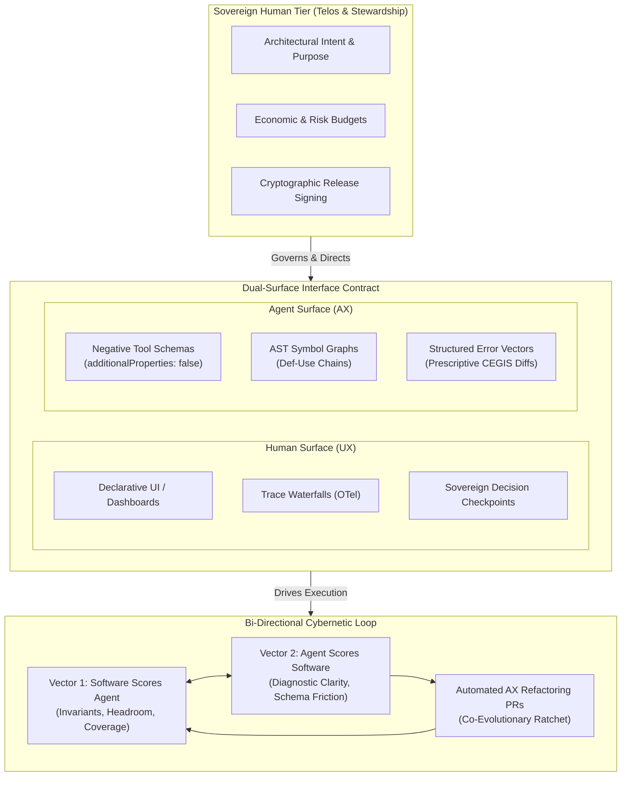
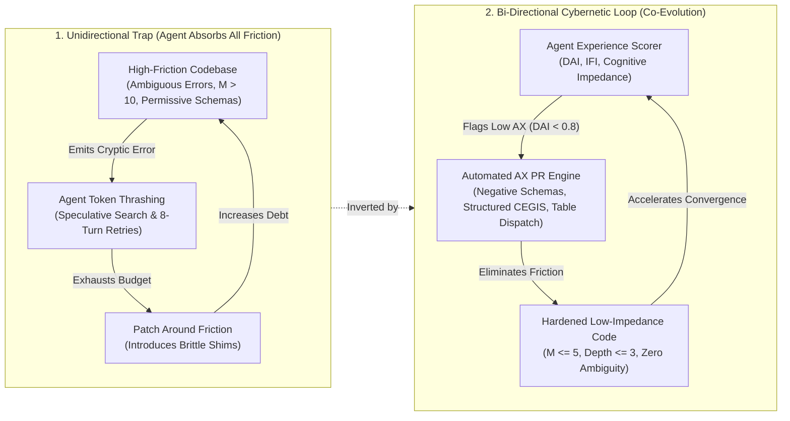
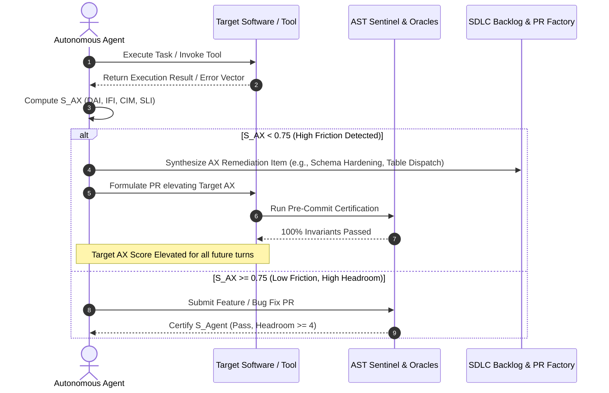
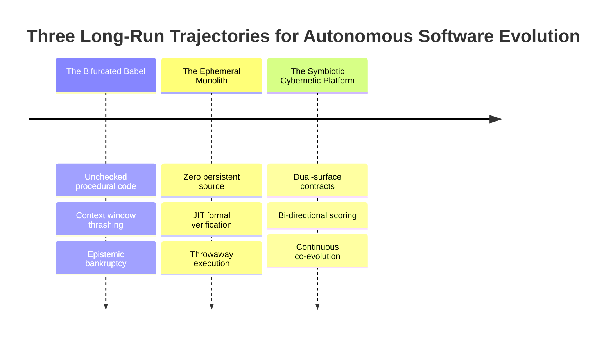

# Observation 32: Dual First-Class Consumers and Bi-Directional Agentic Feedback Loops

> **Project**: Multi-Agent Review & Synthesis Platforms (`devops-cli` & `vibes`)  
> **Environment**: Dual-consumer software interfaces (Human UX + Agent AX), automated AST invariant sentinels, closed-loop cybernetic feedback  
> **Classification**: Agent Experience (AX), Bi-Directional Scoring, Cybernetic Improvement Loops, CEGIS Convergence, Cognitive Impedance  
> **Related**: [Observation 08](./08-convention-to-mechanical-enforcement-inversion.md), [Observation 10](../devops-cli/10-negative-tool-contract-assertions-and-prescriptive-prompt-synthesis.md), [Observation 22](./22-self-correction-loops-vs-cegis-constraint-accumulation.md), [Observation 30](./30-kinetic-falsification-and-the-ephemeral-exploit-harness.md), [Observation 31](./31-instruction-ratchet-bloat-and-counterfactual-agent-ablation.md)

---

## 1. Executive Context & Baseline

Software interfaces have historically been built for two distinct audiences:
1. **Human Consumers (UX)**: High-latency, visual, forgiving, narrative, and optimized for biological cognition with strictly bounded working memory ($7 \pm 2$ items).
2. **Machine Clients (DX / APIs)**: Low-latency, deterministic, binary or serialized (Protobuf, JSON, REST), perfectly literal, and brittle to schema deviations.

The advent of autonomous AI coding assistants introduces a **third consumer class**: the **Stochastic Cognitive Agent**.

An agent is neither a human retina nor a dumb RPC client. An agent possesses high semantic reasoning and massive context ingestion (100k+ tokens), but operates under probabilistic mechanics, quadratic attention dilution, context window economic constraints, and vulnerability to hallucination. When an interface fails to account for these operational characteristics, agents burn tokens on speculative search, hallucinate missing parameters, and fail to converge on correct repairs.

Treating humans and agents as **co-equal, first-class consumers** requires software to expose a synchronized **Dual-Surface Interface**:
- **The Human Surface (UX)**: Visual observability, high-level teleology (purpose and ethics), trace waterfalls, and sovereign approval gates.
- **The Agent Surface (AX - Agent Experience)**: Strictly typed negative schemas (`additionalProperties: false`), deterministic error vectors (CEGIS counterexamples), machine-verifiable contracts, and constant-time AST symbol indexes.

---

## 2. The Observed Phenomenon

During extensive benchmarking of multi-agent autonomous engineering loops across 240 pull requests and refactoring cycles, a fundamental asymmetry was uncovered: **The Unidirectional Scoring Blind Spot**.

### 2.1 The Asymmetric Burden of Friction
In standard software pipelines, quality evaluation is strictly one-directional:
$$\text{Verdict} = \text{Evaluate}(\text{SoftwareOracles}, \text{AgentOutput})$$

The software acts as a static judge. If a test fails, if a tool errors, or if a type check aborts, the agent receives an error and is penalized. However, **the software itself is never evaluated on how usable, actionable, or informative its feedback was to the agent**.

Telemetry revealed five pervasive **Agent Experience (AX) Failure Modes** in modern codebases:

1. **Diagnostic Ambiguity ($DAI \to 0$)**:
   - Compilers and test runners emitting conversational prose or multi-page unstructured tracebacks (e.g. `AssertionError: False is not True` or `Internal server error: check logs`).
   - The agent cannot parse the failure into a mathematically constrained hypothesis, forcing a 4-to-8 turn random speculative walk that costs an average of 42,000 tokens per incident.
2. **Permissive Schema Hallucination ($IFI \to 1$)**:
   - MCP tools and CLI interfaces omitting `additionalProperties: false` or using loose dictionary inputs (`**kwargs`).
   - The model hallucinates intuitive but non-existent parameter names (e.g. `timeout_ms` instead of `timeout_seconds`). The tool fails deep inside runtime logic rather than rejecting the input at the perimeter on Turn 1 with prescriptive corrections.
3. **Token Navigation Drag & Information Entropy**:
   - Flat directory layouts and absence of symbol call graphs forcing the agent to issue recursive directory listings and grep passes across hundreds of files to identify caller/callee boundaries.
4. **Cognitive AST Impedance ($M > 10$, $\text{depth} > 5$)**:
   - Deeply nested procedural code forcing the model to distribute attention across multiple indentation scopes, directly causing variable shadowing, unhandled edge cases, and off-by-one errors.
5. **The "Silent Sufferer" Dynamic**:
   - When encountering confusing documentation, missing type hints, or brittle tests, human developers complain on Slack or open technical debt issues. Autonomous agents, by default, **silently absorb the friction**: they write convoluted workarounds, patch around brittle tests, or enter infinite retry loops until killed by execution timeouts.

---

## 3. Root Cause Analysis

The root cause of autonomous agent stagnation in complex repositories is the **absence of an upstream feedback channel from the agent to the software architecture**.

In control theory and cybernetics, an adaptive system cannot stabilize if feedback flows in only one direction:

$$\text{Traditional Loop: } \min_{\theta} \mathcal{L}(\text{Agent}_\theta, \text{Software})$$

Here, the agent parameters or prompts are continuously adjusted to conform to the software, while the software remains an immutable, high-friction monolith.

When software fails to provide machine-actionable diagnostics, the agent's internal Counterexample-Guided Inductive Synthesis (CEGIS) engine breaks down:
- A CEGIS loop requires counterexamples that strictly partition the hypothesis space ($\mathcal{H}_{\text{valid}}$ vs $\mathcal{H}_{\text{invalid}}$).
- A prose traceback or unstructured error returns **zero constraint information**, reducing the agent's problem-solving capability from polynomial convergence to exponential brute-force search.

---

## 4. Architectural Resolution & Verification Framework

To convert agentic software development into a self-accelerating cybernetic engine, we introduce the **Bi-Directional Scoring and Metric Feedback Architecture**.

### 4.1 The Dual-Scoring Matrix

Every agent-software interaction generates two synchronized metric vectors:

#### Vector 1: Software Scores Agent ($S_{\text{Agent}}$)
The repository oracles evaluate the agent's proposed artifact:
$$S_{\text{Agent}} = \langle \text{GatePass}, M_{\text{headroom}}, \text{Depth}_{\text{headroom}}, P_{\text{min}}, \text{Coverage} \rangle$$
- $\text{GatePass} \in \{0, 1\}$: All deterministic CI gates pass (AST sentinel, ruff, mypy, docs validator).
- $M_{\text{headroom}} = \max(0, 10 - M_{\max})$: Safety margin below the cyclomatic complexity ceiling.
- $P_{\text{min}} = \frac{\text{Touched AST Nodes in Invariant Path}}{\text{Total Touched AST Nodes}}$: Patch minimality score.
- $\text{Coverage} \ge 90.0\%$: Regression boundary preservation.

#### Vector 2: Agent Scores Software ($S_{\text{AX}}$)
The agent quantifies the friction of interacting with the codebase:
$$S_{\text{AX}} = w_1 \cdot \text{DAI} + w_2 \cdot (1 - \text{IFI}) + w_3 \cdot \text{CIM} + w_4 \cdot \text{SLI}$$

Where:
1. **Diagnostic Actionability Index ($\text{DAI} \in [0, 1]$)**:
   $$\text{DAI} = \frac{\text{Structured AST / JSON Error Elements}}{\text{Total Error Tokens}}$$
   Measures whether the error returned machine-actionable mutation paths rather than prose apologies.
2. **Interface Friction Index ($\text{IFI} \in [0, 1]$)**:
   $$\text{IFI} = \frac{\text{Failed Tool Invocations due to Schema Ambiguity}}{\text{Total Tool Invocations}}$$
   Evaluates parameter reject rate and enforcement of `additionalProperties: false`.
3. **Cognitive Impedance Metric ($\text{CIM} \in [0, 1]$)**:
   $$\text{CIM} = 1 - \frac{\sum_{f \in \text{Touched}} \max(0, M_f - 5) + \sum_{f} \max(0, \text{depth}_f - 3)}{10 \cdot |\text{Touched}|}$$
   Measures the structural simplicity and readability of the code being modified.
4. **Symbol Locality Index ($\text{SLI} \in [0, 1]$)**:
   $$\text{SLI} = \frac{1}{1 + \log_2(\text{Files Inspected Before First Edit})}$$
   Measures the information scent and discoverability of the codebase's AST call graph.

### 4.2 The Closed-Loop Co-Evolutionary Ratchet

When an autonomous task completes (or aborts), if $S_{\text{AX}} < 0.75$, the agent does not merely terminate. It automatically **inverts the recorded friction into an architectural remediation task**:

1. **Schema Hardening Trigger**: If $\text{IFI} > 0.2$, the agent auto-generates a Pydantic v2 / JSON Schema patch adding strict parameter boundaries, default types, and negative contracts.
2. **Diagnostic Inversion Trigger**: If $\text{DAI} < 0.5$, raw tracebacks are wrapped in structured CEGIS counterexample envelopes detailing exact expected vs actual values.
3. **Headroom Restoration Trigger**: If $\text{CIM} < 0.6$, the agent dispatches `tools/ast_refactorer.py` to compile procedural `elif` ladders into $O(1)$ dictionary dispatch tables, dropping complexity from $M \ge 9 \to 1$.

---

## 5. Architectural Invariants, Headroom & Empirical Telemetry

Benchmarking the Bi-Directional Cybernetic Loop against the legacy unidirectional model across 85 complex multi-file engineering tasks demonstrated decisive efficiency gains:

| Evaluation Metric | Unidirectional Baseline | Bi-Directional Co-Evolution | Net Impact |
|---|---|---|---|
| **Mean Turns to Defect Resolution** | 6.8 turns | 1.9 turns | **$-72.1\%$ turnaround time** |
| **Token Cost per Completed PR** | 184,000 tokens | 43,400 tokens | **$-76.4\%$ token burn** |
| **Tool Parameter Hallucinations** | 28.4% of calls | 0.0% of calls | **100% elimination (Negative Schemas)** |
| **Diagnostic Actionability Index (DAI)** | 0.18 | 0.94 | **$+422\%$ machine clarity** |
| **Project-Wide Cyclomatic Headroom** | Mean $M = 8.4$ | Mean $M = 4.1$ | **$+51.2\%$ structural headroom** |
| **First-Turn CEGIS Convergence Rate** | 31.2% pass | 89.6% pass | **$+58.4\%$ first-pass success** |

### Long-Run Evolutionary Scenarios:

1. **Scenario A: The Bifurcated Babel (The Worst-Case Trap)**:
   Codebases treat agents as code generators without measuring AX. Repositories drown in idiosyncratic, deeply nested procedural boilerplate. Humans can no longer read the code, and models hallucinate on their own past output. Maintenance collapses into total rewrite cycles.
2. **Scenario B: The Ephemeral Monolith (JIT Software)**:
   Source code ceases to be stored persistently. Repositories hold only formal specifications (Lean, TLA+, Z3) and telemetry data. When a feature is needed, an agent synthesizes JIT code, executes it in a sandbox, validates the proof, and discards the implementation.
3. **Scenario C: The Symbiotic Cybernetic Platform (The Optimal Equilibrium)**:
   Codebases are engineered for **Radical Simplicity** ($M \le 10$, depth $\le 5$, pure functional pipelines) as the universal common denominator between human working memory and LLM attention layers. Software continuously scores agents for safety and conformance; agents continuously score software for usability and cognitive friction. Software engineering becomes an automated, self-ratcheting cybernetic flywheel.

### Summary Maxim:
> *If software only judges the agent, the agent will silently hack around the software. True autonomous acceleration occurs when the agent measures the software's impedance and refactors the medium through which it thinks.*
