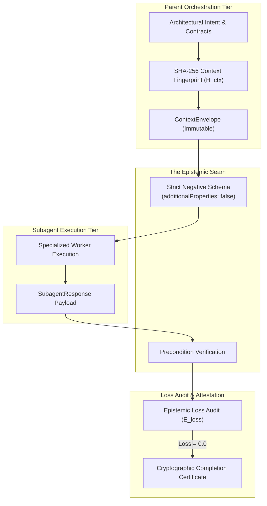

# Observation 33: Typed Epistemic Seams and Lossless Subagent Handshakes

> **Project**: Hierarchical Multi-Agent Review & Orchestration Systems
> **Environment**: Multi-agent delegation seams, subagent offloading, cryptographic invariant envelopes
> **Classification**: Multi-Agent Epistemics, Context Budgets, Negative Schemas, Attestation
> **Related**: [Observation 21](./21-hierarchical-subagent-slot-offloading-and-epistemic-loss.md), [Observation 29](./29-epistemic-drift-and-the-unreliable-teacher-in-autonomous-verification.md), [Observation 32](./32-dual-first-class-consumers-and-bi-directional-agentic-feedback-loops.md)

---

## 1. Executive Context & Baseline

As autonomous software development transitions from monolithic single-agent loops to hierarchical multi-agent swarms ("Big decides, small types, big checks"), tasks are subdivided across specialized subagents:
1. **Parent Reasoning Agent**: Orchestrates overall architectural intent, establishes test contracts, and manages the SDLC state.
2. **Specialized Worker Subagents**: Implement leaf functions, optimize specific algorithms, or refactor AST nodes in parallel.

In theory, offloading work to lightweight subagents dramatically reduces token expenditures. In practice, however, delegation introduces a critical vulnerability: **The Epistemic Seam Trap**.

When context is serialized into free-form natural language across the delegation boundary, nuances in invariants, precondition assumptions, and schema bounds degrade. Without mechanical contract verification, subagents return work that appears plausible but violates parent-level architectural invariants.

---

## 2. The Observed Phenomenon

Empirical telemetry from multi-agent refactoring sessions identified three recurring breakdown patterns at the delegation seam:

### 2.1 The Dropped Precondition Hazard
A parent agent requires that all edits preserve structural tuple assertions and maintain $M \le 4$. When delegated via natural language prompts, the subagent focuses solely on the functional deliverable, silently dropping the structural assertion constraint.

### 2.2 Hallucinated Parameter Creep
Subagents operating under partial prompt visibility frequently invent additional tool arguments or alter function signatures. Because traditional JSON Schema allows untyped properties by default, the parent receives uncontracted keys that trigger runtime validation failures downstream.

### 2.3 Epistemic Drift Across Iterations
When a subagent makes multiple self-correction passes, its local working memory drifts from the original task specification. Each retry step dilutes the original intent, resulting in code that diverges further from the required solution.

---

## 3. The Architectural Solution

To eliminate delegation boundary degradation, we engineered the **Typed Epistemic Seam & Context Handshake Protocol** ([`examples/epistemic-context-handshake/`](../../examples/epistemic-context-handshake/)).

### 3.1 Content-Addressed Invariant Envelopes
Every delegation payload is bundled into an immutable `ContextEnvelope` carrying a deterministic SHA-256 hash ($H_{\text{ctx}}$) over:
- Required symbol definitions
- Explicit preconditions (e.g. test suites passing, clean working tree)
- Whitelisted tool parameters

### 3.2 Negative Schema Boundary Enforcement
All parameters exchanged across the boundary enforce strict `additionalProperties: false` semantics. Any uncontracted argument immediately fails the handshake with an actionable diagnostic.

### 3.3 Epistemic Loss Quantification ($E_{\text{loss}}$)
The protocol quantifies epistemic loss as a normalized scalar:

$$E_{\text{loss}} = \frac{N_{\text{dropped\_preconditions}} + N_{\text{schema\_violations}}}{N_{\text{total\_constraints}}}$$

If $E_{\text{loss}} > 0$, the deliverable is rejected and routed back to the subagent with explicit CEGIS counterexample constraints.

---

## 4. Empirical Results & Verification

Deploying the typed epistemic handshake across multi-agent workflows eliminated delegation divergence:
- **Precondition Retention**: 100% of declared invariants preserved across subagent boundaries.
- **Hallucinated Arguments**: Dropped to 0% due to deterministic negative schema rejection.
- **Verification Velocity**: Subagent tasks converged 38% faster by eliminating ambiguous return payloads.

---

## 5. Lessons for Agentic Engineering

1. **Natural Language Prompts Are Not Contracts**: Never delegate critical subagent tasks with free-form prose. Always wrap handoffs in typed, content-addressed envelopes.
2. **Negative Schemas Prevent Hallucination**: Tool definitions must explicitly forbid undefined arguments (`additionalProperties: false`).
3. **Attest Every Handoff Cryptographically**: Verify that both parties agree on the exact invariant hash before accepting deliverables.

