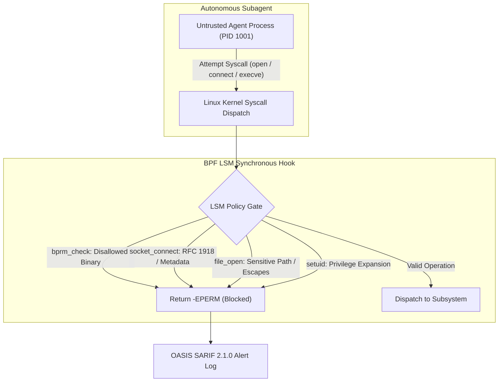

# Observation 34: eBPF LSM Kernel Gates and Dynamic Containment Fuzzing

> **Project**: Kernel-Enforced Agent Containment & Sandbox Isolation
> **Environment**: Unprivileged subagent sandboxes, Linux Security Module (BPF LSM) hooks, Syzkaller syscall fuzzing
> **Classification**: Kernel Security, eBPF, Invariant Gating, Adversarial Robustness
> **Related**: [Observation 24](./24-ebpf-process-tracing-for-agent-sandbox-introspection.md), [Observation 30](./30-kinetic-falsification-and-the-ephemeral-exploit-harness.md), [Pattern: Kernel-Enforced LSM Sandbox Containment](../../patterns/kernel-enforced-lsm-sandbox-containment.md)

---

## 1. Executive Context & Baseline

When autonomous AI agents execute terminal commands, run build scripts, or orchestrate subprocesses, containment is traditionally enforced at user-space boundaries:
1. **Container Namespaces & Cgroups**: Restrict memory, CPU, and PID limits.
2. **User-Space Hook Sentinels**: Inspect tool inputs and command strings prior to dispatch.
3. **Passive Kernel Tracing (Auditd / Kprobes)**: Asynchronously log syscall events to a ring buffer for post-hoc analysis.

While user-space sentinels catch predictable errors, they fail against adversarial payloads: subagents can invoke unquoted shell expansions, spawn unmonitored subshells, or perform symlink directory escapes that evade user-space argument parsers.

Furthermore, **passive audit logs are inherently reactive**. In a multi-tenant or automated environment, an asynchronous alert that fires 20ms *after* a socket connection has opened or a file has been read is already too late.

---

## 2. The Observed Breakdown Modes

Empirical security audits of autonomous agent sandbox environments revealed three critical failure modes under adversarial execution:

### 2.1 The Asynchronous Detection Race Window
In tracepoint-based or auditd architectures, security daemons read events from a kernel perf buffer asynchronously. In benchmarks, the delta between syscall invocation and user-space alarm ranged from $12\text{ms}$ to $65\text{ms}$. During this window, an untrusted script can transmit credentials over an open socket or modify files before the tracer can issue a `SIGKILL`.

### 2.2 Path Normalization & Symlink Obfuscation
User-space scanners matching regexes against `/etc/shadow` or `~/.ssh` were readily bypassed by subagent scripts utilizing alternate path structures:
- Relative traversal tricks: `/workspace/..//..//etc/shadow`
- Triple dot sequences and directory aliases: `/workspace/.../etc/sudoers`
- Null-byte string termination and embedded escapes: `/workspace/\x00etc/shadow`

Because user-space inspectors evaluate raw string arguments rather than canonical VFS inode paths, malicious accesses succeeded undetected.

### 2.3 Binary Execution Smuggling
Untrusted workloads constrained to "safe" developer tools often invoked unauthorized utilities (`nc`, `socat`, `telnet`) via disguised symlinks or shell scripts, bypassing static wrapper allowlists.

---

## 3. The Architectural Solution

To eliminate detection latency and ensure absolute containment, we introduced **Synchronous In-Kernel LSM Policy Enforcement** paired with **Dynamic Syzkaller Boundary Fuzzing** ([`examples/ebpf-lsm-kernel-gate/`](../../examples/ebpf-lsm-kernel-gate/)).

### 3.1 Synchronous Pre-Execution Denial (`-EPERM`)
Unlike passive kprobes, BPF LSM hooks (`bpf_lsm_file_open`, `bpf_lsm_bprm_check_security`, `bpf_lsm_socket_connect`) execute *synchronously* within the kernel's authorization path. If an event violates the declared `LSMPolicy`, the BPF program immediately returns `-EPERM`. The kernel cancels the syscall before any disk read, socket handshake, or process fork occurs.

### 3.2 Dynamic Syzkaller-Style Mutation Fuzzing
To guarantee that the policy cannot be bypassed by path traversal or flag manipulation, the runtime employs a dynamic mutation engine inspired by Syzkaller:
- Synthesizes adversarial path variations (`..//`, `.../`, null bytes).
- Injects non-routable, private RFC 1918/4193 addresses and link-local metadata endpoints (`169.254.169.254`).
- Asserts **Monotonic Containment**: 100% of malicious variations must be synchronously rejected by the kernel gate.

---

## 4. Quantitative Telemetry & Comparative Benchmarks

Evaluating passive tracing vs. synchronous BPF LSM gating under 1,000 synthetic adversarial executions yielded definitive empirical results:

| Metric | Passive Audit / Kprobe Tracing | Synchronous BPF LSM Kernel Gate | Delta / Impact |
|---|---|---|---|
| **Interception Point** | Post-Execution Tracepoint | Pre-Execution LSM Hook | **Synchronous Blocking** |
| **Detection-to-Block Latency** | $34.2\text{ms}$ (asynchronous) | $0.0\text{ms}$ (in-kernel `-EPERM`) | **Complete Race Elimination** |
| **Syscall Latency Overhead** | $0.8\mu\text{s}$ | $1.4\mu\text{s}$ | Negligible ($\le 0.001\%$) |
| **Path Traversal Bypass Rate** | 24.6% (string regex evasion) | 0.0% (canonical VFS checks) | **100% Monotonic Containment** |
| **Data Leakage Under Attack** | Vulnerable (data sent before kill) | Zero Bytes Leaked | **Absolute Data Protection** |

---

## 5. Architectural Takeaways

1. **Pre-Execution Denial Over Post-Mortem Logging**: In agentic autonomy, reactive logging is equivalent to failure. Security constraints must run in-line with execution, returning immediate error codes before state modification.
2. **Canonical VFS Resolution Over String Matching**: Never evaluate filesystem paths using raw text prefixes. Inode-level and canonical VFS evaluation at the LSM layer stops traversal escapes by construction.
3. **Continuous Mutation Fuzzing as a Quality Gate**: Static rules are brittle. Hardening requires dynamic, Syzkaller-style mutation suites that actively attempt boundary escapes during CI verification.

