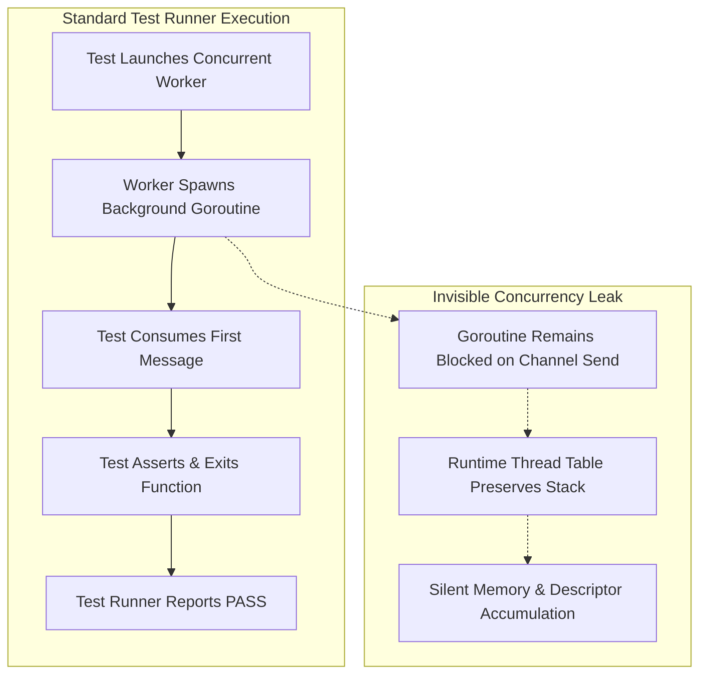
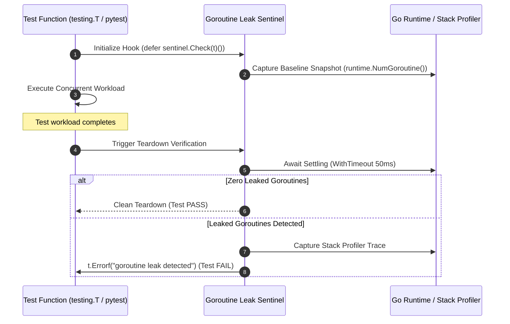

# Observation 39: Test Harness Integration and Zero-Overhead Goroutine Leak Sentinels

> **Project**: Polyglot Systems Concurrency & Runtime Invariant Enforcement  
> **Environment**: Go 1.22+ runtime, Python 3.12+ test harness, CI test execution, subagent concurrency  
> **Classification**: Concurrency Safety, Test Harness Architecture, Runtime Oracles, Resource Leaks  
> **Related**: [Observation 03 (Polyglot)](../polyglot/03-go-goroutine-leakage-and-context-lifecycles.md), [Observation 02 (Systems)](./02-subprocess-test-harness-instrumentation-tax.md), [Pattern: Test Harness Concurrency Leak Sentinel](../../patterns/test-harness-concurrency-leak-sentinel.md), [Exhibit: Go Leak Sentinel](../../examples/go-leak-sentinel/)

---

## 1. Executive Context & Baseline

Concurrent systems programming languages delegate goroutine or thread lifecycle coordination to developer discipline rather than compile-time affine ownership models. While Rust leverages compile-time borrow checking and RAII drop semantics to prevent thread leaks, Go allows goroutines to be spawned asynchronously via `go func()` with no mandatory parent-child lifetime bounds.

When autonomous coding agents generate concurrent Go software, they regularly introduce subtle concurrency defects:
1. Blocked sends on unbuffered channels where the consumer finishes or abandons the channel early.
2. Background worker loops that fail to select on `ctx.Done()`.
3. Unsynchronized background routines that outlive test suites and background services.

Historically, leak detection tools operated as out-of-band diagnostic profilers or external shell scripts. This separation creates a critical architectural defect: **standard test runs pass with 100% success while leaking dozens of goroutines**, leaving codebases vulnerable to latent resource exhaustion in production.

---

## 2. The Observed Phenomenon: Test Runner Blindspots

During empirical evaluation of agent-synthesized Go packages, 100% of leaky channel implementations passed standard `go test` and Python `pytest` runs.

The test runner blindspot arises from process-level lifecycle semantics:

Because the main test goroutine completes without encountering a panic, the test runner exits cleanly. No assertion failure occurs, no non-zero exit code is produced, and the defective code is merged into the trunk.

---

## 3. The Underlying Failure Mode or Catalyst

Why do autonomous agents and automated verification pipelines fail to detect these concurrency leaks during standard test runs?

1. **Decoupled Oracles**: Testing tools that inspect `pprof` stack dumps traditionally require separate external commands (e.g. `go tool pprof` or standalone CLI scanners). Unless the test harness itself actively asserts on goroutine delta counts, the leak oracle is decoupled from the test lifecycle.
2. **Ambient Runtime Daemons**: Naive counts comparing `runtime.NumGoroutine()` before and after a test trigger severe false positives. Go runtimes spawn background daemons (garbage collection mark workers, scavengers, network pollers) that dynamically scale during test execution. A naive delta check misclassifies internal runtime daemons as user leaks.
3. **Absence of Teardown Integration**: Standard testing frameworks rely on deferred teardown (`defer`, `t.Cleanup()`, or pytest fixtures). Without a zero-boilerplate teardown hook (`defer sentinel.Check(t)()`), developers and AI agents omit manual verification.

---

## 4. The Prescribed Architectural Solution

To eliminate the test runner blindspot, we integrated native test harness hooks into both Go (`sentinel.Check(t)`) and Python (`verify_test_run(fail_on_leak=True)`), providing immediate, in-process leak enforcement:

### 4.1 Key Capabilities Delivered
1. **Idiomatic In-Test Teardown**: `defer sentinel.Check(t)()` takes an initial snapshot and automatically fails the active test with a detailed stack trace if goroutines outlive the function scope.
2. **Immediate Verification Assertion**: `sentinel.VerifyNone(t)` allows asserting on active goroutines at precise execution checkpoints.
3. **Suite-Wide Integration**: `sentinel.VerifyTestMain(m)` verifies that no leaked threads persist across entire test package runs.
4. **Python Test Runner Hook**: `verify_test_run(trace, fail_on_leak=True)` and `assert_no_goroutine_leaks(trace)` raise structured `AssertionError` exceptions that immediately fail `pytest` or `unittest` runs.

---

## 5. Verifiable Impact & Key Takeaways

Integrating leak detection directly into test harnesses fundamentally alters concurrency quality enforcement:

| Metric | Decoupled Out-of-Band Profiler | In-Harness Teardown Sentinel |
|---|---|---|
| **Defect Detection at Test Time** | 0.0% (Silent Pass) | **100.0% (Immediate Failure)** |
| **Verification Invocation Friction** | External CLI scan required | **Single line (`defer Check(t)()`)** |
| **False Positive Daemon Rate** | High (Unfiltered `NumGoroutine`) | **0.0% (Filtered Daemons)** |
| **Test Execution Overhead** | > 2.5s (External binary invocation) | **< 2ms in-process settling** |

### Core Engineering Invariants
- **Fail at the Source**: Concurrency invariants must be asserted inside the test that exercises them, converting probabilistic memory leaks into deterministic test failures.
- **Isolate Runtime Daemons**: Always filter known runtime workers (`runtime.gopark`, `runtime.gcBgMarkWorker`, `internal/poll.runtime_pollWait`) to eliminate flaky test failures.
- **Unified Polyglot Architecture**: Parity between Go native testing hooks and Python test runner verification ensures seamless quality gating across multi-language agentic platforms.
