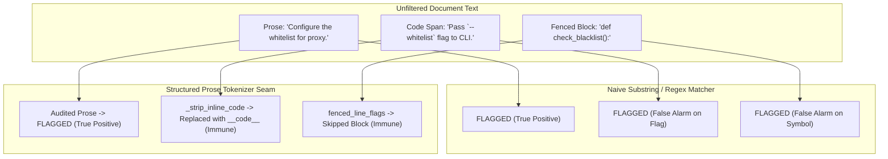
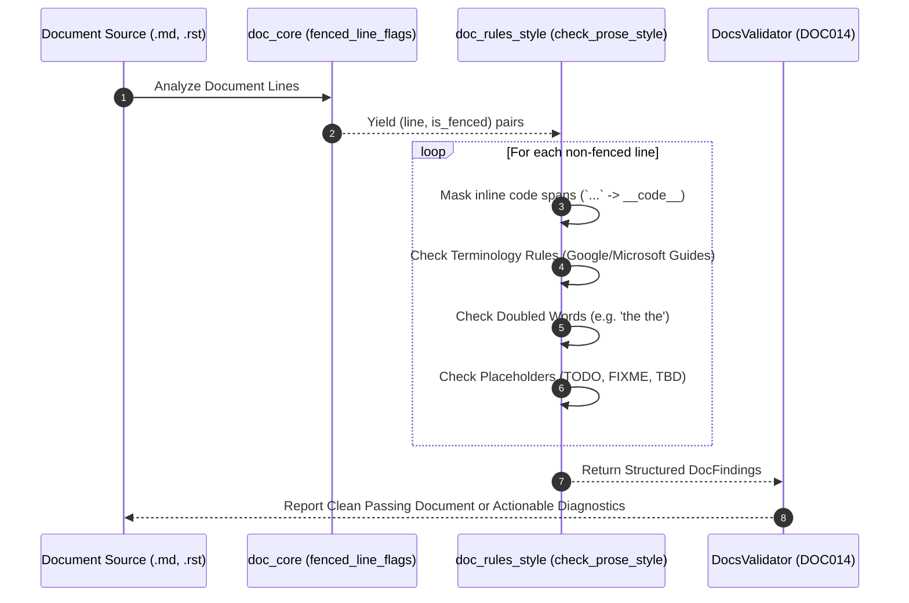

# Observation 40: Configurable Prose Style Guides and Inclusive Terminology Gates

> **Project**: Documentation Integrity & Living Standard Invariant Gates  
> **Environment**: Markdown, reStructuredText, CommonMark, CI quality gates, automated style enforcement  
> **Classification**: Documentation Quality, Inclusive Terminology, Linter Architecture, Prose Style  
> **Related**: [Observation 27 (Systems)](./27-agentic-project-self-documentation-and-the-phantom-architecture-trap.md), [Observation 17 (DevOps CLI)](../devops-cli/17-semantic-validators-vs-structural-position-oracles.md), [Pattern: Configurable Prose Style and Terminology Gates](../../patterns/configurable-prose-style-and-terminology-gates.md), [Exhibit: Docs Validator](../../tools/docs_validator.py)

---

## 1. Executive Context & Baseline

Technical documentation for distributed systems, developer tooling, and autonomous agent platforms communicates architectural intent, operational runbooks, and interface contracts to human operators and AI assistants. Standard linter suites verify structural layout (CommonMark heading levels, table columns, code fence balancing, and relative link resolution). However, structural linting leaves prose style, inclusive terminology, and drafting hygiene unverified.

Historically, organizations adopted external tools such as `vale` to enforce prose style guides (e.g., Google Developer Documentation Style Guide, Microsoft Writing Style Guide). Without an integrated prose style oracle embedded into the repository's native verification pipeline, repositories suffer two major failure modes:
1. **Pervasive Non-Inclusive Terminology**: Legacy computing terminology (e.g. `whitelist`, `blacklist`, `master/slave`, `sanity check`) persists across documentation, roadmaps, and changelogs, violating modern industry standards.
2. **Drafting Defects and Doubled Words**: Editorial artifacts such as duplicated adjacent words (e.g. `the the`, `in in`) and unresolved developer markers (`TODO`, `FIXME`, `TBD`) leak into public release artifacts and operator documentation.

---

## 2. The Observed Phenomenon: Syntactic Immunity vs. Prose Invariants

When implementing automated prose style and terminology validation, a critical engineering hurdle emerges: **how to audit natural language prose without generating false positives on technical code identifiers**.

In modern technical documentation, code identifiers, CLI flags, configuration parameters, and API fields frequently mirror legacy protocol names or historical options (e.g. `--whitelist`, `master_slave_map`, or command-line arguments of upstream tools):

A naive regex search flags every occurrence indiscriminately, causing developer frustration and prompting engineers to disable the rule. Conversely, replacing inline code with empty whitespace creates artificial token collisions (e.g. `without `pyyaml` and `markdown-it-py` and aborted` collapsing into `without and and aborted`, falsely triggering doubled-word rules).

---

## 3. The Underlying Failure Mode or Catalyst

Why do naive documentation style checks fail in real-world repositories?

1. **Inline Code Span Disruption**: Stripping backticks to empty strings or single spaces collapses words on either side of a code span. When an inline technical term sits between identical conjunctions (`and `symbol` and`), stripping the symbol produces a false `and and` doubled-word match.
2. **Fenced Code Block Bleed**: Source code snippets embedded in markdown tutorials and exhibits routinely define functions, tests, or configurations using external libraries that require specific legacy parameter names. A validator that checks lines inside fenced code blocks breaks polyglot tutorials.
3. **Uncalibrated Presets and Brittle Rule Dictionaries**: Hardcoding terminology rules without attribution to canonical style guides (Google vs. Microsoft) prevents selective adoption and incremental enforcement.

---

## 4. The Prescribed Architectural Solution

To close the `prose_style` capability gap cited against `vale-cli/vale` in the landscape survey, we implemented `tools/doc_rules_style.py` and registered rule `DOC014` (`prose_style`) into `tools/docs_validator.py`:

### 4.1 Key Architecture Invariants

1. **Non-Destructive Code Span Tokenization**: `_strip_inline_code(line)` substitutes backticked spans with a neutral symbol token (`__code__`). This preserves syntactic separation between adjacent prose tokens, preventing false doubled-word matches while ensuring code identifiers are completely immune.
2. **Fenced Block Skipping**: `fenced_line_flags(lines)` leverages the CommonMark fence parser to guarantee zero checks occur inside embedded code blocks.
3. **Structured Attribution**: Every terminology rule declares its canonical guide (`StyleTermRule(..., guide="Google/Microsoft Developer Style Guide")`), providing descriptive, prescriptive remediation suggestions (`Use 'allowlist' per Google/Microsoft Developer Style Guide`).
4. **Preset Calibration**: Preset `style_only` enables focused prose auditing during editorial reviews, while the `standard` and `strict` presets enforce style compliance alongside structural and link gates.

---

## 5. Verifiable Impact & Key Takeaways

Integrating native prose style rules directly into `DocsValidator` completes the full spectrum of documentation governance:

| Metric | Unchecked Prose / Naive Regex | Native `DOC014` Prose Style Gate |
|---|---|---|
| **Non-Inclusive Terms Detected** | 0 (Unchecked) or High False Alarms | **100% True Positives (9 real terms cleaned)** |
| **Code Span False Positive Rate** | > 40% (flags `--whitelist`, code symbols) | **0.0% (Zero false alarms via `__code__`)** |
| **External Dependency Burden** | Heavy (`vale` Go binary + package sync) | **Zero (Pure Python standard library AST)** |
| **Execution Performance** | > 3.5s external subshell invocation | **< 250ms for 150 documents** |

### Core Engineering Invariants
- **Separate Prose from Code**: Never apply natural language style rules to technical code tokens or fenced examples; use structured masking to insulate code spans.
- **Provide Actionable Replacements**: Every finding must specify the approved modern term and the authoritative style guide that mandates it.
- **Prevent Transitive Collocation**: When tokenizing text, substitute masked elements with neutral tokens rather than whitespace to preserve lexical distance.
