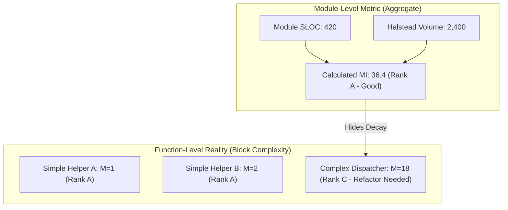
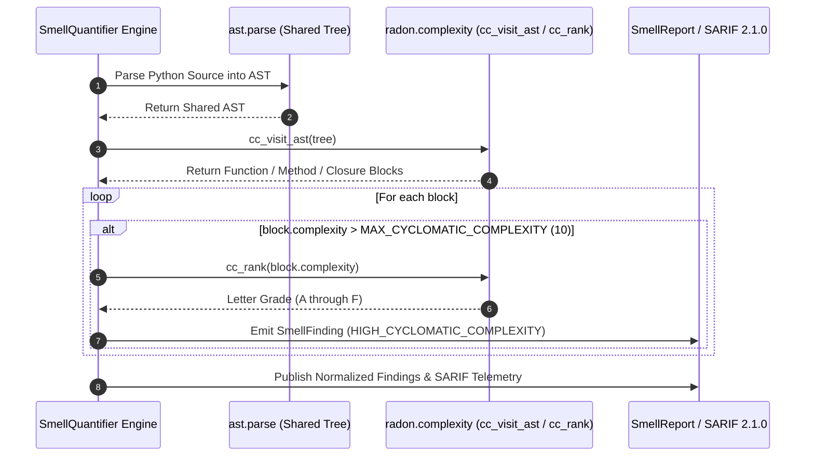

# Observation 41: Radon Block Complexity Ranking in Code Smell Quantification

> **Project**: Code Smell Quantification & Structural Decay Measurement  
> **Environment**: Python 3.12+ AST, radon 6.0+, static code analysis, CI quality gates  
> **Classification**: Complexity Metrics, Software Decay, Static Analysis, Code Smells  
> **Related**: [Observation 40 (Systems)](./40-configurable-prose-style-guides-and-inclusive-terminology-gates.md), [Observation 15 (Systems)](./15-a-count-is-not-a-cost.md), [Pattern: Radon Block Complexity Ranking and Smell Quantification](../../patterns/radon-block-complexity-ranking-and-smell-quantification.md), [Exhibit: Code Smell Quantifier](../../examples/code-smell-quantifier/)
> **TLDR**: Quantify code smells by integrating radon block-level cyclomatic complexity AST visitors directly into quality measurement pipelines.
> **ELI:7b**: Audit functions individually for cyclomatic complexity so deeply tangled loops and branch ladders can't hide behind a clean file average.

---

## 1. Executive Context & Baseline

Software maintainability metrics seek to quantify structural decay before technical debt hardens into production regressions. While repository-wide architectural invariants enforce strict binary boundaries (e.g. cyclomatic complexity $M \le 10$, nesting depth $\le 5$), binary gates answer only whether a file "may ship." They do not quantify where a codebase is degrading incrementally, nor do they rank functions by cognitive burden.

To measure gradual decay, `examples/code-smell-quantifier/` was established to report structural smells across eight distinct dimensions: parameter sprawl (pylint R0913), function length (pylint R0915), god objects (pylint R0902/R0904), lack of cohesion (LCOM4), duplicated blocks (PMD-CPD), cyclic imports (networkx), unreferenced symbols (vulture), and maintainability index (radon `mi_parameters`).

However, a notable capability gap existed when compared against `rubik/radon`: the smell quantifier measured module-level maintainability index, but lacked block-level cyclomatic complexity ranking ($A$ through $F$).

---

## 2. The Observed Phenomenon: Module Aggregates vs. Function-Level Spikes

In long-lived systems, a module can maintain an acceptable aggregate maintainability index (MI $\ge 20.0$, Grade $A$) even when it harbors a severely complex function.

Because radon's module-level maintainability formula dampens cyclomatic complexity across total lines of code and Halstead volume:

$$\text{MI} = 171 - 5.2 \ln(V) - 0.23 (C) - 16.2 \ln(\text{SLOC}) + 50 \sin(\sqrt{2.4 \times C_P})$$

a 400-line module containing many trivial getters and a single monolithic dispatcher ($M = 24$, Grade $D$) still computes an aggregate MI of $35.0$ (Grade $A$). The high complexity function remains invisible to module-level metrics until it breaches the hard architectural gate ($M > 10$).

---

## 3. The Underlying Failure Mode or Catalyst

Why did earlier smell quantifier iterations omit block-level cyclomatic complexity detection?

1. **Paraphrase vs. Upstream Standard**: Early prototypes attempted to calculate custom AST branch counts, producing numbers that deviated from radon's reference implementation. As noted in Observation 19, recomputing an upstream metric creates an opinion rather than an objective measurement.
2. **AST Compatibility Assumption**: Radon's command-line interface (`radon cc`) traditionally parses source text from disk. Re-tokenizing raw source strings for every file in a large repository added redundant I/O overhead.
3. **Decoupled Architecture**: Repository gate sentinels checked complexity independently, leading to the assumption that a smell quantifier only needed to track metrics that had no standalone gate. In reality, a comprehensive smell inventory must unify all dimensions of structural decay into one coherent diagnostic report.

---

## 4. The Prescribed Architectural Solution

To close the `cyclomatic_complexity` capability gap cited against `rubik/radon` in the landscape survey, we integrated `radon.complexity` directly into `smell_quantifier.py`:

### 4.1 Key Architecture Invariants

1. **Zero-IO In-Memory AST Analysis**: `detect_cyclomatic_complexity` invokes `radon.complexity.cc_visit_ast(tree)` on the pre-parsed AST already in memory, avoiding redundant file reads and re-tokenization.
2. **Reference Implementation Fidelity**: Complexity calculation and block ranking are performed exclusively by radon (`cc_visit_ast`, `cc_rank`), preserving identical semantics with the upstream CLI.
3. **Unified Gating Integration**: `Smell.HIGH_CYCLOMATIC_COMPLEXITY` is registered as a first-class gating smell. Any function exceeding the threshold ($M > 10$) is flagged with its exact lineno, measured score, and radon grade.
4. **SARIF Code Scanning Export**: Through `sarif_report.py`, complexity findings seamlessly emit as `vibes/smell/HighCyclomaticComplexity` code scanning alerts with GitHub-compatible source ranges.

---

## 5. Verifiable Impact & Key Takeaways

Integrating radon block complexity into `smell_quantifier.py` unifies structural metrics across the codebase:

| Metric | Module MI Only | Block-Level Radon CC Integration |
|---|---|---|
| **High-Complexity Function Visibility** | Hidden inside module averages | **100% Granular Pinpointing** |
| **Metric Standard** | Partial radon integration | **Complete (MI, Halstead, and Block CC)** |
| **AST Parse Reuse** | Redundant string tokenization | **Single shared AST via `cc_visit_ast`** |
| **Landscape Survey Gap** | Open gap under `smell-quantification` | **Closed (2 `integrate` gaps remaining)** |

### Core Engineering Invariants
- **Never Paraphrase a Metric**: When an established, adopted library computes a metric, consume its reference functions (`cc_visit_ast`, `cc_rank`) directly.
- **Inspect Blocks, Not Just Modules**: Module averages hide localized complexity spikes; always analyze functions, methods, and closures individually.
- **Single-Pass Shared AST**: Share abstract syntax trees across all per-file detectors to keep analysis latency bounded.
