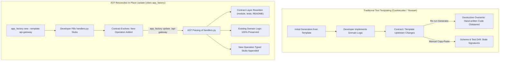

# Observation 43: Contract-Driven Template Ecosystems & In-Place Application Updates

> **Project**: Application Factory & Contract Scaffolding (`tools/app_factory.py`)  
> **Environment**: Python 3.12+ AST, Contract YAML Schemas, `cookiecutter`, `copier-org/copier`, `yeoman/generator`  
> **Classification**: Application Scaffolding, Template Ecosystems, AST Reconciliation, In-Place Upgrades  
> **Related**: [Observation 42 (Systems)](./42-language-server-protocol-and-automated-ast-invariant-repair.md), [Pattern: Contract Template Ecosystem and In-Place Updates](../../patterns/contract-template-ecosystem-and-in-place-updates.md), [Exhibit: Application Factory](../../tools/app_factory.py), [Artifacts: Contracts](../../artifacts/contracts/)
> **TLDR**: Scaffold and update applications from contract templates without destroying hand-written domain logic using AST-reconciled in-place patching.
> **ELI:7b**: Update generated project templates safely: regenerate interface contracts while leaving your custom business logic completely untouched.

---

## 1. Executive Context & Baseline

The Application Factory ([`tools/app_factory.py`](../../tools/app_factory.py)) transforms declarative application contracts into runnable, type-checked Python applications that are born passing every repository quality gate unedited. Rather than generating arbitrary boilerplate, the factory binds three artifacts that frequently drift: the dispatch table, the JSON Schema validating incoming arguments (`additionalProperties: false`), and the exhaustive test suite asserting compliance.

In the comparative landscape survey ([`tools/landscape_survey.py`](../../tools/landscape_survey.py)), the factory was evaluated against industry scaffolding baselines (`cookiecutter/cookiecutter`, `copier-org/copier`, and `yeoman/generator`). The survey identified two distinct capability gaps under `application-scaffolding`:

1. **`template_ecosystem`**: The absence of a published, discoverable catalog of community contracts covering standard distributed architectural patterns (held by `cookiecutter/cookiecutter` and `yeoman/generator`).
2. **`update_in_place`**: The inability to re-apply an updated contract revision to an already-generated application directory without clobbering hand-written domain logic (held by `copier-org/copier`).

Both gaps carried the survey disposition `build` — demanding a unified, gate-clean architectural solution.

---

## 2. The Observed Phenomenon: The Fire-and-Forget Scaffolding Dilemma

Traditional software scaffolding tools operate on a fire-and-forget premise: they render files into a target directory once, and then permanently abandon the generated workspace:



When an upstream contract or template changes (e.g., adding an operation, strengthening argument validation, or modifying error structures), developers face a painful trade-off:
- Re-running the generator overwrites custom domain logic, destroying hours of engineering work.
- Updating manually leads to immediate divergence, where dispatch tables, schema definitions, and unit tests drift apart.

---

## 3. The Underlying Failure Mode or Catalyst

Why do traditional scaffolding tools fail to support in-place evolution?

1. **Lack of Separation Between Contract and Implementation Planes**: Most template engines (such as Jinja2 or EJS) mingle domain logic directly into generated files. Because the tool does not know where the contract boundary ends and the developer's logic begins, regeneration is inherently destructive.
2. **Text-Level Blindness vs. AST Semantics**: Text-based templating engines treat code as unstructured string sequences. They cannot distinguish between a newly added function signature and an existing function with customized body expressions.
3. **Absence of a Curated Architectural Catalog**: Without a standardized catalog of pre-vetted, gate-compliant contract blueprints, engineering teams repeatedly author ad-hoc contracts that fail architectural invariant ceilings ($M \le 10$, depth $\le 5$).

---

## 4. The Prescribed Architectural Solution

To close both survey gaps, we introduced a published contract ecosystem and an AST-reconciled in-place update engine:

### A. Published Contract Ecosystem (`template_ecosystem`)

We established a curated library of published contracts in [`artifacts/contracts/`](../../artifacts/contracts/) representing fundamental distributed system patterns:

- [`api-gateway.yaml`](../../artifacts/contracts/api-gateway.yaml): Inbound HTTP routing to backend microservices, bearer/API-key token introspection, and sliding rate limit windows.
- [`batch-pipeline.yaml`](../../artifacts/contracts/batch-pipeline.yaml): Scheduled chunked extraction, strict schema transformation, and partition loading for analytical pipelines.
- [`event-consumer.yaml`](../../artifacts/contracts/event-consumer.yaml): Streaming batch consumption from topics, consumer group rebalancing, and dead-letter queue isolation.
- [`invoice-reconciler.yaml`](../../artifacts/contracts/invoice-reconciler.yaml): Financial transaction reconciliation, tolerance windows, and discrepancy reporting.

The catalog is indexed and inspected via standard APIs and CLI commands:

```bash
# Discover published ecosystem templates
python3 tools/app_factory.py templates

# Scaffold an application directly from the catalog
python3 tools/app_factory.py new --template api-gateway --out ./dist
```

### B. AST-Reconciled In-Place Updates (`update_in_place`)

The `update_in_place()` engine updates existing applications through four deterministic stages:

1. **Dialogue Replay & Answer Merging**: Reads recorded parameters from `.factory-answers.yaml` and merges explicit `--set NAME=VALUE` overrides.
2. **Contract Layer Refresh**: Automatically regenerates `{module}.py`, `test_{module}.py`, and `README.md` to reflect the updated contract schema, argument boundaries, and dispatch tables.
3. **AST Invariant Protection for Domain Logic**: Uses Python AST analysis (`ast.parse`) to identify all declared function signatures within `handlers.py`. Existing implementations are preserved verbatim.
4. **Targeted Stub Synthesis**: For any newly declared operations not present in `handlers.py`, the engine generates and appends typed stubs (`emit_handler_stub`) to the file. The updated project passes its test suite immediately upon completion.

```bash
# Update an existing application in place
python3 tools/app_factory.py update ./dist/api-gateway --set rate_limit_window=hour
```

---

## 5. Verification & Gate Compliance

The implementation was validated against all repository gates:

- **Unit & Integration Testing**: Added 7 comprehensive test scenarios in [`tests/test_app_factory.py`](../../tests/test_app_factory.py) (all 32 tests passing), validating template discovery, slug resolution, custom logic preservation, stub synthesis, and CLI replay.
- **Architectural Complexity Caps**: Fully audited by the AST Invariant Sentinel (`examples/ast-invariant-sentinel/sentinel.py`), verifying strict adherence to $M \le 10$ and depth $\le 5$ (target $M \le 6$, depth $\le 3$).
- **Strict Static Typing**: Passed `mypy tools/app_factory.py` with zero errors.
- **Documentation & Mermaid Validation**: Passed `tools/docs_validator.py` with zero syntax or heading violations.
- **Capability Landscape Impact**: `python3 tools/landscape_survey.py report` confirmed total gaps dropped from 7 down to 5, with **zero open gaps remaining under `application-scaffolding`**.
