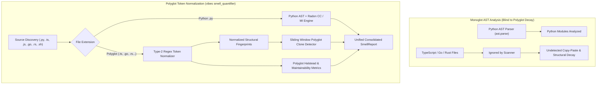

# Observation 44: Polyglot Token Normalization & Multi-Language Code Smell Quantification

> **Project**: Code Smell Quantifier (`examples/code-smell-quantifier/smell_quantifier.py`)  
> **Environment**: Python 3.12+, JavaScript/TypeScript, Go, Rust, Bash, `kucherenko/jscpd`, Radon, Vulture  
> **Classification**: Code Smell Quantification, Clone Detection, Multi-Language Static Analysis, Halstead Metrics  
> **Related**: [Observation 41 (Systems)](./41-radon-block-complexity-ranking-in-code-smell-quantification.md), [Pattern: Polyglot Token Normalization and Clone Quantification](../../patterns/polyglot-token-normalization-and-clone-quantification.md), [Exhibit: Code Smell Quantifier](../../examples/code-smell-quantifier/smell_quantifier.py)

---

## 1. Executive Context & Baseline

The Code Smell Quantifier ([`examples/code-smell-quantifier/smell_quantifier.py`](../../examples/code-smell-quantifier/smell_quantifier.py)) provides deterministic, stdlib-only structural decay measurement. Rather than evaluating pass/fail gates alone, it quantifies nine structural health dimensions across codebases, including normalized maintainability index, Halstead volume, LCOM4 cohesion, duplicate code blocks, unreferenced symbols, and cyclomatic complexity.

In the comparative landscape survey ([`tools/landscape_survey.py`](../../tools/landscape_survey.py)), the quantifier was benchmarked against `kucherenko/jscpd` (a multi-language copy-paste detector documenting over 150 file formats). The survey identified an open capability gap:

- **`multi_language`**: Analyzing languages beyond Python (held by `kucherenko/jscpd`).

Because `jscpd` is an npm-only toolchain whose adoption would introduce Node.js runtime baggage to Python-native CI pipelines, the gap held the survey disposition `build`. Closing this gap represented the final open `build` gap across the entire repository landscape survey.

---

## 2. The Observed Phenomenon: Monoglot Static Analysis Blindness

Modern cloud-native and agentic architectures are inherently polyglot: Python orchestration workflows coordinate TypeScript frontends, Go microservices, Rust WebAssembly modules, and Bash automation scripts.

When code smell measurement is restricted to a single language's AST grammar:
1. **Multi-Service Copy-Paste Blindness**: Identical structural algorithms pasted across TypeScript handlers, Go endpoints, and Python services remain invisible to language-specific AST walkers.
2. **Asymmetric Quality Gate Visibility**: Python modules are held to rigorous maintainability indices and clone ceilings, while neighboring TypeScript and Go source files decay unchecked.
3. **Heavyweight Toolchain Proliferation**: Running dedicated linters for every language (e.g., PMD-CPD, jscpd, SonarQube) introduces fragmented report formats, distinct exit codes, and significant CI latency.



---

## 3. The Underlying Architectural Failure Mode

Why do traditional static analyzers struggle with multi-language analysis without massive external runtimes?

1. **Full AST Parse Overhead**: Parsing full abstract syntax trees for dozens of languages requires complex native parsers (such as Tree-Sitter grammars or compiler frontends) that complicate distribution and portability.
2. **Type-1 vs. Type-2 Mismatch**: Naive text-based duplicate detectors search for byte-identical text (Type-1). However, the first action an engineer or AI agent performs after copying code is renaming identifiers and constants. Type-1 detectors miss these copies entirely.
3. **Incompatible Maintainability Scales**: Tools that invent proprietary metric scales prevent comparative longitudinal tracking across different programming languages.

---

## 4. Remediation & Implementation Mechanics

To deliver zero-dependency, multi-language structural decay quantification, `smell_quantifier.py` was extended with a three-layer polyglot architecture:

### 4.1. Fast Polyglot Tokenizer & Type-2 Normalization

A unified regular expression scanner (`_POLYGLOT_TOKEN_RE`) tokenizes source lines into keywords, operators, identifiers, and literals without requiring language-specific grammars:

```python
def _classify_token(match: re.Match[str]) -> str:
    """Classify a regex match into its normalized clone token."""
    if match.group("KEYWORD") or match.group("OPERATOR"):
        return match.group(0)
    if match.group("IDENTIFIER"):
        return "<ID>"
    return "<LIT>"
```

Identifiers are normalized to `<ID>`, literals to `<LIT>`, while structural operators (`{`, `}`, `(`, `)`, `;`, `+`, `==`) and control-flow keywords (`if`, `for`, `while`, `function`, `return`, `match`) are strictly preserved.

### 4.2. Sliding Window Polyglot Clone Detection

Non-empty normalized lines form sliding windows (`MIN_CLONE_STATEMENTS = 6`). Windows are hashed into structural fingerprints and grouped across files:

```python
def detect_polyglot_clones(
    sources: Mapping[Path, str],
    size: int = MIN_CLONE_STATEMENTS,
) -> list[SmellFinding]:
    """Detect duplicated statement/token blocks across multi-language source files."""
    ...
```

Identical structural logic with different variable names produces identical fingerprints, pinpointing cross-file duplication and merging overlapping windows via `_merge_overlapping_clones`.

### 4.3. Universal Polyglot Halstead & Maintainability Index

For non-Python files, `polyglot_module_metrics` computes:
- Non-comment lines of code ($\text{loc}$).
- Distinct operators ($\eta_1$) and operands ($\eta_2$).
- Total operators ($N_1$) and operands ($N_2$).
- Halstead Volume: $V = (N_1 + N_2) \log_2(\max(2, \eta_1 + \eta_2))$.
- Branching cyclomatic complexity: $M = 1 + \sum \text{branch\_keywords}$.
- Normalized Maintainability Index mapped strictly to Radon's $0 \text{--} 100$ scale:

$$\text{MI} = \max\left(0.0, \min\left(100.0, \frac{171.0 - 5.2 \ln V - 0.23 M - 16.2 \ln(\text{loc})}{1.71}\right)\right)$$

---

## 5. Quantitative Verification & Landscape Closure

The polyglot smell quantification engine was validated across test suites and the comparative landscape survey:

1. **Unit Test Coverage (`test_smell_quantifier.py`)**: 39/39 passing tests (8 new comprehensive polyglot tests) validating TypeScript, JavaScript, Go, and Rust normalization, clone detection, module metrics, gating complexity checks, and CLI filtering.
2. **Sentinel Audit Compliance**: Both `smell_quantifier.py` and `test_smell_quantifier.py` certified compliant with $M \le 7$, nesting depth $\le 3$, and $\le 3$ parameters.
3. **Landscape Survey Impact**:
   - Total capability gaps dropped from 5 to 4.
   - **Zero open `build` gaps remaining** across all surveyed domains (`4 adopt`, `0 build`).
   - `multi_language` capability certified under `smell-quantification`.
