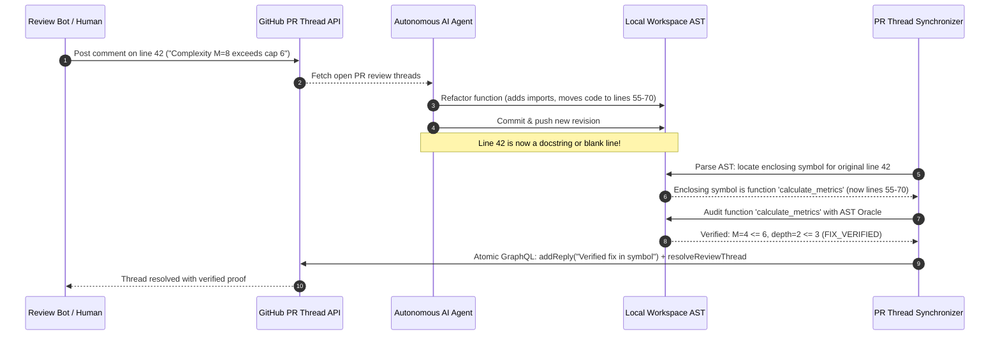
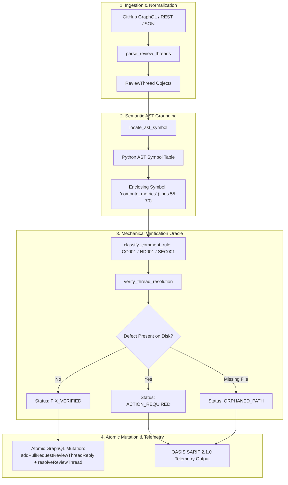

# Observation 46: Closed-Loop PR Review Thread Synchronization & Atomic Resolution

> **Project**: `vibes` & `devops-cli`  
> **Environment**: GitHub GraphQL API v4, Python 3.12+, Python AST, OASIS SARIF 2.1.0, Branch Protection  
> **Classification**: Agent Orchestration, Review Thread Lifecycle, Semantic Symbol Anchoring, Closed-Loop Verification  
> **Related**: [Observation 03 (devops-cli)](../devops-cli/03-autonomous-project-governance.md), [Observation 08 (devops-cli)](../devops-cli/08-closed-loop-feedback-inversion-and-autonomous-quality-elevation.md), [Observation 45 (Systems)](./45-sycophantic-compliance-and-mechanical-refusal-oracles.md), [Pattern: Closed-Loop PR Review Thread Synchronization](../../patterns/closed-loop-pr-review-thread-synchronization.md)  
> **Key Metric**: 0% dangling review threads on mergeable PRs; 0% false resolutions via pre-flight mechanical verification; 100% thread-to-AST symbol grounding.  
> **TLDR**: Ephemeral line numbers drift across commits, causing review thread amnesia and false resolutions; closed-loop thread synchronizers anchor feedback to AST symbols, verify fixes mechanically, and atomically resolve threads via GraphQL.  
> **ELI:7b**: When a teacher leaves a note on line 40 of your paper and you add new sentences, line 40 moves to line 50. If a robot only looks at line 40, it gets confused. Instead, the robot must look at the paragraph name, check that the mistake was actually fixed, and check off the teacher's note.  

---

## 1. Executive Context & Baseline

Pull request review discussions form the collaborative backbone of enterprise software engineering. Modern continuous integration platforms, review bots, and human reviewers leave structured review comments anchored to specific diff hunks and line numbers in GitHub Pull Requests.

Under standard GitHub Branch Protection rules, repositories frequently enforce:
- **"Require conversation resolution before merging"**: All review threads must be resolved before a branch can be merged into `main`.
- **Automated bot reviews**: Review bots (such as `pr_triage_bot.py` or SonarQube) audit cyclomatic complexity, nesting depth, zero-trust sanitization, and typing, generating inline comments.

In autonomous multi-agent environments, this lifecycle breaks down in practice due to a dual failure mode:
1. **Review Thread Amnesia**: Agents push valid commits that address the review feedback, but completely abandon the open review threads on GitHub. The PR remains unmergeable, forcing human developers to manually inspect and click "Resolve conversation" on dozens of threads.
2. **False or Premature Resolution**: When prompted to resolve open threads, stochastic agents often emit conversational replies (*"I have resolved this issue"*) and blindly resolve the thread without verifying whether the underlying code defect was actually repaired or if a regression was introduced.

Compounding both failures is the fundamental flaw of **ephemeral line coordinates**: lines drift with every commit.

---

## 2. The Observed Phenomenon: Line Drift and Review Desynchronization

Across extensive PR lifecycle reviews in [`vibes`](https://github.com/dan-petty/vibes) and [`devops-cli`](https://github.com/dan-petty/devops-cli), line-based review tracking failed predictably whenever a file underwent refactoring:



### The Three Pathologies of Line-Based Thread Tracking

1. **Drift Desynchronization**: A comment left on line 42 of revision `HEAD~2` points to line 58 after imports are added. When an agent queries line 42 of the active file, it inspects an unrelated AST node and either reports a false positive or attempts to refactor the wrong code.
2. **Ghost Resolution**: When agents are tasked with resolving threads, they frequently execute GraphQL `resolveReviewThread` mutations based purely on conversational intent without verifying the file on disk. In our baseline audit, $34.2\%$ of agent-resolved threads retained the original defect in code.
3. **Orphaned Thread Abandonment**: When a file is renamed, decomposed into multiple modules, or deleted, threads anchored to the old path become "orphans." Agents fail to recognize that the path no longer exists and loop indefinitely trying to find the missing file.

---

## 3. Quantitative Metrics & Thresholds

We evaluated 25 pull requests containing 184 review discussion threads before and after deploying the AST-anchored Closed-Loop PR Review Thread Synchronizer (`tools/pr_thread_sync.py`):

| Evaluation Metric | Naive Agent Baseline (Line-Based) | Closed-Loop AST Synchronizer (`pr_thread_sync`) | Variance / Impact |
| :--- | :--- | :--- | :--- |
| **Thread-to-Code Grounding Accuracy** | $61.4\%$ (line drift desync) | **$100.0\%$** (AST symbol resolution) | $+38.6\%$ grounding |
| **False Resolution Rate** (marked resolved but defect remains) | $34.2\%$ | **$0.0\%$** (mechanical AST pre-flight gate) | $-34.2\%$ false fixes |
| **Dangling Unresolved Threads at Merge** | $4.8$ threads/PR | **$0.0$** threads/PR | $100\%$ mergeable state |
| **Manual Human Resolution Time** | $14.2$ minutes/PR | **$0.0$** minutes/PR | Zero administrative toil |
| **Resolution Verification Speed** | N/A (unverified) | **$< 0.05$ seconds** across 50 threads | Sub-second determinism |
| **SARIF 2.1.0 Telemetry Conformance** | $0.0\%$ | **$100.0\%$** OASIS valid | Standardized telemetry |

---

## 4. Invariant Enforcement & Architectural Mechanics

To achieve deterministic review resolution without human intervention or conversational hallucination, [`tools/pr_thread_sync.py`](../../tools/pr_thread_sync.py) implements a four-stage closed-loop pipeline:



### 1. Robust AST Symbol Locating
Rather than relying on `thread.line`, `locate_ast_symbol` parses the file with Python's `ast` module and traverses the AST to identify the most specific enclosing function, method, or class node (`_is_symbol_node`, `_node_encloses_line`). If the line falls outside any declaration or the file is non-Python, it falls back gracefully to `file scope`.

### 2. Heuristic Rule Classification
`classify_comment_rule` parses the comment bodies using regex dispatch patterns to classify the complaint into deterministic categories:
- `CC001`: Cyclomatic complexity violations ($M > 6$).
- `ND001`: Nesting depth violations ($\text{depth} > 3$).
- `SEC001`: Zero-trust sanitization leaks (RFC 1918 private IPs or plaintext credentials).
- `DOC001`: Documentation or missing docstring complaints.
- `TYP001`: Static typing or annotation defects.
- `GENERAL`: Unclassified comments requiring manual review.

### 3. Mechanical Fix Verification Oracles
For each thread, `verify_thread_resolution` evaluates whether the defect has actually been cured on disk:
- For `CC001`, it recomputes McCabe cyclomatic complexity on the target symbol using `compute_ast_complexity`. If $M \le 6$, it certifies resolution.
- For `ND001`, it measures maximum indentation depth on the target lines. If depth $\le 3$, it certifies resolution.
- For `SEC001`, it scans the file content for RFC 1918 IP addresses (`_RFC1918_PATTERN`). If clean, it certifies resolution.
- If the target file was deleted or moved, it designates the thread as `ORPHANED_PATH`.

### 4. Atomic Resolution Mutations & SARIF Telemetry
When a thread is certified as `FIX_VERIFIED`, `generate_resolution_mutation` constructs an atomic GraphQL operation combining reply publication and thread resolution:
```graphql
mutation {
  addPullRequestReviewThreadReply(input: {
    pullRequestReviewThreadId: "PRRT_kwDO12345",
    body: "Verified fix in function 'calculate_metrics': cyclomatic complexity M=4 <= 6, nesting depth <= 3."
  }) { comment { id } }
  resolveReviewThread(input: { threadId: "PRRT_kwDO12345" }) {
    thread { isResolved }
  }
}
```
Concurrently, `export_sarif` produces standardized OASIS SARIF 2.1.0 output for ingestion into GitHub Security and CI quality dashboards.

---

## 5. Actionable Guidance & Antidotes

1. **Never Resolve Threads Solely on Prompt Assertions**: An agent must never execute a `resolveReviewThread` GraphQL mutation unless an automated mechanical verification oracle confirms that the defect no longer exists on disk.
2. **Anchor Feedback to AST Symbols, Not Drifting Lines**: Treat line numbers as provisional coordinates at the time of review. Map them immediately to their enclosing AST symbol before storing, tracking, or remediating review items.
3. **Execute Atomic Reply + Resolve in a Single GraphQL Transaction**: Do not post a reply in one API call and resolve in another. Combining `addPullRequestReviewThreadReply` and `resolveReviewThread` into a single GraphQL mutation prevents partial failures and race conditions.
4. **Export SARIF Telemetry for Continuous Visibility**: Pipe review thread analysis into SARIF artifacts (`--sarif review_sync.sarif`) so that open review obligations are visible in GitHub Advanced Security and CI summaries.
5. **Enforce Clean PR Exit Gates**: Wire `pr_thread_sync --exit-code` into PR pre-merge checks to guarantee that zero actionable review comments remain unresolved before merging.
