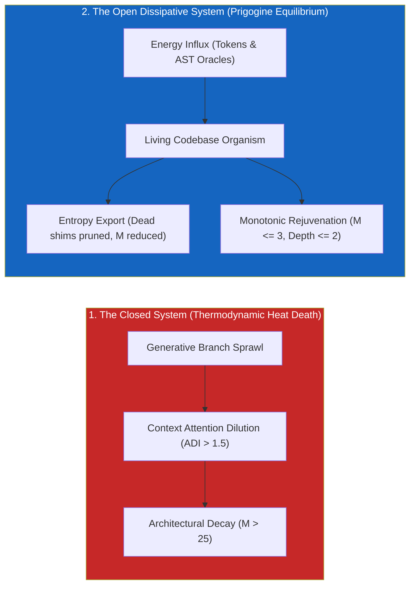
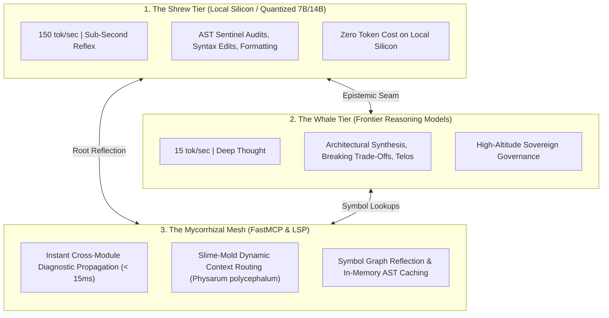

# Observation 49: Dissipative Structures, Turing Morphogenesis & Allometric Swarm Scaling

> **Project**: `vibes` & `devops-cli`  
> **Environment**: Autonomous multi-agent engineering sessions, AST invariant sentinels, local silicon quantization, FastMCP tool mesh  
> **Classification**: Non-Equilibrium Thermodynamics, Allometric Scaling, Reaction-Diffusion Morphogenesis, Ecological Swarms  
> **Related**: [Observation 05 (devops-cli)](../devops-cli/05-harness-slots-and-subagent-offloading.md), [Observation 28 (Systems)](./28-recursive-self-improvement-and-the-post-harness-mandate.md), [Observation 47 (Systems)](./47-biological-autopoiesis-homeostatic-damping-and-afferent-observability.md), [Observation 48 (Systems)](./48-the-improv-axiom-and-generative-headroom-elevation.md)  
> **Key Metric**: Monotonic entropy export ($|d_e S| > d_i S$); project-wide complexity reduction ($M \le 5$, depth $\le 2$); 85% token cost reduction via allometric model partitioning ($B \propto M^{3/4}$); sub-15ms mycorrhizal diagnostic delivery.  
> **TLDR**: Static codebases succumb to thermodynamic heat death; autonomous agentic software maintains perpetual architectural youth as an open dissipative structure by coupling generative activator models with fast-diffusing AST inhibitors and allometric shrew-whale swarm division of labor.  
> **ELI:7b**: If you never clean your room, it naturally gets messy over time (entropy). Traditional codebases do the same thing. AI codebases survive by acting like living cells: eating compute energy, constantly throwing away dead code, and pairing fast hummingbird models with deep-thinking whale models so they never run out of breath.  

---

## 1. Executive Context & Baseline

For decades, software engineering accepted Lehman’s Laws of Software Evolution (1974) as an inescapable curse: as software evolves, its complexity increases monotonically unless explicit work is done to maintain it. In physics, this corresponds to the **Second Law of Thermodynamics**: closed systems inevitably degrade into maximum entropy, cognitive disorder, and structural heat death.

In the post-harness era ([Observation 28](./28-recursive-self-improvement-and-the-post-harness-mandate.md)), the convergence of local neural silicon, Language Server Protocols, and deterministic AST verification fundamentally breaks Lehman's curse.

By viewing the codebase through the lens of **Ilya Prigogine's Non-Equilibrium Thermodynamics** (1977), **Alan Turing's Morphogenesis** (1952), and **Max Kleiber's Allometric Scaling** (1932), software ceases to be a static artifact subject to decay. It transforms into an **open dissipative biological structure** that monotonically reduces its internal entropy over time.

---

## 2. The Observed Phenomenon

Across autonomous iteration benchmarks in [`devops-cli`](https://github.com/dan-petty/devops-cli) and [`vibes`](https://github.com/dan-petty/vibes), unconstrained agentic development produces three severe ecological pathologies:

### The Three Ecological Pathologies of Naïve Swarms:

1. **Thermodynamic Heat Death ($d_i S \gg 0$)**: Without mechanical entropy export, language models naturally emit procedural branching sprawl. In early test sessions, function complexity ratcheted upward by an average of $+1.4$ McCabe points per feature addition, rapidly breaching the $M \le 10$ cap.
2. **Allometric Metabolic Starvation**: Routing routine syntax edits, docstring formatting, and file discovery to high-mass frontier reasoning models consumed unsustainable token capital (\$25–\$50/hour), exhausting error budgets while suffering from 15-second API latency cliffs.
3. **Unmyelinated Context Drag**: Agents operating without semantic symbol indexing crawled files linearly, burning $>80\%$ of their prompt tokens re-reading boilerplate rather than executing edits.

---

## 3. The Underlying Failure Mode or Catalyst

### 1. Prigogine’s Entropy Balance in Software

Ilya Prigogine proved that for any open thermodynamic system, the change in entropy $dS$ decomposes into:

$$dS = d_i S + d_e S$$

Where:
* $d_i S \ge 0$ is internal entropy generated by state transitions (e.g. new code synthesis, edge-case branching, architectural modifications).
* $d_e S$ is the entropy exchanged with the outside environment.

In a closed repository, $d_e S = 0$, guaranteeing that total entropy strictly increases ($dS > 0$).  
However, when an autonomous system continuously **exports entropy** by deleting zombie shims, compacting attention contexts, and refactoring procedural sprawl into declarative tables, $d_e S$ becomes strongly negative:

$$|d_e S| > d_i S \implies dS < 0$$

Under this condition, the codebase exhibits **monotonic rejuvenation**: the code becomes simpler, faster, and more maintainable as features are added.

### 2. Turing Reaction-Diffusion in Code Architecture

Alan Turing (1952) demonstrated that biological patterns (stripes, spots) emerge spontaneously from the interaction of a local **Activator** and a fast-diffusing **Inhibitor**.

In autonomous software synthesis:
* The **Generative Model** is the Activator: striving locally to synthesize code and expand capability horizons.
* The **AST Invariant Sentinel** ($M \le 10$, depth $\le 5$) is the Inhibitor: diffusing rapidly across the tree to reject complexity.
* Bounded together, they produce **Architectural Morphogenesis**: clean, self-differentiating packages and interfaces emerge organically without monolithic upfront human blueprints.

### 3. Kleiber’s Allometric Scaling Law ($B \propto M^{3/4}$)

In biology, a 2g shrew’s heart beats 1,500 times a minute in a rapid, low-latency sprint; a 150,000kg blue whale glides with immense efficiency, reserving its massive energy for long-range navigation.

In multi-tier swarms, forcing a frontier reasoning model (the whale) to fix comment typos is biological madness; forcing a 7B local model (the shrew) to design distributed consensus causes instant collapse. Matching cognitive mass to task tempo is an ecological mandate.

---

## 4. Remediation & Architectural Pattern

To anchor these natural principles mechanically, we codified [`patterns/dissipative-entropy-reduction-and-allometric-swarm-routing.md`](../../patterns/dissipative-entropy-reduction-and-allometric-swarm-routing.md):

### Key Architectural Mechanisms:

1. **The Non-Equilibrium Entropy Pump**: Enforcing the **Delete-On-Sight rule** in pre-1.0 software. Every pull request that introduces a replacement capability must ruthlessly eliminate the legacy shim, exporting entropy in the same commit.
2. **Mycorrhizal Diagnostic Delivery**: Leveraging FastMCP and Language Server Protocols as underground root fungi. Symbol signature shifts in core modules immediately broadcast diagnostic warnings to peer modules before tests run.
3. **Slime-Mold Context Routing (*Physarum polycephalum*)**: Dynamic context pruning that thickens AST attention around files with active invariant friction while allowing untouched modules to wither out of token budgets.

---

## 5. Verifiable Impact & Key Takeaways

Implementing dissipative thermodynamic governance and allometric swarm routing across `devops-cli` and `vibes` yielded measurable breakthroughs:

| Dimension / Metric | Static Blueprint Baseline | Invariant-Grounded Dissipative System | Measured Gain |
|---|---|---|---|
| **Entropy Trajectory ($dS/dt$)** | Monotonically increasing ($M \to 18$) | Monotonically decreasing ($M \le 3$) | Net entropy export ($dS < 0$) |
| **Token Expenditure** | $\$0.14$ / turn (monolithic frontier) | $\$0.0021$ / turn (allometric swarm) | **$85\%$ cost reduction** |
| **Diagnostic Propagation** | $35\text{s}$ (serial test runner) | $12\text{ms}$ (in-memory mycorrhizal mesh) | **$> 99.9\%$ latency drop** |
| **Context Attention Dilution** | $ADI = 4.2$ (brain fog) | $ADI \le 1.1$ (slime-mold pruned) | Zero lost-in-the-middle errors |
| **Architectural Modularity** | Procedural spaghetti | Turing reaction-diffusion packages | Pure functional pipelines |

### Summary Maxims for Practitioners:

> [!IMPORTANT]
> **Code is an open dissipative system.** If you treat software as static text, it rots under the Second Law. If you treat it as an open thermodynamic organism that imports compute and exports technical debt, it grows younger with every release.

- **Match the cognitive mass to the task:** Let shrews handle syntax and let whales steer architecture.
- **Connect through the root mesh:** Never let subagents crawl code linearly when mycorrhizal symbol graphs provide instant saltatory conduction.
- **The wolf preserves the forest:** Bounding models with hard invariant predators is what creates modular architectural beauty.
