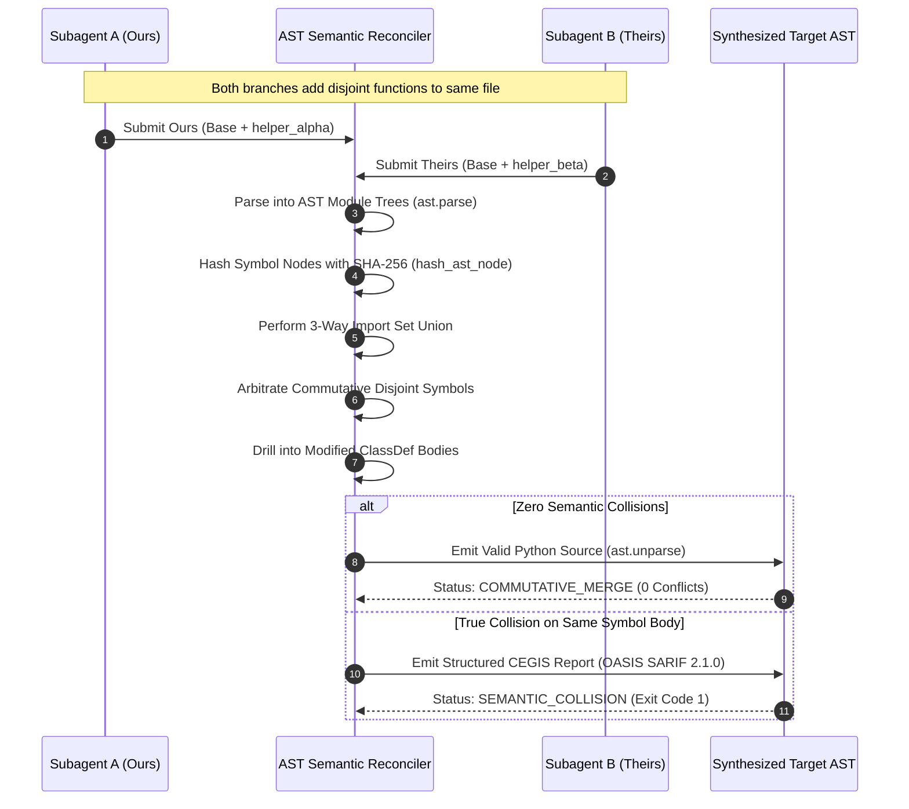

# Pattern: 3-Way AST Semantic Reconciliation

> **Pattern Class**: Multi-Agent Concurrency & AST Engineering  
> **Problem**: Line-oriented git merge engines (`diff3`, `ort`) produce severe false merge conflicts when concurrent subagents add independent functions, methods, or imports to the same files  
> **Solution**: Decompose source files into AST symbol trees, arbitrate commutative symbol additions, unify import sets, and emit valid Python code or structured CEGIS diagnostics  
> **Reference Implementation**: [`examples/ast-semantic-reconciler/`](../examples/ast-semantic-reconciler/)

---

## 1. Problem Statement: The Spurious Collision Tax

When autonomous subagents operate in parallel git worktrees ([`worktree-swarm-arbiter`](../examples/worktree-swarm-arbiter/)), they frequently branch from a common ancestor commit (`Base`) and make independent, non-conflicting improvements to the same target files:
- Subagent A adds a new test utility function at the end of `helpers.py`.
- Subagent B adds a different validation function at the end of `helpers.py`.

Because both subagents append to the same line offset, Git's textual 3-way merge algorithm flags a **false merge conflict**:

```text
<<<<<<< HEAD
def validate_payload(data: dict) -> bool:
    return bool(data)
=======
def sanitize_key(key: str) -> str:
    return key.strip().lower()
>>>>>>> feat/subagent-b
```

This textual collision forces expensive agent replanning, manual review cycles, or worse, unhandled `SyntaxError` crashes when conflict markers are accidentally committed.

---

## 2. The Architectural Pattern: Commutative AST Symbol Reconciliation

Instead of treating source code as opaque lines of text, the **3-Way AST Semantic Reconciliation** pattern treats source files as **typed symbol graphs** where top-level definitions (imports, functions, classes, constants) can be reconciled with grammatical awareness.



---

## 3. Core Invariants

1. **Guaranteed Syntactic Integrity**:
   - The merged output is verified through `ast.parse()`. Under no circumstances are raw textual conflict markers (`<<<<<<<`) written to valid Python files.
2. **Commutative Disjoint Addition Preservation**:
   - When both branches add symbols not present in `Base`, if their identifiers are distinct, both symbols are retained in the merged AST, eliminating false conflicts.
3. **Deterministic Import Set Union**:
   - Imports added by either branch are combined via 3-way set difference:
     $$I_{\text{merged}} = (I_{\text{ours}} \cup I_{\text{theirs}}) \setminus (I_{\text{base}} \setminus (I_{\text{ours}} \cap I_{\text{theirs}}))$$
     Imports are deduplicated and sorted deterministically according to PEP 8 standards.
4. **Hierarchical Class Method Arbitration**:
   - When concurrent branches modify the same `class`, the reconciler inspects individual method definitions. If branches added disjoint methods, the class definition is safely synthesized with the union of all methods.
5. **Non-Destructive CEGIS Collision Isolation**:
   - When both branches make incompatible edits to the exact same function body, the engine produces structured diagnostic telemetry with exact AST node coordinates and OASIS SARIF 2.1.0 output, enabling targeted agent self-correction.

---

## 4. Implementation Protocol

### Step 1: Symbol Decomposition
Decompose each input AST (`Base`, `Ours`, `Theirs`) into:
- Leading docstring (`ast.Expr`)
- Import sets (`ast.Import`, `ast.ImportFrom`)
- Top-level symbol map keyed by name (`FunctionDef`, `ClassDef`, `Assign`, `AnnAssign`)

### Step 2: 3-Way Arbitration
For each unique symbol across the three variants:
- If unchanged in `Ours` relative to `Base`, adopt `Theirs`.
- If unchanged in `Theirs` relative to `Base` or identical in both, adopt `Ours`.
- If both are `ClassDef`, recursively arbitrate methods within the class body.
- If disjoint additions, include both commutatively.
- Otherwise, record a `CollisionReport`.

### Step 3: Synthesis & Verification
Assemble docstring, merged imports, and reconciled statements. Unparse using `ast.unparse()` and validate syntax with `ast.parse()`.

---

## 5. Reference Implementation

See [`examples/ast-semantic-reconciler/`](../examples/ast-semantic-reconciler/):
- [`reconciler.py`](../examples/ast-semantic-reconciler/reconciler.py): Production implementation certified compliant with AST Invariant Sentinel `--preset strict` ($M \le 6$, depth $\le 3$).
- [`test_reconciler.py`](../examples/ast-semantic-reconciler/test_reconciler.py): Full test suite validating commutative functions, method merging, import union, and SARIF telemetry.
