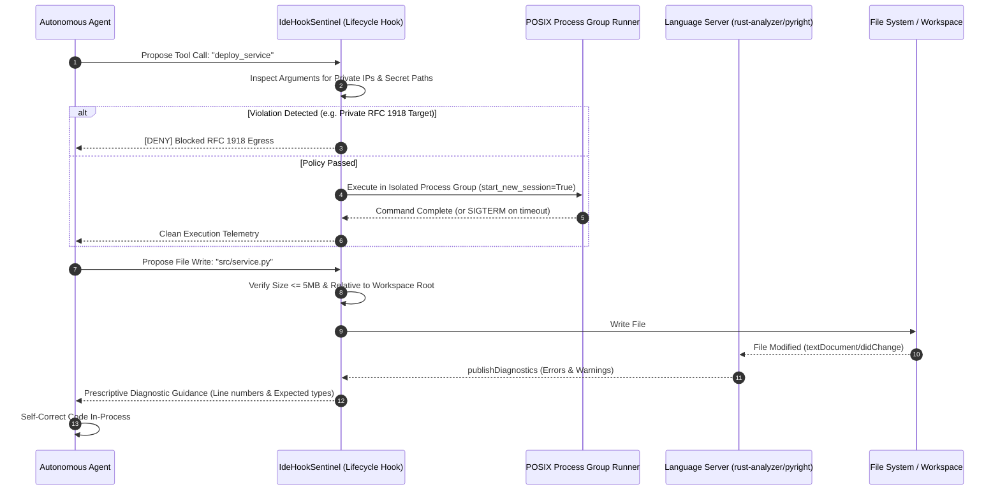

# Pattern: Agentic IDE Lifecycle Hooks & LSP Oracles

> **Pattern Class**: Editor Integration & Control Plane Governance
> **Problem**: Tool execution privileges inside an IDE expose credentials, host filesystem, and network egress to an autonomous agent
> **Solution**: Pre- and post-tool lifecycle hooks enforcing zero-trust egress, process-group containment, and LSP diagnostics as a regression oracle
> **Reference Implementation**: [`examples/agentic-ide-hook-sentinel/`](../examples/agentic-ide-hook-sentinel/)

---

## 1. Problem Statement

Granting autonomous AI agents tool execution privileges inside an integrated development environment creates acute security and reliability risks:
1. **Unrestricted File/Network Access**: Agents can inadvertently leak `.env` tokens, overwrite SSH credentials, or probe private RFC 1918 subnets.
2. **Zombie Subprocess Leaks**: Cancelling background tasks leaves child processes running indefinitely.
3. **Disconnected Compiler Feedback**: Agents authoring code without real-time compiler diagnostics generate hallucinated or unverified syntax.

---

## 2. Core Mechanics

This pattern positions an **IdeHookSentinel** between the agent's intent generation and the physical execution environment, while piping Language Server Protocol (LSP) diagnostics directly into the agent's self-healing loop:



### Key Operational Rules:
1. **Zero Egress to Private RFC 1918 IPs**: All outbound addresses must be public or standard documentation blocks (`192.0.2.0/24`, `198.51.100.0/24`, `203.0.113.0/24`) or loopback (`127.0.0.1`).
2. **Protected Path Shielding**: Intercept file operations targeting `.env*`, `.ssh/`, `.git/`, and system credential files.
3. **Process Group Containment**: Never invoke external processes with plain `subprocess.Popen` without `start_new_session=True`. Always terminate via `os.killpg(os.getpgid(proc.pid), signal.SIGTERM)`.
4. **LSP-Driven Self-Correction**: Convert compiler errors into structured prompts detailing the exact line, symbol, and type expectation for instant zero-shot correction.

---

## 3. Implementation Example

```python
from pathlib import Path
from hook_sentinel import HookDecision, IdeHookSentinel

workspace = Path("/workspaces/my-app")
sentinel = IdeHookSentinel(workspace_root=workspace)

# Step 1: Pre-tool security validation
decision = sentinel.evaluate_tool_call(
    tool_name="http_request",
    arguments={"url": "http://192.0.2.1/api"},
)
if decision.decision != HookDecision.ALLOW:
    raise PermissionError(decision.reason)

# Step 2: Isolated subprocess execution with process group kill
res = sentinel.run_isolated_command(["pytest", "tests/"], timeout_seconds=15.0)
if res.timed_out:
    logger.error("Command timed out and process group was cleanly terminated.")

# Step 3: Ingest LSP compiler diagnostics as CEGIS oracles
diagnostics = fetch_lsp_diagnostics("src/handler.py")
eval_report = sentinel.evaluate_lsp_diagnostics("src/handler.py", diagnostics)

if not eval_report.is_clean:
    # Feed prescriptive guidance directly back into the agent's prompt context
    agent.send_feedback(eval_report.prescriptive_guidance)
```

---

## 4. Guardrails & Anti-Patterns

- ❌ **Anti-Pattern: Post-Execution Path Checking**: Checking if a file was sensitive after the agent has already written to it causes irreversible data corruption.
- ❌ **Anti-Pattern: Killing Only Parent PIDs**: Using `proc.kill()` leaves child compilers or Docker daemons running in the background. Always use `os.killpg()`.
- ⚠️ **Guardrail: Pre-Flight Size Boundaries**: Enforce a strict pre-flight file size cap ($\le 5\text{MB}$) to eliminate out-of-memory denial of service (CWE-400) when agents encounter minified JavaScript or binary blobs.

---

## 5. Cross-References

- **Observation**: [`observations/systems/07-agentic-ide-protocols-and-lsp-mcp-convergence.md`](../observations/systems/07-agentic-ide-protocols-and-lsp-mcp-convergence.md)
- **Reference Implementation**: [`examples/agentic-ide-hook-sentinel/`](../examples/agentic-ide-hook-sentinel/)
- **Manifesto**: [`docs/MANIFESTO.md`](../docs/MANIFESTO.md)

