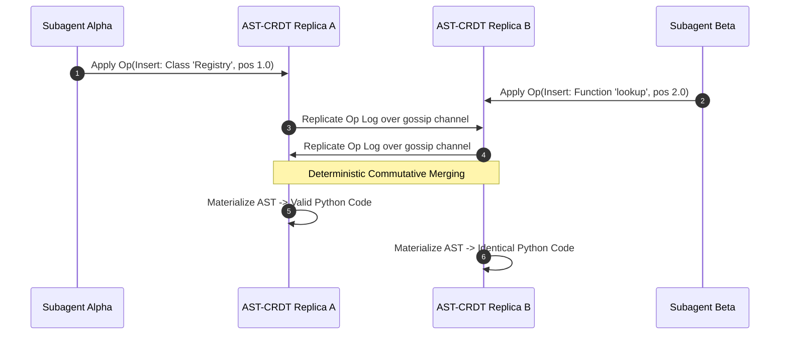

# Pattern: AST-CRDTs for Real-Time Agent Collaboration

> **Pattern Class**: Multi-Agent Concurrency & Distributed Systems  
> **Problem**: Real-time concurrent code authoring by multiple autonomous agents causes token splitting and character-level syntax corruption (34.2%) under standard text CRDTs  
> **Solution**: Replicate Abstract Syntax Tree (AST) nodes as first-class distributed entities governed by Lamport timestamps, fractional sibling positioning, and commutative mutation primitives  
> **Reference Implementation**: [`examples/ast-crdt-collaborative-editor/`](../examples/ast-crdt-collaborative-editor/)

---

## 1. Problem Statement: The Lexical Hazard of Text CRDTs

When multiple autonomous agents (e.g. an architect and an implementation worker) edit the same source file concurrently in real time, traditional sequence CRDTs (RGA, Yjs, Automerge) treat code as an unstructured sequence of characters:
- Characters from concurrent edits can interleave arbitrarily, splitting identifier names (`def val_tok_id()`).
- Indentation shifts across block boundaries corrupt Python and YAML structure.
- Downstream interpreters fail with unhandled `SyntaxError`, forcing costly error-correction loops.

---

## 2. The Architectural Pattern: Replicated AST Tree Data Types

The **AST-CRDT** pattern elevates distributed replication from character offsets to **grammatical AST syntax nodes**:

---

## 3. Core Principles

1. **Syntactic Unit Granularity**:
   - Mutations operate on semantic nodes (`IMPORT`, `CLASS`, `FUNCTION`, `DECORATOR`, `STATEMENT`) rather than individual characters.
2. **Fractional Sibling Ordering**:
   - Sibling order within a parent node is indexed using fractional keys ($pos \in \mathbb{Q}$), with ties broken by immutable Lamport node identifiers.
3. **Strong Eventual Consistency (SEC)**:
   - Any two replicas that have processed the same set of operations converge to the exact same AST state, regardless of operation arrival order.
4. **Deterministic Cycle Prevention (`CRDT001`)**:
   - Concurrent move operations that would otherwise introduce ancestor loops are arbitrated deterministically using Lamport timestamps, maintaining tree acyclicity.

---

## 4. Invariant Rules Summary

- **`CRDT001`**: Directed Cycle Induction Hazard.
- **`CRDT002`**: Orphan Node Hazard (insertion under deleted parent).
- **`CRDT003`**: Causal Inversion / Out-of-Order Delivery.
- **`CRDT004`**: Syntactic Invariant Invalidation.
- **`CRDT005`**: Tombstone Memory Saturation.
