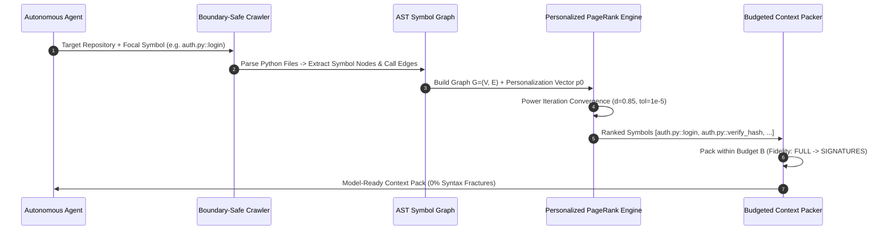

# Pattern: AST Graph Relevance Ranking & Context Packing

> **Pattern Class**: Context Engineering & Information Foraging  
> **Problem**: Naive file-level or line-based prompt context packing causes token budget exhaustion, prompt pollution, and mid-block syntax fractures (18.2% invalidation)  
> **Solution**: Extract repository symbol dependency graphs, compute Personalized PageRank rooted at task focal symbols, and pack whole AST nodes with fidelity degradation (`FULL` $\to$ `SIGNATURES` $\to$ `OUTLINE`)  
> **TLDR**: Construct directed AST symbol dependency graphs and rank context relevance with Personalized PageRank rooted at task focal symbols.
> **ELI:7b**: Instead of feeding the whole repo to the AI, use a graph search to find and send only the exact functions related to the task.
> **Reference Implementation**: [`examples/ast-relevance-context-ranker/`](../examples/ast-relevance-context-ranker/)  
> **Related**: [Observation 38](../observations/systems/38-graph-ranked-ast-context-optimization-and-personalized-pagerank.md)

---

## 1. Problem Statement: The Lexical & Greedy Context Hazard

Autonomous agents face strict prompt token budgets ($B$). When exploring multi-file repositories, agents frequently suffer from two anti-patterns:
1. **Greedy Whole-File Saturation**: Ingesting files alphabetically or by shallow directory traversal packs thousands of tokens of irrelevant configuration, constants, or auxiliary tests before ever reaching the symbols being modified.
2. **Arbitrary Line Truncation**: Cutting files at token limits fractures syntactic blocks, emitting truncated functions with missing closing delimiters and triggering hallucinated syntax error reports.

---

## 2. The Architectural Pattern: Personalized PageRank AST Ranking

The **AST Graph Relevance Ranking** pattern models the repository as a directed dependency graph of functions, classes, and imports, ranking code relevance topologically rather than textually:

---

## 3. Core Principles

1. **Topological Over Textual Context**:
   - Code dependencies follow call graphs and inheritance hierarchies, not lexical distance or file names. Context relevance must be derived from graph centrality.
2. **Task-Anchored Personalization ($p_0$)**:
   - Setting the random walk restart distribution to the symbol being investigated or refactored concentrates probability mass on direct callers, callees, and imported types.
3. **Graceful Fidelity Degradation**:
   - When token limits prevent packing all high-relevance symbols, degrade bodies to signatures and docstrings (`FidelityLevel.SIGNATURES`) instead of dropping symbols entirely.
4. **Guaranteed Syntactic Completeness**:
   - Every snippet in the packed context corresponds to a complete, parseable AST node, guaranteeing 0% mid-block syntax fracture.

---

## 4. Invariant Rules Summary

- **`RNK001`**: Orphaned Symbol Hazard (symbol isolated with zero graph edges).
- **`RNK002`**: Hub Centrality Hotspot (symbol score $> \mu + 3\sigma$, critical dependency).
- **`RNK003`**: Budget Saturation (ranked symbols truncated due to tight budget).
- **`RNK004`**: Circular Reference Cycle (mutual recursive dependency detected).
