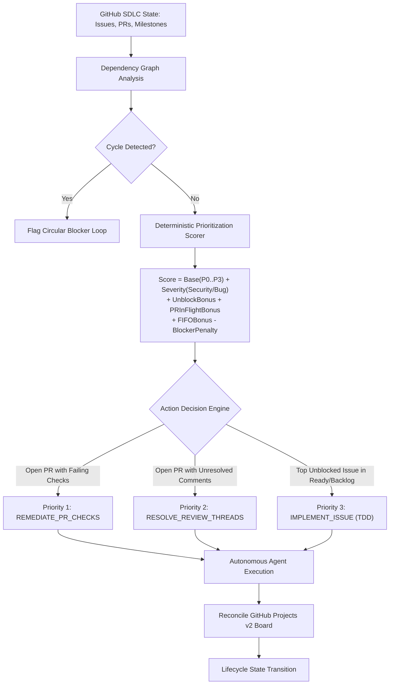

# Pattern: Autonomous SDLC Project Management & Prioritization

> **Pattern Class**: Autonomous Governance & Delivery Lifecycle
> **Problem**: Agents suffer SDLC blindness: they can write code but cannot decide what to work on next, or know when something is blocked
> **Solution**: Deterministic resource modelling, dependency-aware scoring, and a ranked next-action recommendation the agent can obey
> **Reference Implementation**: [`tools/sdlc_project_manager.py`](../tools/sdlc_project_manager.py)

A deterministic project management, resource modeling, and prioritization pattern enabling AI agents and swarms to self-steer through the Software Development Lifecycle (SDLC) without human manual intervention.

---

## 1. Problem Statement

Autonomous coding agents commonly suffer from **"SDLC Blindness"**:
- **Task Fragmentation & Out-of-Order Execution**: Agents start shiny new feature issues while older pull requests sit unmerged, accumulating merge conflicts and starving the release branch (violating the FIFO principle).
- **Check Abandonment**: An agent opens a pull request and moves on to the next task without verifying whether remote CI checks passed or addressing review comments.
- **Dependency Stalls**: Agents pick issues whose foundational dependencies are still in-progress or blocked, resulting in broken branches or duplicative work.
- **Amnesia & Grounding Drift**: Work is performed in terminal isolation without updating GitHub Projects v2 custom fields (`Status`, `Priority`, `Estimate`), leaving human engineering leaders completely in the dark.

---

## 2. Core Mechanics

The **Autonomous SDLC Project Management** pattern introduces a deterministic prioritization engine and state machine:



### 1. Deterministic Prioritization Scoring Formula

The priority score $S$ for each SDLC resource is computed across six dimensions:

$$S = S_{\text{base}} + \sum M_{\text{labels}} + (N_{\text{blocks}} \times 150) + M_{\text{pr}} + \text{ROI}_{\text{effort}} + \min(\text{age}_{\text{days}} \times 12, 200) \times P_{\text{blocked}}$$

- **$S_{\text{base}}$**: Base urgency (`P0_CRITICAL` = 1000, `P1_HIGH` = 500, `P2_MEDIUM` = 200, `P3_LOW` = 50).
- **$M_{\text{labels}}$**: Critical severity modifiers (`security` = +400, `bug`/`regression` = +250–300).
- **$N_{\text{blocks}}$**: Unblocking multiplier: items that unblock $N$ downstream tasks receive $+150 \times N$ to clear critical paths.
- **$M_{\text{pr}}$**: Pull Request in-flight bonus (+300 for active PRs, +250 for failing checks, +50 per unresolved review thread).
- **$\text{ROI}_{\text{effort}}$**: Value-to-effort ratio: $(\text{business\_value} \times 25) / \text{effort\_points}$.
- **FIFO Aging Bonus**: Older items accrue up to +200 points to prevent starvation.
- **$P_{\text{blocked}}$**: Penalty factor (0.2x) if incomplete dependencies remain.

### 2. Prescriptive Next-Action Rules
1. **Rule 1 (Remediate In-Flight PRs)**: If any active pull request has failing CI checks, all new issue implementation is halted until checks pass.
2. **Rule 2 (Resolve Review Discussions)**: If any active pull request has unresolved review comments, the agent authors targeted test-first fixes and resolves the threads.
3. **Rule 3 (Implement Top Unblocked Issue)**: Once the PR queue is clean, the agent picks the highest-scoring unblocked issue from `Ready` or `Backlog` and begins TDD implementation.

---

## 3. Implementation Blueprint

```python
from pathlib import Path
from tools.sdlc_project_manager import SDLCProjectManager, load_resources_from_json

# Load project state from GitHub Projects export
resources = load_resources_from_json(Path(".data/github_project_state.json"))
manager = SDLCProjectManager(resources)

# 1. Print visual ASCII Kanban Board
print(manager.render_kanban_board())

# 2. Get prescriptive agent action
recommendation = manager.recommend_next_agent_action()
print(f"Action: {recommendation.action_type}")
print(f"Target: #{recommendation.target_resource.number} — {recommendation.target_resource.title}")
print(f"Rationale: {recommendation.rationale}")
```

---

## 4. Key Takeaways

1. **Self-Steering Requires Formality**: Without a mathematical scoring formula, agents pick tasks opportunistically, abandoning hard defects and leaving PRs unmerged.
2. **FIFO Prevents Drift**: Enforcing chronological pull request resolution eliminates branch divergence and cascading merge conflicts in autonomous swarms.
3. **Dependency-Aware Scheduling**: Modeling items as a directed acyclic graph (DAG) prevents agents from attempting tasks whose prerequisites are incomplete.
