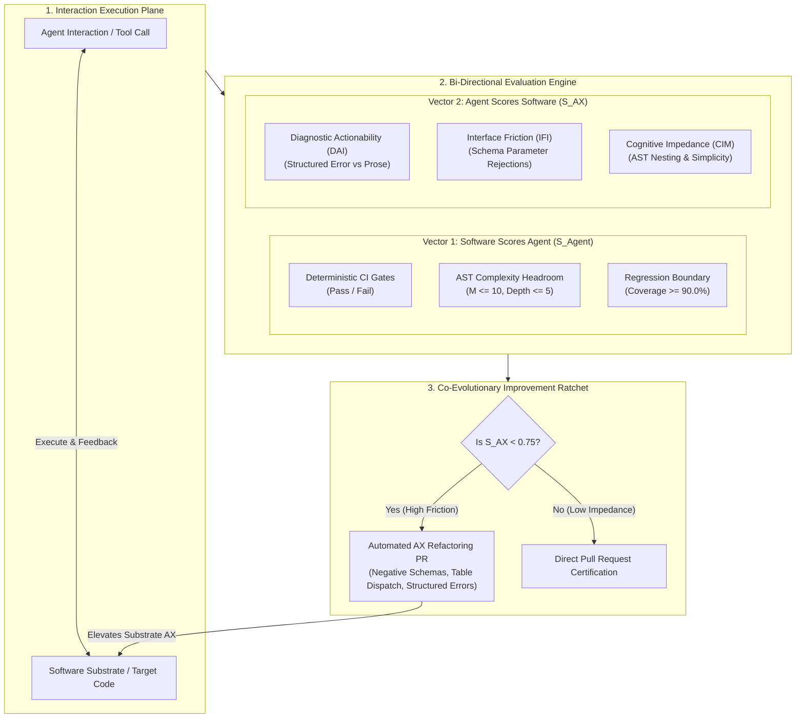

# Pattern: Bi-Directional Metric Feedback and AX Scoring

> **Pattern Class**: Multi-Agent Systems & Continuous Self-Hardening
> **Problem**: Unidirectional quality assessment forces agents to silently absorb software interface friction, resulting in retry spirals, token waste, and recurring architectural degradation
> **Solution**: A bi-directional scoring architecture that pairs deterministic software gates ($S_{\text{Agent}}$) with real-time Agent Experience scoring ($S_{\text{AX}}$), automatically inverting software friction into automated refactoring and schema-hardening deliverables
> **Reference Implementation**: [`examples/agent-experience-evaluator/ax_evaluator.py`](../examples/agent-experience-evaluator/ax_evaluator.py), [`tools/cegis_engine.py`](../tools/cegis_engine.py), [`tools/ast_refactorer.py`](../tools/ast_refactorer.py), [`examples/ast-invariant-sentinel/sentinel.py`](../examples/ast-invariant-sentinel/sentinel.py)

---

## 1. Problem Statement

In standard automated software engineering pipelines, quality scoring is strictly one-directional: the software evaluates the agent. Compilers check syntax, test suites check behavioral regressions, and invariant sentinels enforce complexity thresholds ($M \le 10$, $\text{depth} \le 5$).

While this ensures that substandard code is rejected, it treats the software interface as an immutable constant. When an agent encounters confusing error tracebacks, permissive schemas lacking `additionalProperties: false`, or deeply nested functions ($M \ge 9$), the agent has no mechanism to flag or remediate the friction.

This creates three systemic failure modes:

1. **The Silent Sufferer Trap**:
   Unlike human engineers who complain about poor Developer Experience (DX) and refactor friction points, autonomous agents silently attempt to compensate by generating verbose workarounds or complex wrappers.
2. **Exponential Token Burn Under Diagnostic Ambiguity**:
   When a test failure or compiler error emits unstructured conversational prose instead of machine-actionable diffs, the agent's problem-solving reduces from polynomial Counterexample-Guided Inductive Synthesis (CEGIS) to brute-force speculative search.
3. **One-Way Architectural Decay**:
   Codebases that are hard for agents to navigate become progressively more fragmented as agents add incremental shims rather than simplifying the underlying abstractions.

---

## 2. Core Mechanics

The Bi-Directional Metric Feedback pattern establishes a closed-loop cybernetic feedback mechanism where every interaction generates two complementary evaluation vectors:



### The Three Operational Tenets:

1. **Synchronized Dual-Scoring**:
   - The repository gates evaluate agent conformance ($S_{\text{Agent}}$) via deterministic AST checks and test suites.
   - The agent telemetry layer evaluates repository usability ($S_{\text{AX}}$) via the Diagnostic Actionability Index ($\text{DAI}$), Interface Friction Index ($\text{IFI}$), and Cognitive Impedance Metric ($\text{CIM}$).
2. **Automated Friction Inversion**:
   - Friction is never ignored or patched around. Any tool or test with an AX score below threshold ($\tau_{\text{AX}} = 0.75$) triggers an automated remediation ticket in the project backlog.
3. **The Co-Evolutionary Ratchet**:
   - As software AX improves, agent reasoning velocity and zero-shot accuracy increase.
   - As agent capabilities rise, the software's mechanical invariant gates can be ratcheted tighter without increasing failure rates.

---

## 3. Implementation Example

The following reference implementation illustrates the telemetry instrumentation and evaluation contract:

```python
"""Reference implementation of the Bi-Directional AX Scoring Evaluator."""

from __future__ import annotations

from dataclasses import dataclass
from typing import Final

AX_THRESHOLD: Final[float] = 0.75


@dataclass(frozen=True)
class InteractionTelemetry:
    """Telemetry captured during an agent interaction turn."""

    total_error_tokens: int
    structured_error_tokens: int
    tool_invocations: int
    schema_rejections: int
    mean_cyclomatic_complexity: float
    max_nesting_depth: int
    inspection_hops_before_edit: int


@dataclass(frozen=True)
class AXScoreReport:
    """Bi-directional evaluation of software interaction friction."""

    dai: float  # Diagnostic Actionability Index [0, 1]
    ifi: float  # Interface Friction Index [0, 1]
    cim: float  # Cognitive Impedance Metric [0, 1]
    composite_score: float
    remediation_required: bool
    recommended_action: str


def compute_ax_score(telemetry: InteractionTelemetry) -> AXScoreReport:
    """Calculate the Agent Experience (AX) score and determine remediation needs."""
    # 1. Diagnostic Actionability: ratio of structured machine tokens to total error tokens
    dai = (
        telemetry.structured_error_tokens / telemetry.total_error_tokens
        if telemetry.total_error_tokens > 0
        else 1.0
    )

    # 2. Interface Friction: ratio of schema rejections / hallucinations
    ifi = (
        telemetry.schema_rejections / telemetry.tool_invocations
        if telemetry.tool_invocations > 0
        else 0.0
    )

    # 3. Cognitive Impedance: penalty for functions near the complexity ceiling
    complexity_penalty = max(0.0, telemetry.mean_cyclomatic_complexity - 5.0) / 5.0
    nesting_penalty = max(0.0, float(telemetry.max_nesting_depth - 3)) / 3.0
    cim = max(0.0, 1.0 - (0.5 * complexity_penalty + 0.5 * nesting_penalty))

    # Weighted composite score
    composite = 0.40 * dai + 0.30 * (1.0 - ifi) + 0.30 * cim
    remediation_needed = composite < AX_THRESHOLD

    recommendation = "None (High AX Headroom)"
    if remediation_needed:
        if ifi > 0.2:
            recommendation = "Enforce negative schemas (additionalProperties: false)"
        elif dai < 0.5:
            recommendation = "Wrap tracebacks in structured CEGIS JSON diffs"
        else:
            recommendation = "Decompose nested AST blocks into table dispatch"

    return AXScoreReport(
        dai=round(dai, 3),
        ifi=round(ifi, 3),
        cim=round(cim, 3),
        composite_score=round(composite, 3),
        remediation_required=remediation_needed,
        recommended_action=recommendation,
    )
```

---

## 4. Guardrails & Anti-Patterns

| Anti-Pattern | Operational Trap | Deterministic Guardrail |
| :--- | :--- | :--- |
| **The "Blaming the Compiler" Trap** | The agent flags legitimate compile or type errors as "bad AX" to excuse low-quality synthesis. | Diagnostic Actionability ($\text{DAI}$) measures *structure* (JSON/AST), never the presence of an error. A clear, typed compile error scores $1.0$. |
| **Over-Refactoring Thrash** | The agent spends 100% of its token budget refactoring working utilities rather than delivering features. | AX refactorings are throttled by SRE error budgets ($\le 15\%$ of total agent capacity) and require prior task clearance. |
| **Diluting the Sovereign Telos** | An agent rewrites customer-facing API contracts or business objectives under the guise of AX simplification. | Architectural changes are confined to internal implementations; public interface evolution requires human cryptographic attestation. |
| **Permissive Schema Fallback** | Relaxing schema validation (`extra="allow"`) to artificially lower $\text{IFI}$. | Strict CI invariant forbids `extra="allow"` or permissive dictionary typing across all tool definitions. |

---

## 5. Cross-References

- **Empirical Case Study**: [Observation 32: Dual First-Class Consumers and Bi-Directional Agentic Feedback Loops](../observations/systems/32-dual-first-class-consumers-and-bi-directional-agentic-feedback-loops.md)
- **Negative Schema Oracles**: [Observation 10: Negative Tool Contract Assertions & Prescriptive Prompt Synthesis](../observations/devops-cli/10-negative-tool-contract-assertions-and-prescriptive-prompt-synthesis.md)
- **CEGIS Convergence**: [Observation 22: Self-Correction Loops vs CEGIS Constraint Accumulation](../observations/systems/22-self-correction-loops-vs-cegis-constraint-accumulation.md)
- **Automated AST Refactoring**: [Pattern: Deterministic Oracles and Feedback Inversion](./deterministic-oracles-and-feedback-inversion.md)

