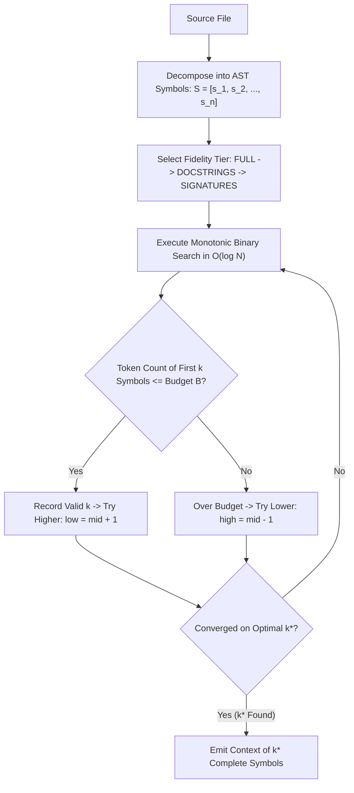

# Pattern: Binary Search AST Context Packing

> **Pattern Class**: Context Topology & Algorithmic Token Budgeting
> **Problem**: Packing multi-file AST context into a fixed token budget by trial and error is slow and truncates mid-block
> **Solution**: Monotonic binary search over the inclusion boundary, in O(log N) probes, cutting only at syntactic boundaries
> **Reference Implementation**: [`examples/binary-search-context-packer/`](../examples/binary-search-context-packer/)

---

## 1. Problem Statement

Autonomous agents exploring complex repositories must pack multi-file AST representations, symbol summaries, and source files into a strict token budget window $B$.

Naive approaches fail:
1. **Raw Line Truncation**: Slices code mid-statement or mid-block, producing invalid syntax trees that confuse downstream models into hallucinating compiler bugs.
2. **Greedy Whole-File Packing**: Strands up to 30% of the token budget when candidate files cannot fit in the remaining margin.
3. **Trial-and-Error Linear Scans**: Iterating symbol-by-symbol incurs $O(N)$ overhead, adding hundreds of milliseconds to turnaround time.

---

## 2. Core Mechanics

The pattern decomposes source files into discrete, top-level AST symbol units and uses a **monotonic binary search** across hierarchical fidelity tiers to pack the maximum number of complete symbols into budget $B$ in $O(\log N)$ evaluations:



### Operational Steps:
1. **AST Extraction**: Parse source into independent symbol blocks (functions, classes, imports) using `ast.parse()`.
2. **Multi-Tier Degradation**: Define renderers for each symbol across three tiers:
   - `FULL`: Complete source implementation.
   - `DOCSTRINGS`: Definition signature + docstring + `...`.
   - `SIGNATURES`: Definition signature + `...`.
3. **Monotonic Binary Search**: For a given tier, evaluate token weight at index $\text{mid} = \lfloor(\text{low} + \text{high}) / 2\rfloor$. If $\le B$, set $\text{best} = \text{mid}$ and explore higher; otherwise explore lower.
4. **Syntax Tree Verification**: Verify that the assembled output compiles cleanly via `ast.parse()`, guaranteeing zero broken syntax trees.

---

## 3. Implementation Example

```python
from context_packer import pack_source_to_budget

# Source code of candidate module
source_code = Path("src/orchestrator.py").read_text()
token_budget = 2000

# Packs source code to fit budget, degrading gracefully: FULL -> DOCSTRINGS -> SIGNATURES
rendered_context, tier, count = pack_source_to_budget(
    source_code,
    budget_tokens=token_budget,
)

# Rendered context is 100% syntactically valid Python
ast.parse(rendered_context)
print(f"Packed {count} symbols at {tier} fidelity ({len(rendered_context)} chars).")
```

---

## 4. Guardrails & Anti-Patterns

- ❌ **Anti-Pattern: Character Slicing (`text[:max_chars]`)**: Slicing raw strings splits multi-byte UTF-8 sequences and fractures code syntax.
- ❌ **Anti-Pattern: Dropping Imports**: Top-level imports provide vital context for type signatures. Ensure imports are prioritized and preserved during symbol slicing.
- ⚠️ **Guardrail: Guarantee Syntax Tree Integrity**: Always assert that the rendered context can be parsed by the language grammar (`ast.parse()` for Python, CST parsers for TypeScript/Rust) before injecting it into prompt templates.

---

## 5. Cross-References

- **Observation**: [`observations/devops-cli/14-binary-search-ast-context-packing-and-token-budgeting.md`](../observations/devops-cli/14-binary-search-ast-context-packing-and-token-budgeting.md)
- **Reference Implementation**: [`examples/binary-search-context-packer/`](../examples/binary-search-context-packer/)
- **Prompt Harness**: [`artifacts/prompts/architectural-invariant-sentinel.md`](../artifacts/prompts/architectural-invariant-sentinel.md)
