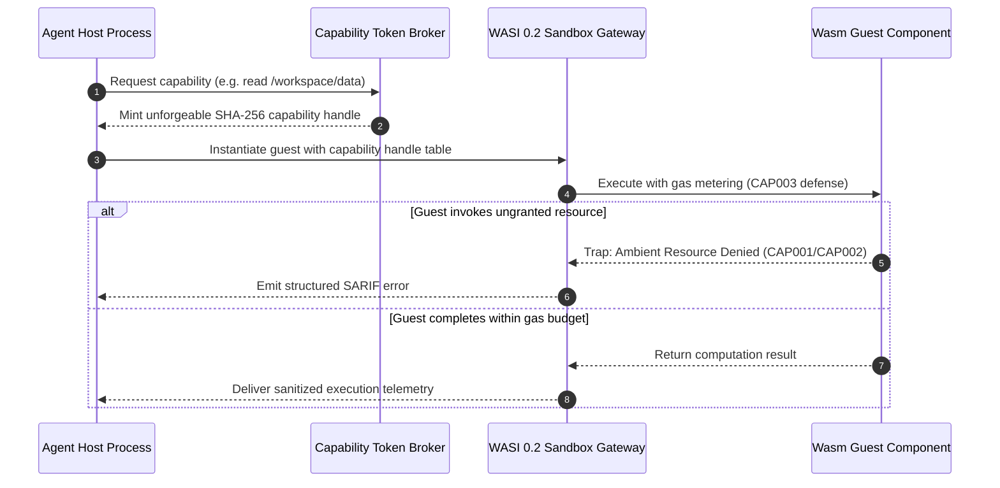

# Pattern: Capability-Based Wasm Sandboxing

> **Pattern Class**: Systems Architecture & Runtime Isolation  
> **Problem**: Ephemeral agent-generated tool execution suffers from ambient UNIX authority vulnerabilities (CWE-250) or excessive container cold-start latency (150ms–400ms)  
> **Solution**: Execute untrusted guest code inside WebAssembly components governed by unforgeable object-capability tokens, deterministic instruction gas budgets, and linear memory limits  
> **Reference Implementation**: [`examples/wasm-capability-sandbox/`](../examples/wasm-capability-sandbox/)

---

## 1. Problem Statement: The Sandboxing Dilemma

Autonomous AI agents generate ephemeral tools (format converters, AST transformers, data validators) during multi-step development tasks. Traditional execution approaches face a difficult tradeoff:

- **Ambient Execution**: Running tools directly on the host grants full ambient UNIX authority, exposing filesystems, environment credentials, and network sockets to unverified LLM-generated code.
- **Container Execution**: Spawning containers (`docker run`, cgroups) enforces security but incurs 150ms–400ms startup latency and 50MB+ RSS per run, stalling iterative feedback loops.

---

## 2. The Architectural Pattern: Object-Capability Perimeter

The **Capability-Based Wasm Sandboxing** pattern decouples code execution from host authority using the WebAssembly Component Model (WASI 0.2):

---

## 3. Core Principles

1. **Zero Ambient Authority**:
   - The guest module cannot access any filesystem path, network socket, or environment variable unless explicitly provided as an unforgeable capability handle.
2. **Deterministic Gas Metering**:
   - Every instruction decrements an instruction counter, deterministically neutralizing infinite loops and CPU exhaustion (CWE-400) without relying on asynchronous OS signals.
3. **Linear Memory Ceilings**:
   - Memory growth is strictly capped at page allocation boundaries (e.g., maximum 16 pages / 1 MiB), preventing memory exhaustion.
4. **Declarative WIT Contracts**:
   - WebAssembly Interface Type (`wit`) declarations explicitly define required imports and provided exports, verified prior to instantiation (`CAP005`).

---

## 4. Invariant Rules Summary

- **`CAP001`**: Ambient Filesystem Access Violation.
- **`CAP002`**: Ambient Network Egress Violation.
- **`CAP003`**: Gas Budget Exhaustion (Halting problem defense).
- **`CAP004`**: Linear Memory Ceiling Breach.
- **`CAP005`**: WIT Interface Contract Mismatch.
