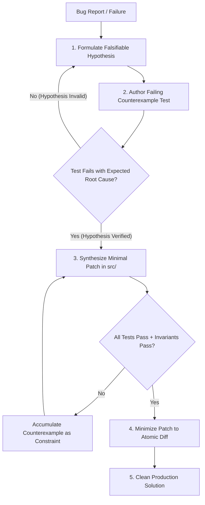

# Pattern: Counterexample-Guided Inductive Synthesis (CEGIS) & Hypothesis Debugging

> **Pattern Class**: Operational Debugging & Defect Remediation
> **Problem**: Faced with a defect, agents guess: they patch symptoms, mask errors, and cycle between fixes that each break the other
> **Solution**: Counterexample-guided synthesis with an accumulating constraint set, so a later patch cannot silently reintroduce an earlier bug
> **Reference Implementation**: [`examples/cegis-debugging-workbench/`](../examples/cegis-debugging-workbench/)

---

## 1. Problem Statement

When an AI agent is presented with a complex bug or regression, the standard default behavior is to guess:
1. The agent reads the error message.
2. It immediately hallucinates a superficial tweak in the source code.
3. If the tweak fails, it generates another guess, wandering through the solution space and making the code worse.

This single-shot trial-and-error approach results in **patch churn, symptom masking, and broken invariants**.

---

## 2. Core Mechanics

The CEGIS pattern transforms debugging from stochastic guessing into a **formal, converging constraint satisfaction loop**:



### The 4 Phases of CEGIS Debugging

#### Phase 1: Falsifiable Hypothesis Formulation
Before modifying any code, the agent must write down a clear, falsifiable hypothesis:
- *"The crash occurs because function `parse_manifest` assumes key `spec.replicas` is always an integer, but Helm templates can emit it as a string."*

#### Phase 2: Authoring the Negative Constraint (Counterexample Test)
The agent translates the hypothesis into an executable unit test that fails in the exact manner predicted:
- The test proves the defect exists and reproduces it deterministically.
- If the test passes immediately, the hypothesis is false and must be discarded.

#### Phase 3: Minimal Patch Synthesis
The agent writes the minimal source code change necessary to satisfy the counterexample test without breaking existing assertions.

#### Phase 4: Patch Minimization & Invariant Gate
The agent audits the resulting diff:
- Removes debug statements and superfluous variables.
- Verifies that cyclomatic complexity remains $\le 10$ and nesting $\le 5$.
- Verifies that 100% of the test suite passes with zero warnings.

---

## 3. Implementation Example

### Step 1: Counterexample Test (`tests/test_parser.py`)
```python
def test_parse_manifest_string_replicas_counterexample():
    """CEGIS Counterexample: Verify parser tolerates string-encoded replica counts."""
    raw_yaml = "spec:\n  replicas: '3'\n"
    manifest = parse_manifest(raw_yaml)
    assert manifest.replicas == 3
```

### Step 2: Minimal Synthesized Patch (`src/devops_cli/parser.py`)
```python
# Before
replicas = manifest_dict["spec"]["replicas"]

# After (minimal, type-safe conversion)
replicas = int(manifest_dict["spec"]["replicas"])
```

---

## 4. Guardrails & Anti-Patterns

| Anti-Pattern | Why It Fails | CEGIS Guardrail |
|---|---|---|
| **Symptom Masking** | Adding a `try/except Exception: pass` block around the failing line. | Strictly forbidden. The root cause must be fixed at the source. |
| **Guessing Without a Test** | Changing source code before reproducing the bug. | Hard requirement: author the counterexample test first. |
| **Monolithic Refactoring** | Rewriting an entire module to fix a localized edge case. | Enforce patch minimization; keep diffs atomic and focused. |

---

## 5. Cross-References
- [Observation 01: TDD as Living Contract](../observations/devops-cli/01-tdd-as-living-contract.md)
- [Observation 02: Architectural Invariants & Complexity Caps](../observations/devops-cli/02-architectural-invariants-and-complexity-caps.md)
- [Pattern: Root-Cause Hardening](./root-cause-hardening.md)
