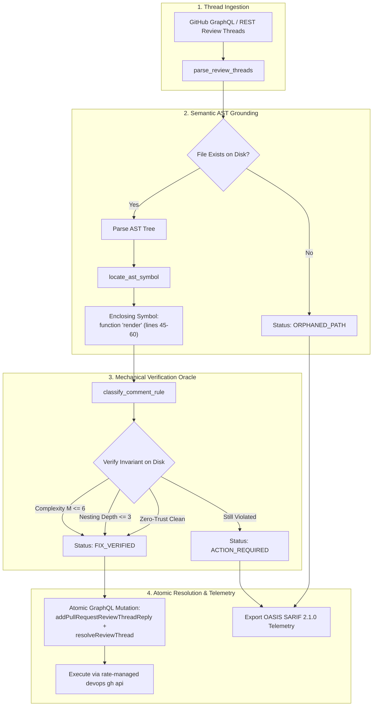

# Pattern: Closed-Loop PR Review Thread Synchronization — AST-Anchored Feedback Remediation & Atomic Resolution

> **Pattern Class**: Agent Orchestration & Review Lifecycle  
> **Problem**: Autonomous agents often push valid code fixes but fail to resolve GitHub PR review threads, get misled by drifting line coordinates, or hallucinate thread resolutions without verifying that the defect is fixed on disk.  
> **Solution**: Anchor review threads to semantic AST symbols rather than brittle line numbers, verify remediations against mechanical invariant oracles, and execute atomic reply-and-resolve GraphQL mutations with SARIF telemetry.  
> **Reference Implementation**: [`tools/pr_thread_sync.py`](../tools/pr_thread_sync.py) — `synchronize_threads`, `verify_thread_resolution`, `locate_ast_symbol`, `generate_resolution_mutation`  
> **TLDR**: Ground PR review comments in AST symbols, mechanically verify that the defect is cured on disk, and atomically resolve threads via GraphQL mutations.  
> **ELI:7b**: Line numbers change whenever you add code, confusing AI helpers. By attaching comments to the function name, checking that the bug is really gone, and answering the reviewer automatically, the robot keeps your PR clean and ready to merge.  

---

## Problem Statement

Continuous integration and automated review personas post granular review comments on GitHub Pull Requests to flag complexity violations, deep nesting, missing documentation, or security leaks. Under enterprise GitHub Branch Protection policies, pull requests require that all conversation threads be marked resolved before merging into `main`.

However, autonomous engineering agents encounter three critical failure modes during PR iteration:

1. **Review Thread Amnesia**: Agents address the core feedback in source code, commit, and push, but abandon the PR review threads in an unresolved state on GitHub. This leaves the PR blocked by branch protection, demanding manual human intervention.
2. **Ephemeral Line Drift**: Review comments are anchored to diff line numbers at the moment of review. As the agent refactors the file, earlier lines are added or removed, causing line coordinates to drift. When querying the file at the original line number, the agent inspects unrelated code, producing false positives or damaging unrelated statements.
3. **Ghost Resolutions**: When prompted to resolve open threads, agents frequently call GraphQL resolution mutations based purely on conversational intent without verifying whether the underlying code defect was actually repaired or if a regression was introduced.

---

## Core Mechanics

The **Closed-Loop PR Review Thread Synchronization** pattern replaces naive line-based inspection and unverified conversation closing with a deterministic four-phase verification pipeline:



### The Four Operational Phases

1. **Payload Ingestion & Normalization**:
   - `parse_review_threads` deserializes review thread trees from either GitHub GraphQL API v4 (`data.repository.pullRequest.reviewThreads.nodes`) or REST JSON exports.
   - Extracts thread IDs, resolution states, target relative file paths, and chronological comment bodies.

2. **Semantic AST Grounding**:
   - Rather than assuming the comment line remains valid, `locate_ast_symbol` loads the target file from the active branch and traverses the abstract syntax tree (`ast.walk`).
   - Identifies the enclosing function, method, or class declaration spanning the line coordinate.
   - Converts brittle numeric coordinates into durable semantic coordinates (e.g. `function 'calculate_scores' (lines 40-58)`).

3. **Mechanical Verification Oracles**:
   - `classify_comment_rule` parses review comments against invariant rules (`CC001`, `ND001`, `SEC001`, `DOC001`, `TYP001`).
   - Directly executes the relevant deterministic checker against the file on disk:
     - Recomputes cyclomatic complexity via `compute_ast_complexity`.
     - Measures indentation depth.
     - Scans for RFC 1918 private IP leaks (`_RFC1918_PATTERN`).
   - Computes explicit resolution state: `FIX_VERIFIED`, `ACTION_REQUIRED`, `RESOLVED`, or `ORPHANED_PATH`.

4. **Atomic Resolution & Standardized Telemetry**:
   - For all `FIX_VERIFIED` threads, `generate_resolution_mutation` constructs a single atomic GraphQL mutation combining reply publication and thread resolution.
   - `export_sarif` serializes findings into OASIS SARIF 2.1.0 format, linking review thread IDs, rule IDs, file paths, and resolution statuses for CI ingestion.

---

## Implementation Reference

The pattern is implemented in [`tools/pr_thread_sync.py`](../tools/pr_thread_sync.py):

```python
# Atomic resolution query generation
def generate_resolution_mutation(thread_id: str, reply_body: str) -> str:
    """Synthesizes a GraphQL mutation query to reply to and resolve a review thread."""
    sanitized_body = json.dumps(reply_body)
    return (
        f'mutation {{ addPullRequestReviewThreadReply(input: {{ pullRequestReviewThreadId: "{thread_id}", body: {sanitized_body} }}) '
        f'{{ comment {{ id }} }} resolveReviewThread(input: {{ threadId: "{thread_id}" }}) {{ thread {{ isResolved }} }} }}'
    )
```

CLI execution modes:
```bash
# Audit and summarize active review threads
python3 tools/pr_thread_sync.py --input threads.json --root .

# Export OASIS SARIF 2.1.0 telemetry for CI dashboards
python3 tools/pr_thread_sync.py --input threads.json --sarif threads.sarif

# Emit executable GraphQL mutations for verified threads
python3 tools/pr_thread_sync.py --input threads.json --resolve-verified

# Enforce clean PR gate (exit 1 if ACTION_REQUIRED threads remain)
python3 tools/pr_thread_sync.py --input threads.json --exit-code
```

---

## Invariants & Guardrails

1. **Zero Unverified Resolutions**: Never mark a thread resolved based solely on conversational LLM intent. Pre-flight AST or lint verification against active disk state is strictly mandatory.
2. **Atomic Single-Transaction Mutations**: Never separate reply generation from thread resolution. Both operations must occur in a single GraphQL mutation to guarantee atomic consistency.
3. **AST Grounding Over Line Numbers**: Always translate diff line numbers to semantic symbol descriptors to survive file refactorings and line insertions.
4. **Standard Telemetry Output**: Always emit SARIF 2.1.0 payloads to maintain unified dashboard visibility across static analysis tools, review bots, and thread synchronizers.
