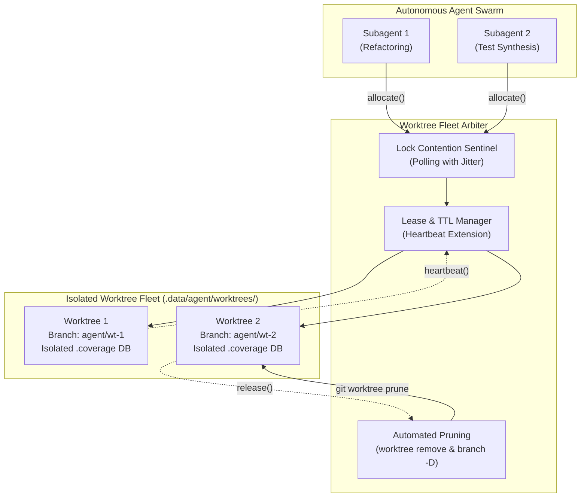

# Pattern: Collision-Free Worktree Fleet Allocation

> **Pattern Class**: Multi-Agent Concurrency & Workspace Arbitration
> **Problem**: Parallel subagents collide on .git/index.lock, dirty shared trees, and leave orphaned checkouts on disk
> **Solution**: Ephemeral leased worktrees with bounded TTL, jittered lock polling, POSIX process group containment, and automated stale pruning
> **Reference Implementation**: [`examples/worktree-swarm-arbiter/`](../examples/worktree-swarm-arbiter/)  

---

## 1. Problem Statement & Concurrency Hazards

When multiple autonomous agents or subagent worker threads execute concurrently on a single repository workspace, shared filesystem state causes immediate operational breakdown:

1. **Git Index Lock Contention (`.git/index.lock`)**:
   Git operations that mutate repository references lock the index exclusively. If Agent A runs `git add` while Agent B runs `git commit`, one agent encounters a fatal exit code (`fatal: Unable to create '.git/index.lock': File exists`).
2. **Intermediate Dirty State Collisions**:
   Subagents executing refactoring tasks modify files in place before running test verification. If two subagents touch the same repository root, their partial edits interleave, causing false test failures and syntax corruption.
3. **Database & Artifact Race Conditions**:
   Test tooling (such as `pytest-cov` writing to `.coverage` SQLite databases, or local L2 caches) expects exclusive filesystem ownership. Concurrent execution results in unlinked database locks and malformed coverage reports.
4. **Zombie Worktree Accumulation**:
   When a subagent exhausts its token budget or crashes, unmanaged `git worktree` checkouts remain on disk, consuming storage and locking temporary branches indefinitely.

---

## 2. The Architectural Pattern

The **Collision-Free Worktree Fleet Allocation** pattern eliminates shared-state hazards by establishing **ephemeral, leased spatial sandboxes** for every subagent task.

---

## 3. Core Operational Mechanisms

### 3.1 Bounded Leases and Heartbeat Renewal
Every allocated worktree carries a cryptographically unique or timestamped identifier and a strictly bounded Time-To-Live (TTL):
- **Default TTL**: Standard allocations expire after 1 hour (3600s).
- **Heartbeat Protocol**: Active workers periodically emit heartbeat pings (`refresh_lease_heartbeat`), extending their lease deadline while actively making progress.
- **Stale Pruning**: The arbiter periodically audits all registered leases; checkouts that exceed their TTL without a heartbeat are automatically torn down (`git worktree remove --force` and `git worktree prune`).

### 3.2 POSIX Process Group Containment
Subagents executing external tasks inside a worktree must run within an isolated POSIX process group (`start_new_session=True`).
- When a lease is released or expired, the arbiter sends `signal.SIGTERM` to the entire process group (`os.killpg(pgid, signal.SIGTERM)`), ensuring that spawned subshells, linters, or test workers do not survive as zombie processes.

### 3.3 Jittered Index Lock Backoff
Before executing git commands that modify worktree state (`git worktree add`, `git worktree remove`), the arbiter polls `.git/index.lock` with bounded exponential backoff and jitter, preventing catastrophic lock-contention cascades across agent swarms.

---

## 4. Key Takeaways for Agentic Systems

1. **Spatial Isolation Over Lock Contention**: Never allow parallel agents to write to the same working directory. Give each agent an isolated `git worktree` checkout.
2. **Lease All Resources with Bounded TTL**: Unbounded workspaces become permanent disk leaks. Every checkout must have an explicit expiration time.
3. **Isolate Test and Cache Artifacts**: Ensure subagents configure isolated `.coverage` paths and build artifact directories within their allocated worktrees.
