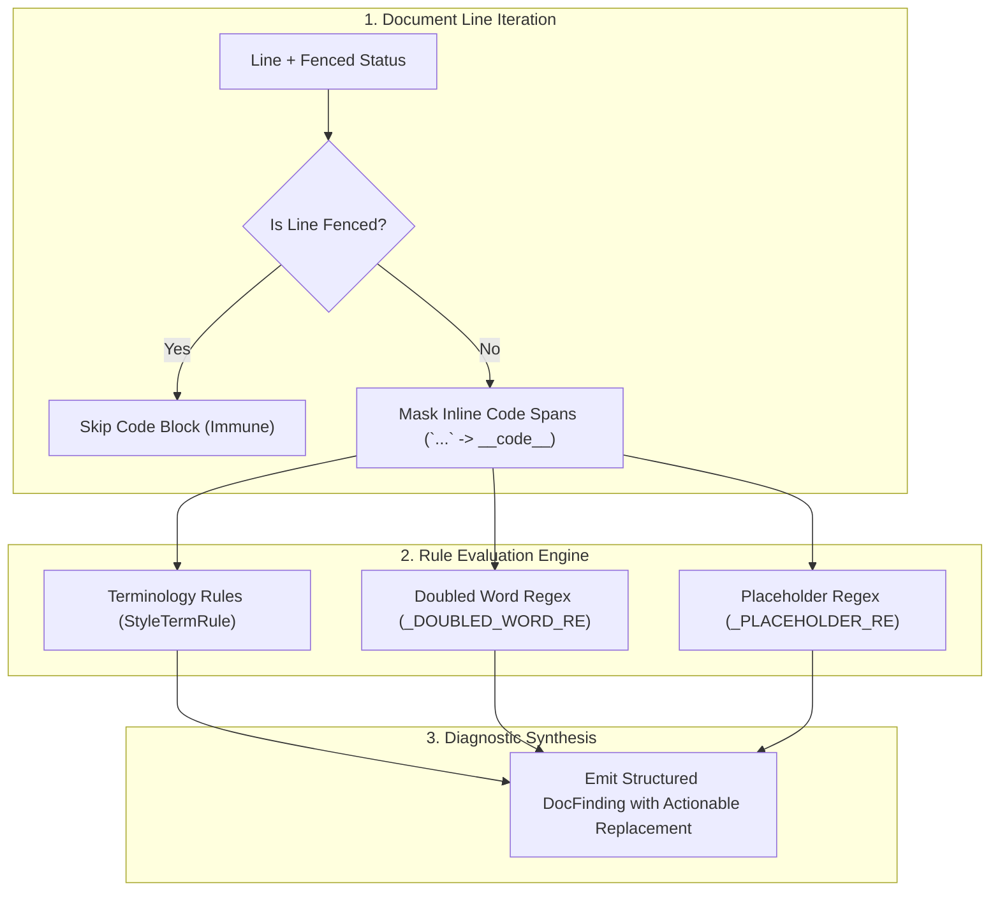

# Pattern: Configurable Prose Style and Terminology Gates

> **Pattern Class**: Living Documentation Architecture & Quality Gates  
> **Problem**: Technical documentation silently accumulates non-inclusive terminology, duplicated words, and unresolved development placeholders when linter suites verify only markdown syntax without auditing prose  
> **Solution**: Extract and audit natural language prose across canonical style guides (Google, Microsoft) while insulating code spans and fenced blocks via neutral placeholder tokenization  
> **Reference Implementation**: [`tools/doc_rules_style.py`](../tools/doc_rules_style.py)

---

## 1. Problem Statement: Unchecked Prose and Terminology Drift

While automated documentation linters verify CommonMark syntax, link validity, and table formatting, they treat natural language text as an uninspected payload. In long-lived engineering repositories and autonomous agent workflows, this results in three distinct defect patterns:

1. **Deprecated and Non-Inclusive Vocabulary**: Legacy terms such as `blacklist`, `whitelist`, `master-slave`, and `sanity check` proliferate across specifications and changelogs.
2. **Drafting Collisions**: Repetitive word duplications (`the the`, `in in`) slip past spell checkers.
3. **Drafting Residue**: Unresolved markers (`TODO`, `FIXME`, `TBD`, `LOREM IPSUM`) leak into production documentation.

Existing standalone style linters (like Vale) require external Go binaries and separate configuration trees. Conversely, naive in-repo regular expressions flag code identifiers (`--whitelist`, `master_replica_map`), causing false positive fatigue.

---

## 2. The Architectural Pattern: Structured Prose Tokenization

The **Configurable Prose Style and Terminology Gate** isolates prose text from code syntax before evaluation. It leverages CommonMark block parsing to ignore code fences and substitutes inline backticked code spans with neutral symbol placeholders (`__code__`):



---

## 3. Implementation Contracts

### 3.1 Masking Inline Code Without Token Collisions

Naive regex replacements substituting empty space (`" "`) for inline code destroy token adjacency, causing words separated by code spans (`and `sym` and`) to artificially collide into false doubled-word errors. The implementation contract requires replacing code spans with a non-matching placeholder token:

```python
_INLINE_CODE_SPAN_RE: Final[re.Pattern[str]] = re.compile(r"`[^`]*`")

def _strip_inline_code(line: str) -> str:
    """Remove inline backtick code spans, preserving lexical separation."""
    return _INLINE_CODE_SPAN_RE.sub(" __code__ ", line)
```

### 3.2 Canonical Terminology Rule Definition

Terminology rules are declared as immutable frozen dataclasses referencing the authoritative style guide:

```python
@dataclass(frozen=True)
class StyleTermRule:
    pattern: re.Pattern[str]
    replacement: str
    guide: str
    severity: str = "error"

STYLE_TERMINOLOGY_RULES: Final[tuple[StyleTermRule, ...]] = (
    StyleTermRule(
        pattern=re.compile(r"\bblacklist(?:ed|ing|s)?\b", re.IGNORECASE),
        replacement="blocklist / denylist",
        guide="Google/Microsoft Developer Style Guide",
    ),
    StyleTermRule(
        pattern=re.compile(r"\bwhitelist(?:ed|ing|s)?\b", re.IGNORECASE),
        replacement="allowlist",
        guide="Google/Microsoft Developer Style Guide",
    ),
    StyleTermRule(
        pattern=re.compile(r"\bmaster[-/]slave\b", re.IGNORECASE),
        replacement="primary/replica or main/worker",
        guide="Google/Microsoft Developer Style Guide",
    ),
    StyleTermRule(
        pattern=re.compile(r"\bsanity[- ]check(?:ed|ing|s)?\b", re.IGNORECASE),
        replacement="coherence check or validity check",
        guide="Google/Microsoft Developer Style Guide",
    ),
)
```

---

## 4. Verification & Operational Guidelines

1. **Preset Integration**: Ensure the prose style rule is registered in calibrated presets (e.g. `style_only`, `standard`, `strict`) so it runs automatically in CI.
2. **Deterministic Remediation**: Diagnostics must include the exact replacement and style guide link, allowing automated autofix or immediate developer remediation.
3. **Zero False Positives on Code**: All backtick spans (` `...` `) and fenced blocks must be strictly immune from prose terminology rejections.
