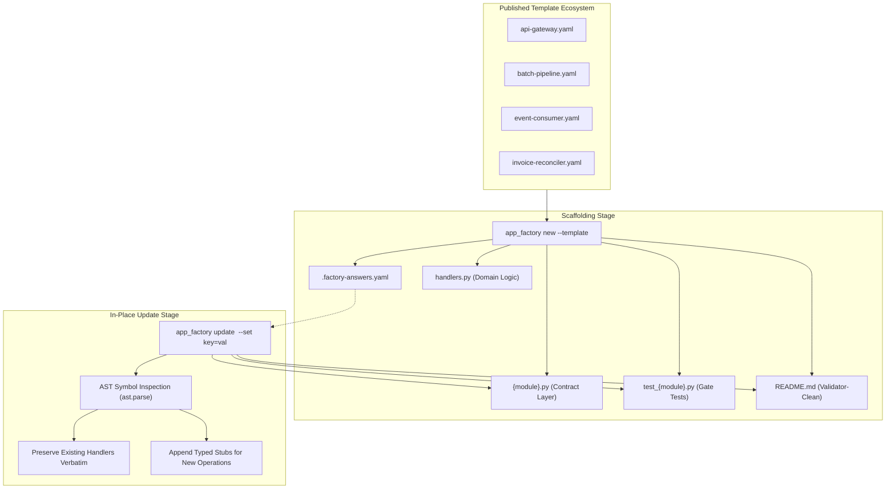

# Pattern: Contract Template Ecosystem and In-Place Updates

> **Pattern Class**: Application Architecture & Lifecycle Scaffolding  
> **Problem**: Scaffolding generators treat applications as fire-and-forget outputs, clobbering hand-written code upon regeneration and allowing schemas, dispatch tables, and tests to drift out of sync over time  
> **Solution**: Maintain a published library of standard architectural contracts paired with an AST-reconciled in-place update engine that refreshes the contract layer, replays recorded variable answers, preserves domain logic, and appends typed stubs for newly declared operations  
> **TLDR**: Decouple contract boundary definitions from hand-written business logic via AST reconciliation, enabling in-place application updates without destruction.
> **ELI:7b**: Update generated project scaffolding and API templates without overwriting the custom code you or the AI already wrote.
> **Reference Implementation**: [`tools/app_factory.py`](../tools/app_factory.py)

---

## 1. Problem Statement: The Scaffolding Lifecycle Chasm

Most software generators (`cookiecutter`, `yeoman`) focus exclusively on initial creation. Once files are written to disk, the generation lifecycle ends:

1. **Destructive Regeneration**: Re-running a template generator destroys hand-written domain logic and custom integrations.
2. **Schema & Dispatch Drift**: When an upstream specification evolves (such as adding an endpoint or modifying argument constraints), developers must manually synchronize JSON Schemas, CLI argument parsers, dispatch mappings, and test assertions.
3. **Ad-Hoc Contract Sprawl**: Lacking a curated, gate-compliant template ecosystem, developers invent ad-hoc schemas that frequently breach architectural complexity and nesting bounds.

---

## 2. The Architectural Pattern: In-Place Contract Evolution

The **Contract Template Ecosystem and In-Place Updates Pattern** decouples the volatile application contract layer from the durable domain implementation, utilizing AST parsing to reconcile changes safely:



---

## 3. Implementation Contracts

### 3.1 Template Discovery and Ecosystem Catalog

Published contracts are discovered dynamically via filesystem traversal, mapping both slug and filename stems to validated contract definitions:

```python
def discover_templates(directory: Path | None = None) -> dict[str, Path]:
    """Scan the template directory for published contract YAML files."""
    base = directory or DEFAULT_TEMPLATES_DIR
    if not base.is_dir():
        return {}
    templates: dict[str, Path] = {}
    for entry in sorted(base.glob("*.yaml")) + sorted(base.glob("*.yml")):
        templates[entry.stem] = entry
        _index_template_slug(entry, templates)
    return templates
```

### 3.2 AST Reconciliation for Domain Logic Preservation

Rather than diffing raw text lines, the update engine inspects `handlers.py` using Python's standard `ast` module. Existing top-level function names are collected and compared against declared operations in the updated contract:

```python
def _declared_handler_names(handlers_path: Path) -> set[str]:
    """Extract top-level function names from an existing handlers module."""
    try:
        tree = ast.parse(handlers_path.read_text(encoding="utf-8"), filename=str(handlers_path))
    except (SyntaxError, OSError):
        return set()
    return {
        node.name
        for node in tree.body
        if isinstance(node, (ast.FunctionDef, ast.AsyncFunctionDef))
    }
```

### 3.3 Targeted Operation Stub Synthesis

When an updated contract declares operations not present in `handlers.py`, typed stubs are synthesized and appended:

```python
def _reconcile_handlers(handlers_path: Path, contract: Contract, result: Generated) -> None:
    """Preserve existing handler implementations, appending stubs for new operations."""
    if not handlers_path.exists():
        handlers_path.write_text(emit_handlers(contract), encoding="utf-8")
        result.written.append(handlers_path)
        return

    existing_funcs = _declared_handler_names(handlers_path)
    missing_ops = [op for op in contract.operations if op.name not in existing_funcs]
    if missing_ops:
        current_content = handlers_path.read_text(encoding="utf-8").rstrip()
        stubs = "\n\n" + "\n\n".join(emit_handler_stub(op) for op in missing_ops)
        handlers_path.write_text(current_content + stubs + "\n", encoding="utf-8")
        result.appended.append(handlers_path)
    else:
        result.preserved.append(handlers_path)
```

---

## 4. Consequences and Invariants

- **Non-Destructive Evolution**: Handlers authored by developers are never overwritten; only newly introduced operations receive fresh stubs.
- **Immediate Gate Compliance**: Regenerated contract files (`{module}.py`, `test_{module}.py`, `README.md`) pass AST invariant ceilings, ruff, mypy, and doc validators unedited.
- **Zero-Drift Boundary**: The JSON Schema, CLI argument parser, and test assertions are regenerated from a single source of truth, eliminating silent interface divergence.
