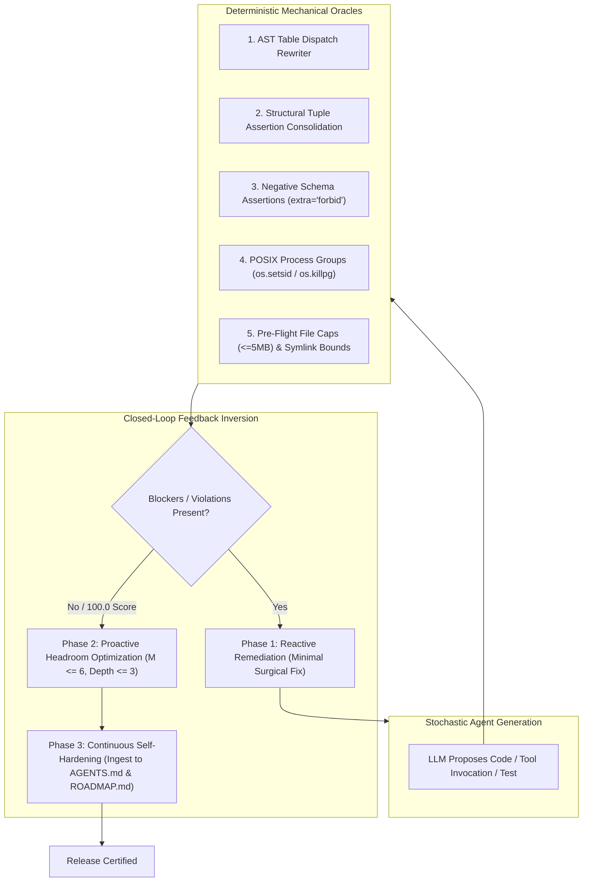

# Pattern: Deterministic Mechanical Oracles & Closed-Loop Feedback Inversion

> **Pattern Type**: Meta-Cognitive Architecture & Deterministic Quality Enforcement  
> **Target Audience**: AI Agents, System Prompt Engineers & Autonomous Tooling Designers  
> **Source Projects**: [`devops-cli`](https://github.com/dan-petty/devops-cli) & [`vibes`](https://github.com/dan-petty/vibes)  

---

## 1. Problem Statement

Autonomous AI coding assistants operate via probabilistic next-token generation. When left unconstrained or guided solely by natural language instructions, agents predictably succumb to **five recurring cognitive pitfalls**:

1. **The AST `elif` Nesting Illusion**: Assuming a flat visual `if/elif` ladder is flat in AST representation, inadvertently creating deep recursive AST nesting ($depth > 8$) that breaches architectural limits.
2. **Linear Assertion Complexity Sprawl**: Writing sequential `assert` statements in unit tests without realizing each assert increments McCabe cyclomatic complexity ($M+1$), tripping $M \le 10$ quality gates on linear test code.
3. **Permissive Tool Schema Hallucination**: Permissive JSON schemas (`additionalProperties: true`) silently accept hallucinated tool parameters, causing silent logical errors or cyclic retry loops.
4. **Process Tree Orphan Escapes**: Terminating subprocesses with simple `proc.kill()` leaves child subshells and grandchild workers running as zombie background leaks adopted by PID 1.
5. **Minified Polyglot Bundles & Symlink Recursion**: Unbounded filesystem ingestion chokes on 25MB minified JavaScript/CSS bundles or enters infinite loops on circular directory symlinks (`ELOOP`).

Prompt engineering alone cannot solve these problems. Stochastic tokens must be bound by **deterministic mechanical oracles**. Furthermore, once blockers are resolved, agents must not stall; they must proactively invert their focus from reactive defect remediation to proactive architectural headroom elevation.

---

## 2. Core Mechanics



### The 5 Deterministic Mechanical Oracles

1. **Table-Driven Dictionary Dispatch**: Decomposes `if/elif` equality ladders into module-level constant dictionaries (`_<FN>_DISPATCH.get(key, fallback)`), collapsing cyclomatic complexity from $M \ge 8$ to $M = 1$ and nesting depth from $8$ to $1$.
2. **Structural Tuple Equality Consolidation**: Replaces 10 sequential scalar assertions with a single structural tuple comparison (`assert (a, b, c) == (x, y, z)`), collapsing decision branches from $M = 11$ to $M = 1$ while fully preserving Pytest element-level diff diagnostics.
3. **Negative Schema Assertions & Prescriptive Prompts**: Configures tool schemas with strict parameter boundaries (`additionalProperties: false` or Pydantic v2 `extra="forbid"`). On violation, the oracle synthesizes prescriptive error feedback detailing allowable parameters for deterministic zero-shot self-correction.
4. **POSIX Process Group Containment**: Spawns untrusted subprocesses with `start_new_session=True` (avoiding `preexec_fn=os.setsid` fork-deadlocks in multithreaded runtimes) and terminates the entire tree via `os.killpg(os.getpgid(proc.pid), signal.SIGTERM/SIGKILL)`, eliminating orphaned grandchild processes.
5. **Pre-Flight File Size Caps & Defensive Symlink Verification**: Enforces an $O(1)$ size guard (`MAX_FILE_SIZE_BYTES = 5MB`) before reading file buffers and verifies `path.resolve().is_relative_to(base_root)` to reject circular symlinks and workspace traversal escapes.

### The Feedback Inversion Dynamic

When an automated feedback engine monitors an autonomous agent:
- **Phase 1 (Reactive Remediation)**: If any tests fail or invariant gates trigger, the agent is restricted to minimal, surgical defect correction.
- **Phase 2 (Proactive Quality Elevation)**: As soon as the health score reaches 100.0/100, the feedback loop dynamically inverts:
  - Identifies functions operating near the ceiling ($7 \le M \le 10$) and refactors them to safe headroom ($M \le 6$).
  - Scans for missing public docstrings or unannotated function parameters and elevates coverage to 100%.
  - Optimizes test execution latency (sub-second target).
- **Phase 3 (Continuous Self-Hardening)**: Every struggle, cognitive trap, or architectural friction point is immediately ingested into [`docs/ROADMAP.md`](../docs/ROADMAP.md) and codified as a permanent guardrail in [`AGENTS.md`](../AGENTS.md).

---

## 3. Implementation Examples

### Example 1: Structural Tuple Assertion Consolidation
Instead of linear assertion sprawl that breaches McCabe complexity:
```python
# Anti-Pattern: Linear assertion sprawl (Cyclomatic Complexity M = 7)
def test_user_profile():
    profile = build_profile("alice")
    assert profile.username == "alice"
    assert profile.role == "admin"
    assert profile.is_active is True
    assert profile.quota_gb == 100
    assert profile.tier == "enterprise"
    assert profile.egress_policy == "restricted"

# Deterministic Pattern: Structural tuple equality (Cyclomatic Complexity M = 1)
def test_user_profile_consolidated():
    profile = build_profile("alice")
    actual = (profile.username, profile.role, profile.is_active, profile.quota_gb, profile.tier, profile.egress_policy)
    expected = ("alice", "admin", True, 100, "enterprise", "restricted")
    assert actual == expected
```

### Example 2: POSIX Process Group Containment
Safely terminating a spawned process hierarchy:
```python
import os
import signal
import subprocess

def run_isolated_command(cmd: list[str], timeout_s: float = 10.0) -> str:
    """Executes a subprocess in an isolated process group to prevent orphan leaks."""
    proc = subprocess.Popen(
        cmd,
        stdout=subprocess.PIPE,
        stderr=subprocess.PIPE,
        text=True,
        start_new_session=True,  # Create a new POSIX session and process group (fork-safe)
    )
    try:
        stdout, _ = proc.communicate(timeout=timeout_s)
        return stdout
    except subprocess.TimeoutExpired:
        # Kill the entire process group, including any spawned subshells/workers
        os.killpg(os.getpgid(proc.pid), signal.SIGKILL)
        proc.communicate()
        raise
```

---

## 4. Guardrails & Anti-Patterns

| Anti-Pattern | Operational Risk | Deterministic Countermeasure |
|---|---|---|
| **Prompt-Only Invariants** | Relying on system prompts to keep functions simple. LLMs drift under context noise. | Enforce AST complexity ($M \le 10$) and nesting ($\le 5$) via mechanical pre-push gates. |
| **Operating at the Ceiling** | Leaving functions at $M = 9$ or $10$. Any future 1-line edit breaks CI. | Enforce proactive headroom optimization to $M \le 6$ during Phase 2. |
| **Loose Tool Schemas** | Permissive schemas (`additionalProperties: true`) allow hallucinated tool args. | Enforce `extra="forbid"` and synthesize prescriptive error prompts. |
| **Simple `proc.kill()`** | Leaves grandchild workers running indefinitely on host nodes. | Enforce `start_new_session=True` and `os.killpg(pgid, SIGKILL)`. |
| **Unbounded File Ingestion** | Ingesting minified bundles crashes agent tools with OOM (CWE-400). | Enforce pre-flight `st_size <= 5MB` check before reading into memory. |

---

## 5. Cross-References

- [Retrospective Analysis: The Dynamics of Autonomous Agentic Engineering](../docs/RETROSPECTIVE.md)
- [Observation 07: Proactive Headroom & Recursive Feedback Loops](../observations/devops-cli/07-proactive-headroom-and-recursive-feedback-loops.md)
- [Observation 08: Closed-Loop Feedback Inversion](../observations/devops-cli/08-closed-loop-feedback-inversion-and-autonomous-quality-elevation.md)
- [Observation 11: Assertion Density & Structural Tuple Consolidation](../observations/devops-cli/11-assertion-density-and-structural-tuple-consolidation.md)
- [Observation 12: Polyglot CST Boundary Guards & Symlink Containment](../observations/devops-cli/12-polyglot-cst-boundary-guards-and-symlink-containment.md)
- [Pattern: Root-Cause Remediation & Instruction Hardening](./root-cause-hardening.md)
- [Canonical Agent Operating Instructions](../AGENTS.md)
