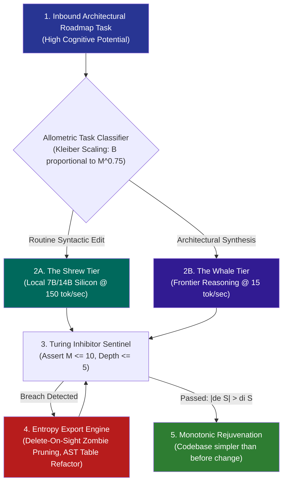

# Pattern: Dissipative Entropy Reduction & Allometric Swarm Routing — Ecological Cybernetics for Autonomous Systems

> **Pattern Class**: Non-Equilibrium Architecture & Swarm Metabolism  
> **Problem**: Naive agent swarms either suffer from architectural heat death (monotonically accumulating complexity) or burn unsustainable token capital by assigning frontier models to trivial syntactic tasks  
> **Solution**: An ecological architecture combining non-equilibrium entropy export (continuous AST compaction and zero-zombie code pruning), Turing activator-inhibitor gates, and Kleiber allometric model routing  
> **Reference Implementation**: [`examples/fastmcp-token-bucket-gateway/gateway.py`](../examples/fastmcp-token-bucket-gateway/gateway.py), [`examples/ast-invariant-sentinel/sentinel.py`](../examples/ast-invariant-sentinel/sentinel.py), [`tools/portfolio_balance.py`](../tools/portfolio_balance.py)

---

## 1. Problem Statement

Autonomous software engineering systems face two thermodynamic failure modes:
1. **Architectural Heat Death (Lehman’s Curse)**: Every added feature introduces edge-case branching and procedural loops. Without active entropy export, cyclomatic complexity $M$ and nesting depth ratchet upward until the codebase becomes unmaintainable.
2. **Allometric Metabolic Starvation**: Deploying high-mass frontier reasoning models to perform mechanical syntax edits, file searches, and lint checks incurs unsustainable token costs (\$20–\$50/hour) and introduces high-latency bottlenecks.

---

## 2. Core Mechanics

This pattern models software engineering as an open, non-equilibrium dissipative ecosystem:



### The Three Ecological Pillars:

### 1. The Non-Equilibrium Entropy Pump ($|d_e S| > d_i S$)
* Total entropy reduction is achieved by making the **Delete-On-Sight rule** a mandatory pre-commit invariant.
* When an agent refactors an abstraction, all obsolete shims, legacy fallbacks, and commented-out code must be pruned in the exact same commit.
* Code bloat is treated as metabolic waste, automatically compacted back to baseline.

### 2. Allometric Shrew-Whale Swarm Partitioning
* Model capabilities are partitioned according to Kleiber’s Law:
  - **The Shrew Tier (Local Silicon / 7B/14B)**: Fast, high-tempo, zero-cost reflexes handling single-line fixes, AST checks, docstrings, and formatting.
  - **The Whale Tier (Frontier Models)**: High-altitude, slow, expensive cognitive mass handling strategic telos, complex schema reconciliation, and architectural trade-offs.

### 3. Turing Reaction-Diffusion Gates
* The generative model acts as the **Activator**, driving feature expansion.
* The AST Invariant Sentinel acts as the **Inhibitor**, diffusing across the repository to suppress complexity sprawl.
* The balanced opposition produces clean, modular, self-differentiating packages.

---

## 3. Implementation Blueprint

### Step 1: Allometric Model Routing (`examples/fastmcp-token-bucket-gateway/gateway.py`)

```python
from enum import Enum

class TaskMetabolism(Enum):
    SHREW = "local_quantized_fast"    # 150 tok/sec, $0 cost
    WHALE = "frontier_reasoning_deep" # 15 tok/sec, high leverage

def route_task(task_type: str, cyclomatic_complexity: int) -> TaskMetabolism:
    """Match cognitive mass to task tempo using allometric scaling."""
    if task_type in ("lint_fix", "ast_scan", "docstring", "formatting"):
        return TaskMetabolism.SHREW
    if cyclomatic_complexity > 8 or task_type in ("architectural_refactor", "taxonomy"):
        return TaskMetabolism.WHALE
    return TaskMetabolism.SHREW
```

### Step 2: Non-Equilibrium Entropy Export via Pre-Commit Gate

```python
def assert_zero_zombie_sediment(repo_path: Path) -> None:
    """Verify that no deprecated shims or vestigial fallbacks survive."""
    for py_file in repo_path.rglob("*.py"):
        text = py_file.read_text(encoding="utf-8")
        assert "# TODO: remove" not in text, f"Unexported entropy in {py_file}"
        assert "warnings.warn(" not in text, f"Legacy shim detected in {py_file}: delete on sight"
```

---

## 4. Guardrails & Anti-Patterns

| Anti-Pattern | Thermodynamic Failure | Ecological Analogy | Corrective Action |
|---|---|---|---|
| **Whale Typo Burn** | Running frontier models on linter passes | Using a blue whale to catch gnats | Route all routine syntax tasks to local quantized silicon. |
| **Shrew Architectural Collapse** | Asking small models to resolve complex AST merge conflicts | Asking a mouse to pull a freight train | Escalate cross-domain architectural decisions to frontier reasoning models. |
| **Entropy Accumulation** | Preserving backwards-compatibility shims indefinitely | Refusing to allow forest fires in tangled underbrush | Enforce pre-1.0 delete-on-sight and structured deprecation lifecycles. |
| **Unmyelinated Context Drag** | Scanning whole repositories line-by-line | Crawling nerve pulses along uninsulated squid axons | Leverage in-memory AST symbol graphs and FastMCP reflection. |

---

## 5. Cross-References

- [Observation 05 (devops-cli): Harness Slots and Subagent Offloading](../observations/devops-cli/05-harness-slots-and-subagent-offloading.md)
- [Observation 28 (Systems): Recursive Self-Improvement and the Post-Harness Mandate](../observations/systems/28-recursive-self-improvement-and-the-post-harness-mandate.md)
- [Observation 47 (Systems): Biological Autopoiesis, Homeostatic Damping & Afferent Observability](../observations/systems/47-biological-autopoiesis-homeostatic-damping-and-afferent-observability.md)
- [Observation 49 (Systems): Dissipative Structures, Turing Morphogenesis & Allometric Swarm Scaling](../observations/systems/49-dissipative-structures-and-allometric-metabolism-in-agentic-swarms.md)
- [Pattern: Post-V1 Deprecation Lifecycle](./post-v1-deprecation-lifecycle.md)
- [Pattern: Invariant-Grounded Recursive Self-Improvement](./invariant-grounded-recursive-self-improvement.md)
