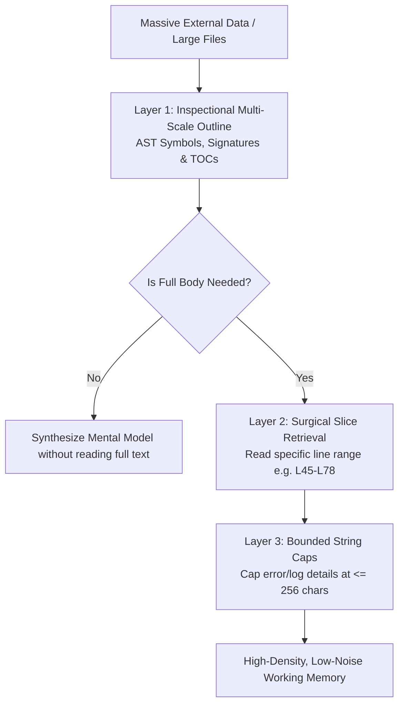

# Pattern: Epistemic Hygiene & Context Pruning

> **Pattern Type**: Context Engineering & Cognitive Economics  
> **Target Audience**: AI Coding Assistants & Agent Framework Architects  
> **Source Project**: `devops-cli`  

---

## 1. Problem Statement

Context windows in modern LLMs are large, but **attention is finite**. When an agent blindly ingests massive files, verbose compiler outputs, or monolithic JSON payloads:
- Attention is diluted ("lost in the middle" phenomenon).
- Latency and token costs skyrocket.
- The agent suffers from **context saturation**, losing track of nuanced architectural constraints set at the beginning of the prompt.

---

## 2. Core Mechanics

Epistemic Hygiene enforces human-like cognitive foraging through **three disciplined layers**:



### Layer 1: Inspectional Multi-Scale Outlining
- Never dump an entire 1,000-line file into the context window unless strictly necessary.
- First inspect the high-level outline: class hierarchy, method names, and docstrings via AST parsing or outline tools.
- Formulate a precise targeted question before requesting source code lines.

### Layer 2: Surgical Slice Retrieval
- Use bounded line-range reads (e.g. `view_file(StartLine=45, EndLine=80)`) instead of viewing entire files.
- Drill down only into the code that directly pertains to the active hypothesis.

### Layer 3: Bounded String Truncation on Errors
- External error messages, HTTP response bodies, and exception details must be bounded to $\le 256$ characters when propagated into structured logs or error details.
- Prevents log bloat, denial-of-service, and prompt injection (CWE-209 / CWE-400).

---

## 3. Implementation Example

### Bounded Error Detail Sanitizer in Python
```python
def sanitize_error_detail(detail: str, max_chars: int = 256) -> str:
    """Enforce bounded length caps on caller or external inputs to prevent context saturation."""
    cleaned = detail.strip().replace("\n", " ")
    if len(cleaned) <= max_chars:
        return cleaned
    return f"{cleaned[:max_chars - 3]}..."
```

---

## 4. Guardrails & Anti-Patterns

| Anti-Pattern | Why It Fails | Epistemic Hygiene Guardrail |
|---|---|---|
| **Context Dumping** | Ingesting 10 entire files at once "just in case". | Banned. Use inspectional browsing and read slices. |
| **Uncapped Stacktraces** | Injecting 500 lines of traceback into prompts. | Banned. Truncate to top 3 relevant frames and core message. |
| **Passive Hallucination** | Guessing what a function does instead of inspecting its signature. | Read the AST signature first; never guess. |

---

## 5. Cross-References
- [Observation 05: Harness Slots & Sub-Agent Offloading](../observations/devops-cli/05-harness-slots-and-subagent-offloading.md)
- [Canonical Agent Instructions](../AGENTS.md)
