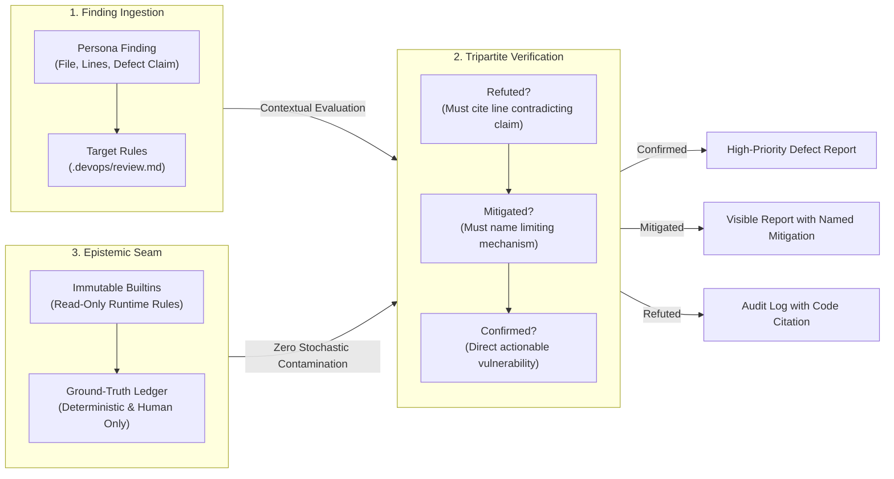

# Pattern: Epistemic Seam and Mitigated Defect Auditing

> **Pattern Class**: Multi-Agent Verification & Epistemic Governance
> **Problem**: Verifier personas conflate mitigation with refutation, silently discarding genuine defects based on hallucinated safety context, while negative filtering catalogs suffer runaway epistemic drift by learning from model opinions
> **Solution**: A tripartite verification protocol (Confirmed, Refuted with Line Citation, Mitigated with Named Mechanism) paired with an immutable Epistemic Seam that permits negative catalog learning solely from deterministic ground truth or human verification
> **Reference Implementation**: [`tools/finding_baseline.py`](../tools/finding_baseline.py), [`tools/sarif_report.py`](../tools/sarif_report.py)

---

## 1. Problem Statement

In autonomous multi-agent engineering harnesses, verification personas evaluate findings generated by specialized analysis agents (Security, QA, Architecture) before alerting developers or attempting automated remediation.

Without rigorous epistemic boundaries, the verification seam suffers two critical vulnerabilities:

1. **The Silent Invalidation Trap (Mitigation-Refutation Conflation)**:
   A verifier acknowledges that a reported defect exists in the code, but locates or imagines a contextual mitigating factor (e.g., claiming symlink checks block relative path traversal, or claiming caller wrappers enforce bounded sizes). It records the verdict as "Refuted" and discards the finding, silently burying critical security flaws under hallucinated mitigations.
2. **Epistemic Drift via the Unreliable Teacher**:
   When negative filtering catalogs (designed to prune recurring model false positives) learn autonomously from model verdicts or synthetic replays, they create an uncontrolled negative feedback loop. Stochastic model consensus widens matching patterns, eventually suppressing genuine CWE vulnerabilities.

---

## 2. Core Mechanics

The Epistemic Seam and Mitigated Defect Auditing pattern enforces strict boundaries between refutation, mitigation, and catalog mutation:



### The Three Operational Tenets:

1. **The Tripartite Verdict Protocol**:
   - **`Confirmed`**: The defect is present as stated and directly actionable.
   - **`Refuted`**: The cited lines directly contradict the defect claim. Must provide a concrete line number citation. Absent a citation, the verdict degrades to `Unverified`.
   - **`Mitigated`**: The defect exists, but an external mechanism, runtime harness, or wrapper limits its impact. The mechanism must be explicitly named. Mitigated findings are **never discarded**; they are reported with their mitigation visible to developers.
2. **The Epistemic Seam (Model-Proof Negative Catalogs)**:
   - Builtin false-positive catalogs are static, read-only assets.
   - The catalog may never learn from LLM verdicts, model agreement, or automated test replays.
   - Learning is restricted exclusively to deterministic AST/CST checks or explicit human review actions (`devops review verify`).
3. **Parochial Decoupling via Nearest-Root Conventions**:
   - Universal evaluators contain zero host repository assumptions (e.g., no hardcoded Python versions, strict typing mandates, or doc sanitization rules).
   - Project-specific conventions are loaded from the nearest `.devops/review.md` moving upwards from the target file to the repository root.

---

## 3. Concrete Implementation Snippets

Below is a reference Python implementation of the tripartite verdict model and the immutable epistemic catalog guardrail:

```python
"""Tripartite verification engine with immutable epistemic seam."""

from __future__ import annotations

import re
from dataclasses import dataclass
from enum import Enum
from pathlib import Path
from typing import Final


class Verdict(str, Enum):
    """Tripartite verification state."""
    CONFIRMED = "confirmed"
    MITIGATED = "mitigated"
    REFUTED = "refuted"
    UNVERIFIED = "unverified"


@dataclass(frozen=True)
class VerificationResult:
    verdict: Verdict
    finding_id: str
    rationale: str
    citation_line: int | None = None
    mitigating_mechanism: str | None = None

    def is_visible_to_developer(self) -> bool:
        """Mitigated findings remain visible to developers; only refuted are dropped."""
        return self.verdict in (Verdict.CONFIRMED, Verdict.MITIGATED, Verdict.UNVERIFIED)


class EpistemicCatalog:
    """Negative filtering catalog with immutable builtins and deterministic learning seam."""

    def __init__(self, builtin_rules: list[str]) -> None:
        self._builtins: Final[tuple[str, ...]] = tuple(builtin_rules)
        self._learned_rules: set[str] = set()

    def matches(self, finding_text: str) -> bool:
        """Check if finding matches any builtin or verified learned pattern."""
        all_rules = self._builtins + tuple(self._learned_rules)
        return any(re.search(rule, finding_text, re.IGNORECASE) for rule in all_rules)

    def learn_from_oracle(self, pattern: str, is_human_or_deterministic: bool) -> bool:
        """Record a learned suppression pattern ONLY from verified ground truth."""
        if not is_human_or_deterministic:
            # Epistemic Seam: Stochastic LLM verdicts are strictly prohibited from mutating the catalog
            return False
        self._learned_rules.add(pattern)
        return True
```

---

## 4. Key Takeaways

1. **Mitigation is Not Absence**: Treating a mitigated defect as refuted silently sweeps compounding architectural risk under the rug.
2. **Models Cannot Teach Their Own Oracles**: Allowing an LLM's invalidation opinions to train false-positive suppression catalogs guarantees catastrophic false-negative drift over time.
3. **Visible Nuance Over Binary Filters**: Presenting developers with *"Mitigated: Defect present, bounded by seccomp sandbox"* empowers human judgement rather than creating false senses of security.

