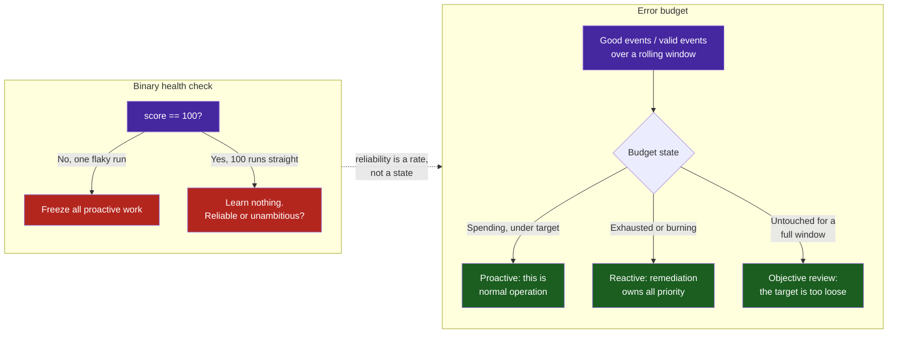

# Pattern: Error-Budget-Driven Feedback Inversion — Letting the Loop Spend Failure Deliberately

> **Pattern Class**: Reliability Engineering & Autonomous Loop Governance
> **Problem**: A binary health check makes a loop both twitchy and blind — one flaky run freezes it, and permanent green tells it nothing
> **Solution**: Objectives measured as good events over valid events, an explicit error budget, and a policy table mapping budget state to loop phase
> **Reference Implementation**: [`tools/reliability_slo.py`](../tools/reliability_slo.py)

---

## Problem Statement

A self-improving loop needs a rule for when to stop fixing and start improving. The obvious rule is a threshold on a health score: at 100.0, invert to proactive work; below it, remediate. It is easy to implement and wrong in both directions.

**It is too twitchy.** One flaky suite, one transient timeout, one module mid-edit drops the score, and the loop abandons proactive work that nothing was blocking. Worse, the reaction is identical whether one resource out of two hundred regressed or all two hundred did.

**It is too blind.** Once the score sits at 100.0 for a hundred consecutive runs, the loop has learned nothing. It cannot distinguish a genuinely reliable system from a set of thresholds so loose that nothing could ever breach them. Permanent green is the expected output of both, and the second is far more common.

Underneath both failures is the same mistake: treating reliability as a state rather than a rate. States are binary and memoryless. Rates have budgets, and budgets can be spent.



---

## Core Mechanics

1. **Define indicators as event ratios.** Every SLI is *good events over valid events* — resources certified healthy over resources evaluated, suites inside the latency ceiling over suites run. Never an average: one pathologically slow suite is precisely what a mean is designed to hide, and the tail is what the agent actually experiences.

2. **Give every indicator an objective and a window.** The target states how much failure is affordable; the rolling window states over what span. A target of `1.0` is legitimate and means *no budget at all* — appropriate for invariants, where a single breach is never routine, and wrong for almost everything else.

3. **Compute the budget, not the state.** `consumed = (1 - observed) / (1 - target)`. Spending 40% of budget is not a problem to be solved, it is the budget working. `burn_rate = consumed / elapsed_window` answers the question that matters: will this window close before the budget does?

4. **Require a minimum sample before burn-rate alerting.** Burn rate divides by elapsed window, so the first iteration of a twenty-iteration window always reads catastrophic. Without a floor, the instrument installed to remove twitchiness becomes its loudest source.

5. **Apply the same floor to the denominator.** Burn rate is not the only place small samples lie. An indicator measured over three backlog items reads `0.000` the moment one of them is machine-fixable, and a phase freeze on that is noise wearing a percentage sign. Objectives declare `min_valid_events`; below it the state is `INSUFFICIENT_DATA`, which is reported honestly rather than rounded to green. Zero-budget objectives override the floor to `1`, because one resource violating an invariant is a breach however few were measured.

6. **Map budget state to phase through one table.** The rule an agent must obey should be readable in one place, not inferred from a dispatcher:

   | Budget state | Phase | Meaning |
   |---|---|---|
   | `EXHAUSTED` | Reactive remediation | Past the objective; remediation owns all priority |
   | `BURNING` | Reactive remediation | Will exhaust before the window closes |
   | `HEALTHY` | Proactive elevation | Spending inside budget — carry on improving |
   | `UNSPENT` (full window) | Objective review | The target is not steering anything |
   | `INSUFFICIENT_DATA` | Proactive elevation | Too few events to judge; say so rather than assume |

7. **Treat a permanently unspent budget as a finding.** This is the half that binary checks cannot express at all. If every objective closes a full window untouched, the loop is not being governed by its objectives — tighten them, or deliberately spend the risk they were reserving.

---

## Implementation Example

Indicators live in a registry, so adding one is a dict entry rather than a branch:

```python
SLI_REGISTRY: Final[dict[str, Callable[[dict[str, Any]], SliMeasurement]]] = {
    "gate_pass_rate": measure_gate_pass_rate,
    "invariant_compliance": measure_invariant_compliance,
    "feedback_latency": measure_feedback_latency,
    "headroom_saturation": measure_headroom_saturation,
    "toil_containment": measure_toil_containment,
}
```

The loop then runs the policy instead of eyeballing a score:

```bash
python3 tools/resource_iteration_workbench.py --json > .data/iteration_report.json
python3 tools/reliability_slo.py record .data/iteration_report.json
python3 tools/reliability_slo.py status     # non-zero exit when remediation is owed
```

Three design patterns carry the weight, each chosen for a reason a comment can state:

- **Registry / Strategy** for indicators — a new SLI never edits a dispatcher, which is what keeps the AST nesting caps satisfiable as the set grows.
- **Value objects** — `SliMeasurement`, `BudgetState` and `PolicyDecision` are frozen, so any decision can be logged, replayed and diffed against the iteration that produced it.
- **Policy object** — `decide_phase` is the single function an agent must read to know what it is allowed to work on.

### Mapping the golden signals

The four golden signals do transfer to a self-improving codebase, provided the analogy is stated rather than assumed:

| Golden signal | Loop analogue | Indicator |
|---|---|---|
| Latency | Time from edit to verdict | `feedback_latency` |
| Errors | Resources failing their gate | `gate_pass_rate` |
| Traffic | Resources evaluated per iteration | window denominator |
| Saturation | Functions approaching the complexity ceiling | `headroom_saturation` |

Toil earns a fifth indicator with no golden-signal counterpart. `toil_containment` counts backlog items an existing tool could already fix — work `ast_refactorer.py` or `docs_validator --fix` would clear without judgement. An agent spending judgement there is doing exactly what SRE tells you to automate.

---

## Guardrails & Anti-Patterns

> [!WARNING]
> **Not every objective should block a release.** Ask of each one: does a breach mean *this must not ship*, or *we should work on this next*? Only defect indicators answer the first. Latency, saturation and toil all answer the second — a slow suite, a function near the complexity ceiling, and an automatable backlog are worth prioritising and none makes the artifact unfit. Wiring them to the build means a healthy repository cannot ship, which discredits the instrument the first time it fires. Mark them steering: they move the phase, and the release verdict comes from the gating ones alone. Beware in particular any indicator whose measurement depends on the machine that took it.

> [!WARNING]
> **An objective nobody can breach is decoration.** Setting every target to 1.0 reproduces the binary check with more machinery. Reserve zero-budget objectives for invariants that genuinely admit no failure, and give everything else room to be spent.

- **Do not average the window across iterations.** An iteration that evaluated two resources must not weigh as much as one that evaluated two hundred. Aggregate events, not ratios.
- **Do not alert on burn rate without a minimum sample.** See mechanic 4; this is the single most common way the pattern backfires.
- **Do not let a small denominator masquerade as a measurement.** `0/1` and `0/1000` are the same ratio and entirely different facts. Reporting `INSUFFICIENT_DATA` costs nothing; acting on the first as though it were the second costs the loop's credibility.
- **Do not silently move a target because it failed.** Adjusting an objective is a legitimate decision and a visible one. Lowering it during an incident is how a project discovers, a year later, that it has no objectives at all.
- **Do not treat the history ledger as a source of truth.** It is telemetry. A corrupt or missing file must degrade to an empty window, never halt the loop.
- **Do not skip the `UNSPENT` branch because it never fires.** It is the only mechanism in the pattern that can tell you your standards have stopped being standards.

---

## Cross-References

- **[Deterministic Oracles & Feedback Inversion](./deterministic-oracles-and-feedback-inversion.md)**: The binary inversion this pattern generalizes.
- **[Iterative Resource Refinement Loop](./iterative-resource-refinement-loop.md)**: The Scan-Run-Review-Feedback-Iterate cycle the objectives are measured over.
- **[Gate Integrity & Total Input Coverage](./gate-integrity-and-total-input-coverage.md)**: Why an indicator with a zero denominator must not read as success.
- **[Autonomous SDLC Project Management](./autonomous-sdlc-project-management.md)**: The backlog the phase decision governs.
