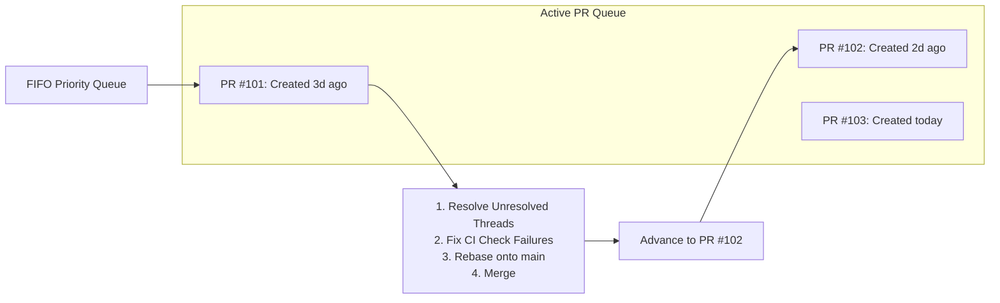

# Pattern: FIFO Pull Request Shepherding

> **Pattern Type**: Swarm Orchestration & Delivery Lifecycle  
> **Target Audience**: AI Agents, Multi-Agent Review Pipelines & Human Tech Leads  
> **Source Project**: `devops-cli`  

---

## 1. Problem Statement

When multiple AI agents or human contributors submit pull requests concurrently, a common failure mode is **PR starvation and cascading merge conflicts**:
- Agents jump to the newest, most exciting PR, leaving older PRs to rot.
- As the main branch advances, older PRs fall behind and suffer complex git merge conflicts.
- Unresolved review threads linger indefinitely because subsequent agents open new PRs rather than finishing open ones.

---

## 2. Core Mechanics

The FIFO (First-In, First-Out) Pull Request Shepherding pattern enforces a **strict chronological queue** for reviewing, rebasing, and merging PRs:



### The 4 Rules of FIFO Shepherding

1. **Oldest-First Priority**:
   - Always process PRs in ascending order of creation date / lowest PR number first.
   - Working on newer PRs while older open PRs are pending review or blocked is strictly forbidden.
2. **Draft PRs for In-Progress Work**:
   - Every PR is authored as a `Draft` until all local quality gates and unit tests pass.
   - Only convert to `Ready for Review` when fully certified.
3. **Mandatory Thread Resolution**:
   - Agents must query all unresolved review discussion threads (`devops pr threads list --unresolved-only`).
   - Fix each issue via test-first code changes.
   - Reply directly to the specific comment being addressed.
   - Resolve the thread via GraphQL mutation.
4. **Active CI Check Monitoring**:
   - After pushing commits, the agent must monitor remote CI runs (`devops pr monitor <pr-number>`).
   - If a check fails, inspect failed logs immediately, fix the root cause, and re-push. Never abandon a failing PR.

---

## 3. Implementation Example

### Listing and Addressing Unresolved Threads
```bash
# 1. List unresolved threads on the oldest open PR
devops pr threads list 101 --unresolved-only

# 2. Reply to the exact comment thread
devops pr threads reply PRRT_kwDO... "Fixed via commit abc1234: added type validation and unit test."

# 3. Resolve the thread
devops pr threads resolve PRRT_kwDO...
```

---

## 4. Guardrails & Anti-Patterns

| Anti-Pattern | Why It Fails | FIFO Guardrail |
|---|---|---|
| **PR Leapfrogging** | Merging PR #105 before PR #101. | Causes git merge conflicts on PR #101. Enforce strict FIFO queue. |
| **Silent Abandonment** | Leaving a PR with red CI checks to start another task. | Banned. Agents must shepherd the PR until all CI gates pass. |
| **Resolving Threads Without Replying** | Clicking "Resolve" without explanation. | Banned. Always post the fixing commit SHA and rationale in the thread. |

---

## 5. Cross-References
- [Observation 03: Autonomous Project Governance](../observations/devops-cli/03-autonomous-project-governance.md)
- [Pattern: Root-Cause Hardening](./root-cause-hardening.md)
