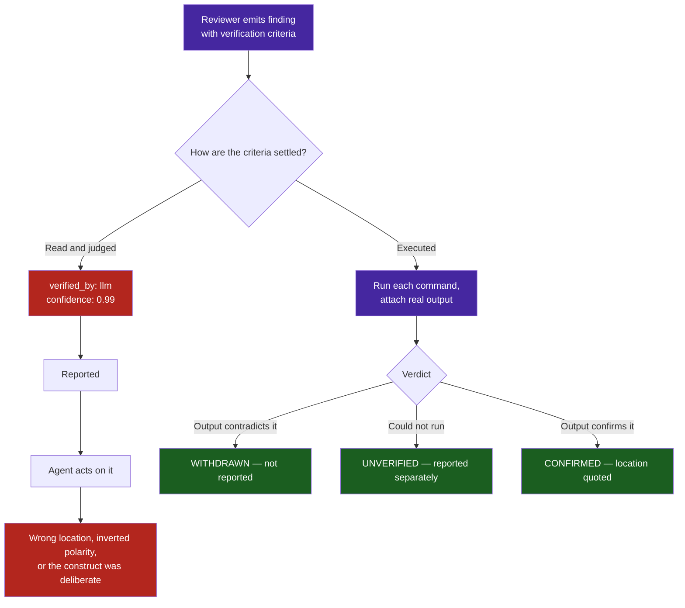

# Pattern: Findings Must Carry Their Own Falsification — Executable Criteria Over Asserted Confidence

> **Pattern Class**: Review Pipelines & Feedback Quality
> **Problem**: A review that writes verification criteria and then judges them by reading produces confident findings nobody tested
> **Solution**: Findings carry shell commands with deterministic output, the pipeline executes them, and a withdrawn finding is not reportable
> **Reference Implementation**: [`artifacts/prompts/multi-persona-code-reviewer.md`](../artifacts/prompts/multi-persona-code-reviewer.md)

---

## Problem Statement

A review pipeline that produces findings is a work generator, and work generators are judged by what they produce. Nothing in the usual design penalises a finding that is wrong, because the cost lands on whoever acts on it — often an agent, which will act on all of them, in order, without asking whether they are real.

The failure is not that reviewers hallucinate. In a review of 286 findings against this repository, most were real and several were valuable. The failure is subtler and more corrosive:

- Every finding carried a location with line numbers. Two cited lines that do not contain the described construct.
- 274 of 286 carried **executable** verification criteria — `git check-ignore -v .env`, `git ls-files .env*`, `grep -n`.
- All 286 were marked `verified_by: llm`. **The criteria were written to be run, and nothing ran them.**
- `reportable` was `true` for all 286, including the 7 that were never verified at all.
- 23 findings carried a withdrawal reason and were reported anyway.

The result reads like rigour. It has locations, severities, confidence scores between 0.5 and 1.0, and criteria that look like evidence. What it does not have is a single executed command.

---

## Core Mechanics



1. **Criteria are commands, not sentences.** "The `.gitignore` contains `.env` entries" is a claim. `git check-ignore -v .env` is a test. Only the second can come back and say no.
2. **The pipeline executes them and attaches the output.** A criterion settled by reading is marked `UNVERIFIED`, not `verified`.
3. **The location is quoted, not cited.** Print the lines the finding points at. If they do not contain the construct, the location is wrong — correct it or withdraw, because a finding nobody can navigate to cannot be acted on.
4. **Polarity is stated explicitly.** Observed value beside expected value. *Always ERROR* and *always OK* are different defects with different severities, and confusing them discredits the reviewer on precisely the finding that mattered.
5. **Intent is read before flagging.** A file whose name, docstring or comment declares a construct deliberate — a demonstration, a negative fixture, a documented trade-off — is not defective for containing it.
6. **A withdrawal binds.** A finding with a withdrawal reason is not reportable. Restating the finding as its own withdrawal reason is a confirmation wearing the wrong label.

---

## Implementation Example

```text
1. EXECUTE, do not judge. verification_criteria must be shell commands with
   deterministic output. Run each and paste the actual output.
2. QUOTE THE LOCATION. Print the exact lines cited. If they do not contain the
   construct, correct the location or withdraw.
3. CHECK POLARITY. State observed and expected side by side.
4. READ FOR INTENT. Deliberate anti-patterns in a teaching artifact are the artifact.
5. DECIDE: CONFIRMED (output attached) | WITHDRAWN (not reported) | UNVERIFIED
   (reported separately, never mixed in).
```

Test the pipeline the way you would test any gate: feed it a finding that must be withdrawn and assert that it is. A verdict field that has never come back negative has never been exercised.

---

## Guardrails & Anti-Patterns

> [!WARNING]
> **A field that is never false carries no information.** `reportable: true` on all 286 findings is not a filter, it is a column. Before trusting any verdict field, check its distribution: if one value never appears, nothing is deciding it.

- **Do not accept confidence as evidence.** A score of 0.99 attached to an unexecuted criterion measures fluency, not truth. Rank by executed outcome, not by asserted certainty.
- **Do not let volume substitute for signal.** 286 findings with 14 CRITICAL invites triage by severity, and severity is exactly the field polarity errors corrupt.
- **Do not mix unverified findings into the confirmed list.** They need a different reader and a different decision.
- **Do not fix in finding order.** Verify the whole batch first: withdrawals are cheap, and a batch with a systematic error — a stale line map, an inverted check — is far easier to spot across findings than within one.
- **Do not skip the pipeline's own regression test.** The bug here was never in a finding; it was in the stage that was supposed to falsify them and instead rubber-stamped them.

---

## Cross-References

- **[Observation 13](../observations/systems/13-verify-the-finding-before-you-fix-it.md)**: the same failure inside this repository's own loop, where four of five backlog items were measurement error.
- **[Gate Integrity & Total Input Coverage](./gate-integrity-and-total-input-coverage.md)**: the complementary failure, where the gate never examined the input at all.
- **[Multi-Persona Code Reviewer](../artifacts/prompts/multi-persona-code-reviewer.md)**: the prompt harness this falsification stage attaches to.
- **[Root-Cause Remediation & Instruction Hardening](./root-cause-hardening.md)**: fixing the rule that let the class through, rather than the instance.
