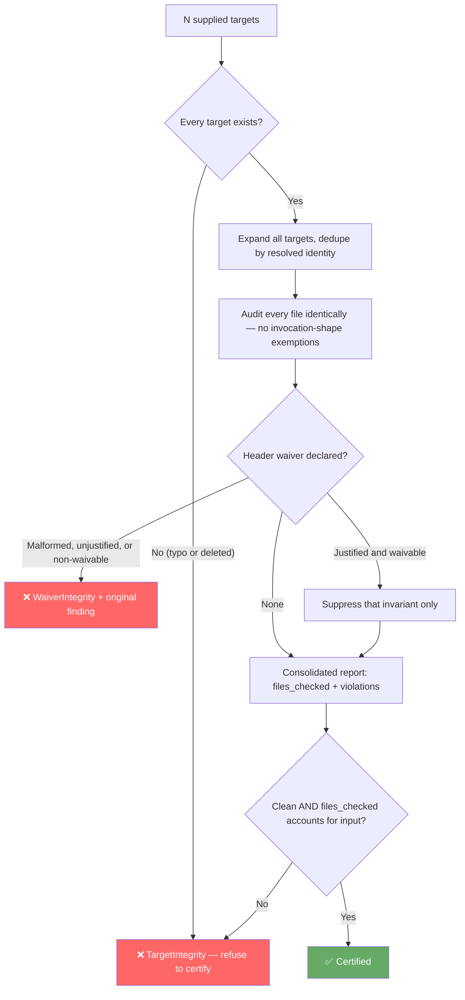

# Pattern: Gate Integrity & Total Input Coverage — Making "Nothing Was Checked" Impossible to Confuse With "Everything Passed"

> **Pattern Class**: Mechanical Enforcement & Verification Infrastructure
> **Problem**: Quality gates default to success when they audit nothing, silently certifying code they never opened
> **Solution**: Account for every supplied input, measure the artifact rather than the harness, and make unaudited input a failure
> **Reference Implementation**: [`examples/ast-invariant-sentinel/sentinel.py`](../examples/ast-invariant-sentinel/sentinel.py) — `audit_targets`, `_scan_waivers`

---

## Problem Statement

Every mechanical gate computes a verdict from a collection of findings, and the natural encoding of "clean" is an empty collection. This makes **doing no work indistinguishable from finding no problems**:

```python
targets = collect(paths)        # 0 files — a typo, a discarded argv, a skipped extension
violations = audit(targets)     # []
return 0 if not violations else 1   # ✅ PASSED
```

The detection logic can be flawless and fully tested while the gate certifies nothing at all. Observed failure modes, all from a single repository whose dashboard read 100.0/100:

| Mode | Mechanism | Symptom |
|---|---|---|
| **Truncated input** | Entrypoint reads `argv[1]`; pre-commit passes N filenames | `Checked 1 Python files. ✅ PASSED` over 12 staged files |
| **Phantom target** | Nonexistent path expands to an empty file list | Typo'd or deleted path audits clean |
| **Invocation-shape dependence** | Exemptions applied during directory expansion but not to named files | `gate dir/` and `gate dir/file.py` disagree about `file.py` |
| **Harness measurement** | Oracle times the subprocess that runs the artifact | A 0.38s suite reported as 2.04s; threshold unsatisfiable by any edit |
| **Enumerated coverage** | CI lists directories by hand | A whole directory silently outside the gate |

The compounding cost is misdirection. A false green does not merely fail to find defects — it ranks phantoms and sends every subsequent session after them.

---

## Core Mechanics



Four rules:

1. **Total input coverage.** Parse `nargs="*"`, audit every path, and reject unknown flags non-zero. Never hand-slice `sys.argv` or filter tokens by prefix — silently dropping an argument is the defect.
2. **Unaudited input fails.** A target that cannot be read is a gate failure, not an empty result set. Report `files_checked` alongside the verdict so a caller can see the denominator.
3. **Uniform treatment.** The same file receives the same judgement whether it arrives via directory sweep or named argument. Exemptions applied at one entry point and not another make the verdict a function of the command line.
4. **Measure the artifact, not the scaffolding.** Prefer the tool's self-reported metric over externally observed process behavior, and report irreducible harness cost separately.

---

## Implementation Example

```python
def audit_targets(paths: Sequence[Path], max_complexity: int = 10) -> AuditReport:
    """Audit every supplied file or directory target into one consolidated report."""
    report = AuditReport()
    report.violations.extend(
        Violation(str(path), 1, "TargetIntegrity", "Audit target does not exist.")
        for path in paths
        if not path.exists()
    )
    targets = _expand_targets([path for path in paths if path.exists()])
    report.files_checked = len(targets)
    for py_file in targets:
        report.violations.extend(audit_file(py_file, max_complexity))
    return report
```

Waivers, where a detector's own negative fixtures must embed the strings it hunts:

```python
"""Unit tests for the egress guard."""

# sentinel: allow[ZeroTrustSanitization] — negative fixtures asserting the detector fires
```

Read from real `COMMENT` tokens via `tokenize` (never text inside a string literal), honored only in the module header, restricted to a closed set of waivable invariants, and requiring written justification — a malformed waiver raises `WaiverIntegrity` and does not suppress the finding.

The regression test that matters most is the one asserting the gate *fails*:

```python
def test_main_audits_all_cli_paths_and_fails(tmp_path, capsys):
    """A violation in any trailing argument must fail the run, never be silently dropped."""
    clean = _write_module(tmp_path, "clean.py", "def ok() -> int:\n    return 1\n")
    dirty = _write_module(tmp_path, "dirty.py", 'HOST = "http://10.1.2.3"\n')

    assert main(["sentinel.py", str(clean), str(dirty)]) == 1
    assert "Checked 2 Python files." in capsys.readouterr().out
```

---

## Guardrails & Anti-Patterns

> [!WARNING]
> **Waivers become mute buttons the moment they are cheap.** Restrict them to content detectors with legitimate fixtures, never to structural caps. A complexity limit you can waive is not an invariant. Require justification text, bound waivers to the module header where reviewers see them, and treat a malformed waiver as its own violation.

- **Do not test only the detector.** A sentinel with thorough coverage of its AST visitors and none of its argument parser is the exact shape of this failure. Every gate needs a test proving it fails on bad input supplied in the *last* position.
- **Do not trust `files_checked` implicitly — print it.** The number is the gate's own testimony about how much work it did, and it is the cheapest possible tripwire for this whole failure class.
- **Do not enumerate coverage by hand in CI.** See [Structure-Driven CI Directory Contracts](./structure-driven-ci-directory-contracts.md). Enumerations freeze at the moment they were written.
- **Do not let instruction files drift from implementations.** When `AGENTS.md` documents `<modified_files>` and the code reads `argv[1]`, nothing detects the contradiction, because prose is the one artifact nothing executes. Encode the documented invocation shape as a test.

---

## Cross-References

- **[Observation 11](../observations/systems/11-silent-certification-failure-and-gate-integrity.md)**: The empirical case study that originated this pattern.
- **[Observation 08](../observations/systems/08-convention-to-mechanical-enforcement-inversion.md)**: Converting documented mandates into git hooks — the infrastructure whose hollow interior this pattern addresses.
- **[Structure-Driven CI Directory Contracts](./structure-driven-ci-directory-contracts.md)**: Directory contracts over hand-enumerated file lists.
- **[Deterministic Oracles & Feedback Inversion](./deterministic-oracles-and-feedback-inversion.md)**: Why mechanical oracles must bound stochastic generation — and why a miscalibrated oracle is worse than none.
