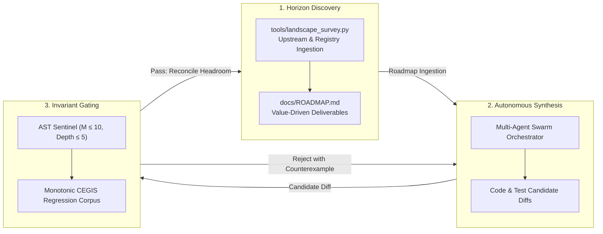

# Pattern: Invariant-Grounded Recursive Self-Improvement

> **Pattern Class**: Architecture & Autonomous Governance  
> **Problem**: Static codebases decay exponentially in the post-harness era, but unconstrained recursive self-improvement collapses into phantom architectures, circular self-consistency traps, and attention dilution  
> **Solution**: A tripartite architecture binding deterministic AST invariants, counterexample-guided regression accumulation, and outward landscape foraging into a convergent, closed-loop self-evolution engine  
> **Reference Implementation**: [`tools/resource_iteration_workbench.py`](../tools/resource_iteration_workbench.py), [`tools/landscape_survey.py`](../tools/landscape_survey.py)

---

## 1. Problem Statement

In the post-agentic-harness era, the velocity of software generation outstrips human auditing capacity. If a codebase relies solely on human engineers to identify architectural decay, refactor procedural bloat, and track upstream evolutions, it accumulates technical debt faster than it can be addressed.

Conversely, attempting autonomous recursive self-improvement (RSI) without formal verification fails catastrophically:
1. **The Phantom Architecture Trap**: Language models hallucinate idealized capabilities in documentation and tests, creating self-reinforcing loops of synthetic non-functionality ([Observation 27](../observations/systems/27-agentic-project-self-documentation-and-the-phantom-architecture-trap.md)).
2. **Circular Self-Consistency**: Internal unit test suites pass completely against internal mock models while diverging from real-world wire protocols, kernel APIs, and network behaviors ([Observation 19](../observations/systems/19-self-consistency-is-not-conformance.md)).
3. **Defect-Shaped Convergence**: Systems that only run linters converge to a myopic dead-end: zero open issues on a static codebase that nobody uses ([Observation 14](../observations/systems/14-defect-shaped-loops-and-the-feature-blind-spot.md)).

To scale safely, self-improvement must be anchored to **unforgiving, asymmetric mechanical invariants**.

---

## 2. Core Mechanics

The Invariant-Grounded RSI pattern coordinates three interconnected feedback loops:



### The Three Structural Pillars:

1. **Asymmetric Invariant Gatekeeping ($P$ vs $NP$)**:
   Code generation is treated as probabilistic search. Every proposed modification must pass an array of deterministic, polynomial-time oracles before landing:
   - **AST Structural Invariants**: McCabe cyclomatic complexity $M \le 10$, indentation depth $\le 5$.
   - **Zero-Trust Egress Guards**: Rejection of private RFC 1918 IPs, internal DNS suffixes, and plain-text secrets.
   - **Coverage & Test Floors**: Strict $\ge 90.0\%$ line coverage with zero unhandled deprecation warnings.
2. **Monotonic Constraint Accumulation (CEGIS)**:
   Every bug, race condition, or fuzzing crash is permanently converted into a regression fixture. The regression corpus strictly accumulates; a self-improving agent cannot drop or weaken existing test cases to make a build pass.
3. **Outward Telemetry & Horizon Expansion**:
   The self-improving loop actively crawls upstream ecosystem dependencies, OpenTelemetry semantic conventions, and industry benchmarks to ingest forward-looking roadmap items, preventing defect-shaped stagnation.

---

## 3. Implementation Blueprint

### Step 1: Deterministic AST Invariant Verification (`tools/ast_sentinel.py`)
```python
import ast
from pathlib import Path

def audit_function_complexity(node: ast.FunctionDef, max_m: int = 10, max_depth: int = 5) -> None:
    """Enforce mathematical complexity caps across all synthesized routines."""
    complexity = 1 + sum(
        1 for n in ast.walk(node)
        if isinstance(n, (ast.If, ast.While, ast.For, ast.ExceptHandler, ast.Assert))
    )
    if complexity > max_m:
        raise AssertionError(f"Function {node.name} breached complexity cap: {complexity} > {max_m}")
```

### Step 2: Monotonic Regression Corpus Replay (`tools/fuzz_harness.py`)
```python
def replay_regression_corpus(corpus_dir: Path) -> None:
    """Guarantee that no defect once remediated can ever be reintroduced."""
    for case_file in corpus_dir.glob("*.case"):
        payload = case_file.read_bytes()
        # Assert deterministic handling without crashes, timeouts, or leaks
        execute_isolated_target(payload)
```

---

## 4. Prescriptive Operational Guardrails

- **The Grounding Rule**: Never permit an agent to evaluate its own output without an external oracle (compiler, AST visitor, OS sandbox, or reference benchmark).
- **The Outward Balance Rule**: Maintain a balanced portfolio between quality instruments and product capabilities (`python3 tools/portfolio_balance.py`). A loop that only fixes defects is a failing loop.
- **The Monotonicity Rule**: Regression tests and invariant thresholds may only be tightened, never relaxed or waived without audited justifications (`# sentinel: allow[...]`).
- **The Visual Proportion Rule**: Diagrams generated during self-documentation must stay within the **$1:3$ to $3:1$ aspect ratio ceiling** to prevent cognitive overload.

---

## 5. Key Takeaways & Architectural Relevance

1. **Recursive Self-Improvement is a Mandate**: In a world of instantaneous code synthesis, static codebases suffer fatal relative decay.
2. **The Invariant Architect**: The human role evolves from writing procedural syntax to curating the objective functions, invariant gates, and CEGIS regression corpora that constrain autonomous evolution.
3. **Internal Consistency $\neq$ Conformance**: Continuous external probing is the only antidote to autonomous model echo chambers.
