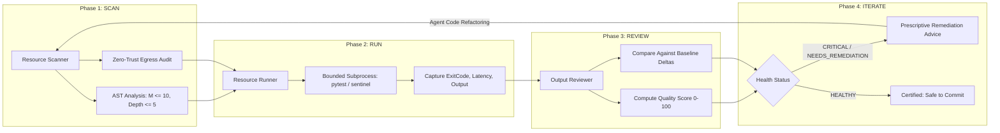

# Pattern: Iterative Resource Refinement Loop (Scan-Run-Review-Iterate)

A continuous, metric-driven engineering loop enabling AI agents to iteratively inspect, execute, evaluate, and refine repository resources before committing changes.

---

## 1. Problem Statement

AI coding agents often operate in an open-loop, single-shot execution mode:
1. An agent writes or edits code.
2. It claims the change is complete without measuring whether cyclomatic complexity spiked, tests failed, or private identifiers were leaked.
3. Regressions, unhandled warnings, and architectural drift accumulate until manual human intervention or remote CI breaks.

Without continuous **closed-loop verification**, agent development quickly devolves into unstructured code churn.

---

## 2. Core Mechanics: The 4-Phase Iteration Engine

The **Iterative Resource Refinement Loop** formalizes the agentic development cycle into four disciplined phases:



### 1. Phase 1: SCAN (Static Invariant Baseline)
- Discovers and classifies repository resources (`PYTHON_MODULE`, `TEST_SUITE`, `SAMPLE_APP`, `BENCHMARK`, `MANIFEST`).
- Measures AST McCabe cyclomatic complexity ($M \le 10$) and indentation nesting depth ($\le 5$).
- Checks string literals for private RFC 1918 IPs (`10.x`, `172.16-31.x`, `192.168.x`) or invalid mock subdomains.

### 2. Phase 2: RUN (Bounded Execution Telemetry)
- Executes target verification commands (`pytest`, `benchmarks`, `sentinels`) with bounded timeouts.
- Captures wall-clock duration, exit codes, and standard streams without hanging or leaking zombie processes.

### 3. Phase 3: REVIEW (Output Evaluation & Delta Tracking)
- Parses test pass/fail counts, assertion errors, and deprecation warnings.
- Computes an objective **Quality Score** (0–100):
  - Base: 100 points
  - Deductions: -20 per complexity violation, -25 per failed test, -15 per sanitization leak, -5 per deprecation warning.
- Compares metrics against persistent baseline runs (`.data/iteration_baseline.json`) to track complexity deltas ($\Delta M$) and latency regressions ($\Delta t$).

### 4. Phase 4: ITERATE (Prescriptive Agent Remediation)
- If `HealthStatus` is `CRITICAL` or `NEEDS_REMEDIATION`, emits explicit, targeted recommendations:
  - *"Decompose function `analyze` to reduce complexity from 12 to 10."*
  - *"Remediate 2 failing tests in `tests/test_foo.py` before committing."*
- Agent addresses root causes, re-triggers the scan, and repeats until the resource achieves `HEALTHY` status.

---

## 3. Implementation Blueprint

```python
from pathlib import Path
from tools.resource_iteration_workbench import ResourceIterationWorkbench

# Initialize workbench pointing to repository root
workbench = ResourceIterationWorkbench(root_dir=Path("."))

# Execute complete Scan -> Run -> Review -> Iterate cycle
report = workbench.run_cycle(execute_tests=True)

# Render ASCII Scorecard & Metrics
print(workbench.render_report(report))

# Automated gating: block push if overall health is not clean
if report.overall_health.value == "CRITICAL":
    raise SystemExit(f"Quality gate blocked: {report.prescriptive_action}")
```

---

## 4. Key Takeaways

1. **Closed-Loop Feedback Anchors LLM Tokens**: Providing agents with immediate, structured metrics (pass rate, complexity, deltas) turns non-deterministic code edits into predictable engineering progress.
2. **Delta Tracking Exposes Regressions**: Comparing current AST metrics against a saved baseline ensures complexity never creeps upward silently.
3. **Prescriptive Guidance Prevents Thrashing**: Clear error localization (exact line numbers and function names) directs agent attention to root causes rather than symptoms.
