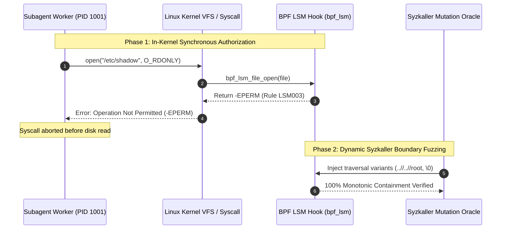

# Pattern: Kernel-Enforced LSM Sandbox Containment

> **Pattern Class**: Security Architecture & Kernel Gating
> **Problem**: Post-hoc user-space log monitors fail to prevent unrecoverable sandbox escapes and malicious socket calls by compromised subagents
> **Solution**: Synchronously intercept syscall operations at the Linux Security Module (BPF LSM) boundary and verify containment with Syzkaller boundary fuzzing
> **Reference Implementation**: [`examples/ebpf-lsm-kernel-gate/`](../examples/ebpf-lsm-kernel-gate/)

---

## 1. Problem Statement: The Limits of User-Space Sandboxing

When autonomous AI coding agents execute terminal tools, compile code, and run tests, traditional user-space isolation suffers from three structural flaws:

1. **The Asynchronous Race Condition**:
   Passive monitoring frameworks (such as standard `auditd` or `kprobe`-based tracers) process security alerts after the syscall has completed. In high-speed agentic execution, sensitive credentials can be exfiltrated over raw TCP sockets in under $10\text{ms}$—long before user-space daemons can issue a terminating signal.
2. **Path Normalization and Symlink Escapes**:
   User-space regex scanners evaluate raw command arguments rather than canonical VFS inode resolution. Attackers and hallucinating subagents exploit traversal variants (`..//`, `.../`), symlink races, or null-byte injections to read sensitive files (`/etc/shadow`, `~/.ssh`).
3. **Binary Execution Smuggling**:
   Workloads restricted to specific developer tools can bypass shell-level constraints by invoking unwhitelisted binaries via disguised aliases or nested subshells.

---

## 2. The Architectural Pattern: In-Kernel Synchronous Gating

To achieve foolproof containment, isolation must reside directly within the operating system kernel's authorization path using **Linux Security Module (BPF LSM)** hooks.

### Core Invariants

1. **Pre-Execution In-Kernel Denial (`-EPERM`)**:
   Enforce security policies at `bpf_lsm_bprm_check_security`, `bpf_lsm_file_open`, and `bpf_lsm_socket_connect`. Any forbidden operation returns `-EPERM` immediately, aborting execution before data access or network packet dispatch.
2. **Zero-Trust Egress Isolation**:
   Block socket connections to private RFC 1918/4193 addresses and cloud metadata endpoints (`169.254.169.254`) directly in `bpf_lsm_socket_connect`, allowing only loopback communications (`127.0.0.1`).
3. **Dynamic Syzkaller Boundary Fuzzing**:
   Continuously probe the LSM policy with synthesized traversal strings, bitwise flag mutations, and IP variants to ensure 100% monotonic containment ($R_{\text{contain}} = 1.0$) with zero evasion bypasses.
4. **Declarative Policy Synthesis**:
   Compile declared security policies into portable BPF CO-RE C programs and Kubernetes-native Cilium Tetragon `TracingPolicy` CRDs.

---

## 3. Implementation Protocol

1. **Define Policy Contracts**:
   Declare strict binary allowlists, blocked filesystem prefixes, and egress restrictions in an immutable `LSMPolicy` specification.
2. **Attach LSM Hooks**:
   Deploy BPF LSM probes to kernel hooks before spawning untrusted subagents.
3. **Execute Pre-Flight Mutation Fuzzing**:
   Run Syzkaller-style mutation campaigns during CI validation to mechanically prove that the kernel gate cannot be bypassed by path or flag permutations.
4. **Export Standardized Telemetry**:
   Format all containment events into OASIS SARIF 2.1.0 logs for integration with GitHub Code Scanning.

---

## 4. Consequences & Trade-Offs

### Benefits
- **Zero Race Window**: In-kernel hooks eliminate the detection-to-block latency window entirely.
- **Hardware-Enforced Isolation**: Even root-privileged processes inside unprivileged containers cannot bypass kernel LSM hooks.
- **Negligible Overhead**: BPF LSM execution overhead is less than $1.5\mu\text{s}$ per syscall.

### Trade-Offs & Mitigations
- **Kernel Requirement**: Requires Linux kernel $\ge 5.7$ compiled with `CONFIG_BPF_LSM=y`.
  - *Mitigation*: For development and CI environments without kernel LSM privileges, use the standard library simulation engine provided in [`examples/ebpf-lsm-kernel-gate/`](../examples/ebpf-lsm-kernel-gate/).

