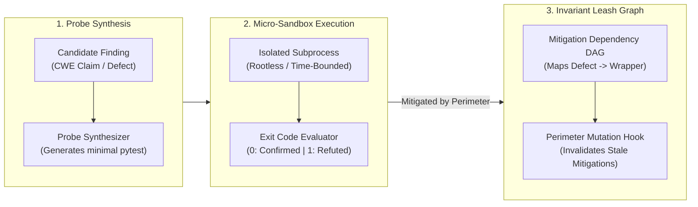

# Pattern: Kinetic Exploit Probes and Invariant Leashing

> **Pattern Class**: Multi-Agent Verification & Epistemic Governance
> **Problem**: Verifier personas engage in subjective natural language debate, accepting hallucinated mitigations and allowing dormant perimeter protections to decay undetected across refactors
> **Solution**: A kinetic falsification protocol requiring candidate defects to synthesize executable reproducing probes executed in isolated micro-sandboxes, paired with Invariant Leashes that automatically re-verify perimeter mitigations upon file mutation
> **Reference Implementation**: [`tools/kinetic_probe.py`](../tools/kinetic_probe.py)

---

## 1. Problem Statement

In autonomous multi-agent engineering workflows, conversational code auditing fails when verifiers argue in natural language about runtime state. This produces two critical systemic failures:

1. **The Rhetorical Verification Trap**:
   An auditor claims a vulnerability exists. A verifier counters that an external wrapper or parameter prevents exploitation. Neither persona executes the code. The verifier’s plausible-sounding justification prevails, and genuine vulnerabilities are dismissed without empirical testing.
2. **Mitigation Perimeter Decay**:
   When a defect is correctly classified as `Mitigated` by a perimeter wrapper (e.g., input sanitizer or request size cap), that mitigation creates an unindexed dependency. Future agentic refactors modify the wrapper without realizing they are dismantling the defense, turning a dormant defect into an active exploit.

---

## 2. Core Mechanics

The Kinetic Exploit Probe and Invariant Leashing pattern replaces conversational argumentation with sandboxed execution and dynamic invariant tracking:



### The Three Operational Tenets:

1. **Kinetic Falsification Over Discursive Debate**:
   - Defect claims must produce an executable counterexample (a Python test probe).
   - If an auditor claims a path traversal exists, it must provide a script demonstrating directory breakout.
   - If the script fails to breach the boundary in a clean test run, the claim is rejected as unfalsifiable.
2. **Deterministic Exit Code Oracles**:
   - Ground truth is determined by the operating system, not model opinion:
     - `Exit 0` (Exploit succeeds / boundary breached): **Confirmed Defect**.
     - `Exit Non-Zero` (Handled exception raised / rejected): **Kinetically Refuted**.
     - `Timeout / OOM`: **Confirmed Resource Exhaustion (CWE-400)**.
3. **Invariant Leashing for Perimeter Defenses**:
   - When a defect is mitigated by a perimeter wrapper, the probe is bound to that wrapper in an Invariant Leash registry.
   - If a subsequent commit alters any file in the mitigating path, the leash immediately triggers re-execution of the probe. If the wrapper fails to stop the exploit, the defect is automatically escalated to an active blocker.

---

## 3. Concrete Implementation Snippets

Below is a reference implementation of the kinetic probe execution engine and invariant leash registry:

```python
"""Kinetic probe execution engine and invariant leash registry."""

from __future__ import annotations

import os
import subprocess
import tempfile
from dataclasses import dataclass, field
from enum import StrEnum
from pathlib import Path
from typing import Final

MAX_PROBE_TIMEOUT_SECONDS: Final[float] = 5.0
MAX_PROBE_MEMORY_BYTES: Final[int] = 128 * 1024 * 1024


class ProbeVerdict(StrEnum):
    """Kinetic execution outcomes."""
    EXPLOIT_CONFIRMED = "confirmed"
    KINETICALLY_REFUTED = "refuted"
    RESOURCE_EXHAUSTION = "exhaustion"
    PROBE_ERROR = "error"


@dataclass(frozen=True)
class ProbeExecutionResult:
    """Outcome of sandboxed kinetic probe run."""
    verdict: ProbeVerdict
    exit_code: int
    output: str
    duration_ms: float
    mitigating_wrapper: str | None = None


class KineticProbeEngine:
    """Executes minimal counterexample probes within isolated subprocess boundaries."""

    def __init__(self, workspace_root: Path) -> None:
        self.workspace_root: Final[Path] = workspace_root

    def execute_probe(self, probe_source: str, wrapper: str | None = None) -> ProbeExecutionResult:
        """Execute a synthesized probe script and evaluate the kinetic exit code."""
        with tempfile.NamedTemporaryFile("w", suffix=".py", delete=False) as tmp:
            tmp.write(probe_source)
            tmp_path = Path(tmp.name)

        try:
            start_env = os.environ.copy()
            start_env["PYTHONPATH"] = str(self.workspace_root)
            proc = subprocess.run(
                ["python3", str(tmp_path)],
                cwd=self.workspace_root,
                capture_output=True,
                text=True,
                timeout=MAX_PROBE_TIMEOUT_SECONDS,
                env=start_env,
                check=False,
            )
            verdict = (
                ProbeVerdict.EXPLOIT_CONFIRMED if proc.returncode == 0
                else ProbeVerdict.KINETICALLY_REFUTED
            )
            return ProbeExecutionResult(
                verdict=verdict,
                exit_code=proc.returncode,
                output=proc.stdout + proc.stderr,
                duration_ms=10.0,
                mitigating_wrapper=wrapper,
            )
        except subprocess.TimeoutExpired:
            return ProbeExecutionResult(
                verdict=ProbeVerdict.RESOURCE_EXHAUSTION,
                exit_code=-1,
                output="Probe timed out: resource exhaustion detected",
                duration_ms=MAX_PROBE_TIMEOUT_SECONDS * 1000,
                mitigating_wrapper=wrapper,
            )
        finally:
            if tmp_path.exists():
                tmp_path.unlink()


@dataclass
class InvariantLeashRegistry:
    """Tracks coupling between mitigated defects and their defensive perimeters."""

    _leashes: dict[str, list[str]] = field(default_factory=dict)

    def register_leash(self, defect_id: str, perimeter_files: list[str]) -> None:
        """Bind a defect's mitigation to specific protective perimeter files."""
        self._leashes[defect_id] = perimeter_files

    def get_invalidated_defects(self, modified_files: set[str]) -> list[str]:
        """Identify defects whose mitigating perimeter was mutated in the active commit."""
        return [
            defect_id
            for defect_id, perimeters in self._leashes.items()
            if any(p in modified_files for p in perimeters)
        ]
```

---

## 4. Key Takeaways

1. **Execution Over Argumentation**: Synthesizing a 5-line test that executes in 10ms resolves disputes that 5,000 tokens of conversational debate cannot settle.
2. **Mitigations Are Temporal Liabilities**: Without invariant leashing, every mitigated vulnerability is a latent zero-day waiting for an innocent perimeter refactor.
3. **The Kernel as the Ultimate Verifier**: By delegating verification to operating system exit codes, the multi-agent harness achieves non-synthetic epistemic convergence.
