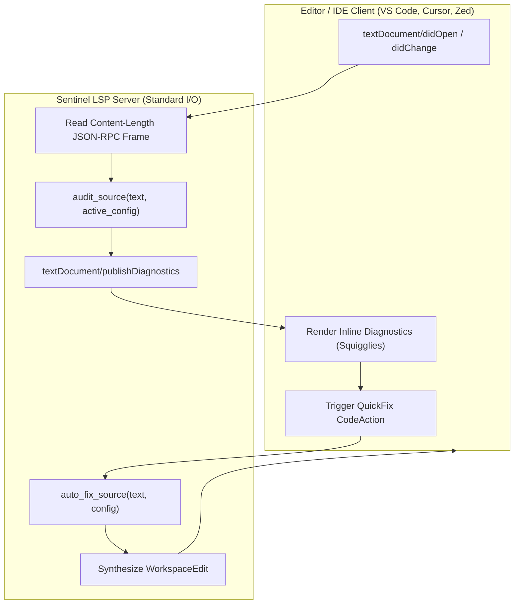

# Pattern: LSP Diagnostics and Automated Invariant Repair

> **Pattern Class**: Developer Ergonomics & Real-Time Quality Gates  
> **Problem**: Batch-mode CLI quality gates introduce high feedback latency and friction, discovering invariant breaches only at commit time and requiring manual context switching to resolve  
> **Solution**: Implement an in-process, zero-dependency Language Server Protocol (LSP 3.17) server paired with deterministic AST-verified auto-remediation, delivering sub-millisecond in-editor diagnostics and one-click QuickFix code actions  
> **TLDR**: Implement an in-process Language Server Protocol server with AST-verified auto-remediation, providing sub-millisecond diagnostics and QuickFix actions.
> **ELI:7b**: Give the code editor instant auto-fix powers so it detects mistakes in real time and fixes them with a single click.
> **Reference Implementation**: [`examples/ast-invariant-sentinel/`](../examples/ast-invariant-sentinel/)

---

## 1. Problem Statement: Batch Latency in Quality Gates

When quality gates operate solely as pre-commit hooks or CI jobs, the discovery-to-repair cycle suffers from batch feedback latency:

1. **Delayed Discovery**: Code is authored, tested, and staged before the developer or AI agent receives invariant feedback.
2. **Context Switching**: The engineer must leave the editor, inspect console outputs or SARIF logs, identify line numbers, and manually re-edit the file.
3. **Conversational Thrashing**: In agentic pair-programming workflows, agents often oscillate between making edits and running validation scripts, consuming token budgets on mechanical fixes.

To provide optimal velocity and zero-trust discipline, architectural invariants must be evaluated in real time at the editor cursor.

---

## 2. The Architectural Pattern: In-Editor LSP + Verified Auto-Fix

The **LSP Diagnostics and Automated Invariant Repair Pattern** connects in-memory AST analysis with the Language Server Protocol over standard I/O:



---

## 3. Implementation Contracts

### 3.1 Zero-Dependency Stdio Framing

The language server operates directly over standard input and output streams (`sys.stdin.buffer` / `sys.stdout.buffer`), parsing HTTP-like Content-Length headers:

```python
def _read_lsp_headers(stream: io.BufferedReader) -> int | None:
    """Read LSP headers until empty separator line, extracting Content-Length."""
    content_length: int | None = None
    while True:
        line = stream.readline()
        if not line or not line.strip():
            break
        parsed = _parse_content_length(line.strip())
        if parsed is not None:
            content_length = parsed
    return content_length
```

### 3.2 Real-Time Diagnostic Emission

When documents are opened or edited, diagnostics are published immediately with 0-indexed line and character ranges:

```python
def _violation_to_lsp_diagnostic(v: Violation) -> dict[str, Any]:
    """Convert an architectural Violation into an LSP Diagnostic object."""
    line = max(0, v.line_number - 1)
    return {
        "range": {
            "start": {"line": line, "character": 0},
            "end": {"line": line, "character": 80},
        },
        "severity": 1,
        "code": v.invariant,
        "source": "ast-invariant-sentinel",
        "message": f"[{v.invariant}] {v.message}",
    }
```

### 3.3 Safe In-Editor QuickFix Code Actions

When an editor requests code actions for an affected range, the server synthesizes a `quickfix` `WorkspaceEdit` providing deterministic source remediation:

```python
def _handle_code_action(
    req_id: Any,
    params: dict[str, Any],
    open_docs: dict[str, str],
    config: SentinelConfig,
) -> dict[str, Any]:
    """Synthesize QuickFix CodeAction proposing auto-fix remediations."""
    uri = params.get("textDocument", {}).get("uri", "")
    source = open_docs.get(uri, "")
    fixed, count = auto_fix_source(source, uri, config)
    if count == 0 or fixed == source:
        return {"jsonrpc": "2.0", "id": req_id, "result": []}

    return {
        "jsonrpc": "2.0",
        "id": req_id,
        "result": [{
            "title": f"Fix {count} invariant violation(s) (ast-invariant-sentinel)",
            "kind": "quickfix",
            "isPreferred": True,
            "edit": {"changes": {uri: [{"range": full_range, "newText": fixed}]}},
        }],
    }
```

---

## 4. Key Architectural Invariants

1. **AST Pre-Verification Guarantee**: No auto-fixed source is ever applied or proposed without first validating that `ast.parse(candidate)` succeeds without syntax errors.
2. **Zero Ambient External Runtime Requirement**: The core LSP server requires no Node.js runtime, no heavy Python LSP framework, and no network sockets — running purely over standard streams.
3. **Proactive Headroom Compliance**: Every server dispatch function, frame reader, and remediation helper strictly respects $M \le 6$ and depth $\le 3$.
