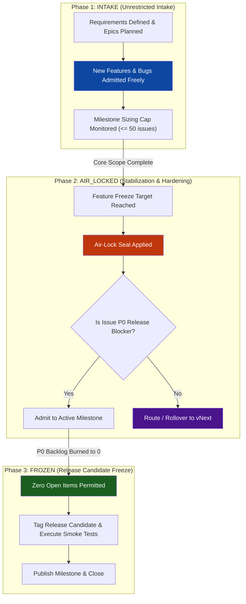

# Pattern: Milestone Scope Air-Lock & Triage Ratchet Governance

> **Pattern Class**: Project Governance / Release Engineering
> **Problem**: Autonomous AI agent workflows continually discover and inject new tasks, refactor targets, and secondary defects into active release milestones, causing milestone horizon inflation, release live-lock, and unmanageable mega-milestones.
> **Solution**: A 3-phase lifecycle ratchet (`INTAKE` → `AIR_LOCKED` → `FROZEN`) governed by mathematical convergence ratio thresholds ($C_R \ge 1.2$) and automated issue partitioning that rolls non-blockers into `vNext`.
> **Reference Implementation**: [`tools/milestone_governor.py`](../tools/milestone_governor.py) + [`tests/test_milestone_governor.py`](../tests/test_milestone_governor.py)

---

## Problem Statement

When development velocity is accelerated by autonomous AI agents, issue creation rates often match or exceed burn-down capacity. Autonomous agents exploring codebases, auditing invariants, running linters, and executing integration tests reliably surface genuine defects and architectural improvements.

If these items are reflexively attached to the **currently active milestone**, the milestone horizon recedes dynamically:
- Denominators inflate constantly ($I_{\text{total}} = I_{\text{closed}} + I_{\text{open}}$).
- Teams get trapped in stagnant completion bands ($70\% - 90\%$) despite closing dozens of PRs.
- Releases cannot converge because secondary polish and opportunistic refactors block the tagging of release candidates.

This creates the **Milestone Horizon Inflation Trap**: high throughput coupled with zero release convergence.

---

## Core Mechanics



### Step-by-Step Implementation

1. **Phase Transition Ratchet**:
   - `INTAKE`: Open admission for all verified user stories, architecture spikes, and bug fixes. Sizing warning triggered at 50 issues; critical alert at 100 issues (`MLS003`).
   - `AIR_LOCKED`: Transitioned when core deliverables are code-complete and the release enters verification. **Non-P0 admissions are prohibited (`MLS002`)**. Incoming enhancements are automatically tagged with `vNext`.
   - `FROZEN`: Transitioned when cutting release candidates. Exactly zero open items are permitted. Any open work remaining must be resolved or partitioned into rollover.
   - `CLOSED`: Milestone tagged, binaries published, and milestone closed.

2. **Mathematical Convergence Tracking**:
   Calculate Scope Injection Velocity ($V_{\text{scope}}$), Burn Velocity ($V_{\text{burn}}$), and the Convergence Ratio ($C_R$):

   $$C_R = \frac{V_{\text{burn}}}{\max(V_{\text{scope}}, 0.01)}$$

   - **Healthy Convergence**: $C_R \ge 1.2$ ($V_{\text{burn}} > V_{\text{scope}}$).
   - **Scope Live-Lock**: $C_R \le 1.0$ ($V_{\text{scope}} \ge V_{\text{burn}}$). Triggers `MLS001` error.
   - **Projected Completion Time**:

   $$T_{\text{conv}} = \frac{I_{\text{open}}}{V_{\text{burn}} - V_{\text{scope}}}$$

3. **Automated Partitioning Protocol**:
   The milestone governor partitions open issues using deterministic predicate logic:
   - **Retain**: Issues with `priority/p0-critical`, `p0`, `blocker`, `critical`, or `type/epic`.
   - **Rollover**: All other open issues (`type/feature`, `type/enhancement`, `type/docs`, low-priority technical debt).

---

## Invariant Catalog

| Rule ID | Invariant Name | Level | Trigger Condition |
| :--- | :--- | :--- | :--- |
| `MLS001` | `ScopeExpansionLiveLock` | Error / Warn | $V_{\text{scope}} \ge V_{\text{burn}}$ ($C_R \le 1.0$) |
| `MLS002` | `AirLockBoundaryBreach` | Error | Non-P0 issue open during `AIR_LOCKED` or any issue open in `FROZEN` |
| `MLS003` | `MegaMilestoneSizingAlert` | Error / Warn | Total issues $> 100$ (Error) or $> 50$ (Warning) |
| `MLS004` | `StagnantHorizonRatchet` | Warning | Completion $70\% - 90\%$ with $\ge 15$ open issues |

---

## Command-Line Usage

```bash
# Audit an active milestone JSON export against AIR_LOCKED phase
python tools/milestone_governor.py milestone_36.json --phase AIR_LOCKED --title "v0.2.23"

# Export SARIF 2.1.0 diagnostics for CI reporting
python tools/milestone_governor.py milestone_36.json --phase AIR_LOCKED --sarif findings.sarif

# Emit JSON payload with rollover recommendations
python tools/milestone_governor.py milestone_36.json --rollover-to "v0.2.24" --json
```

---

## Verifiable Impact

- **Eliminates Release Live-Locks**: Provides mathematical proof of release convergence before tagging release candidates.
- **Protects Autonomous Exploration**: Autonomous agents are never instructed to ignore bugs; instead, discoveries are routed cleanly to future milestone vehicles (`vNext`), preventing scope cascades from stalling active shipments.
- **Lowers Cognitive Sizing Friction**: Enforces milestone sizing caps ($\le 50$ issues) to keep release choreography agile and manageable.
