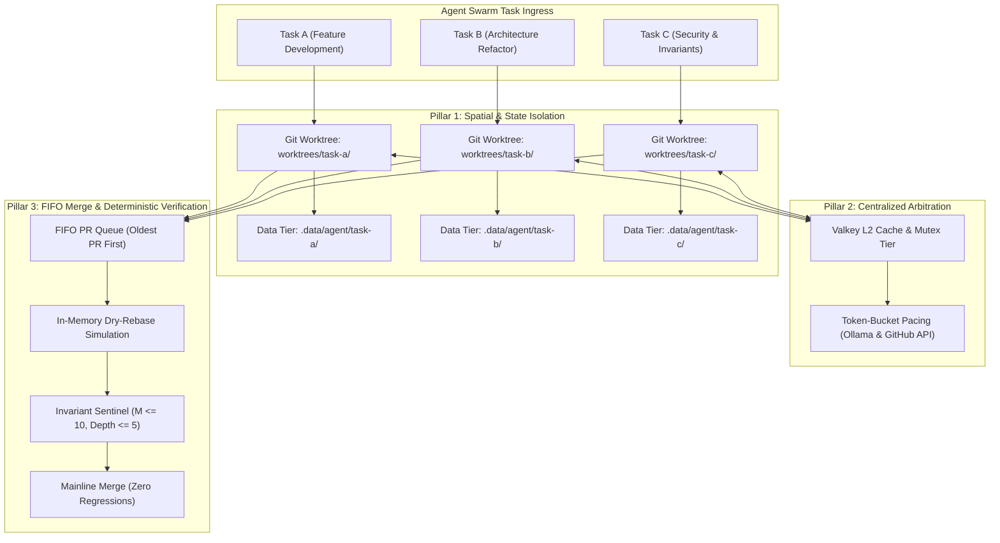

# Pattern: Multi-Agent Codebase Concurrency

> **Pattern Class**: Swarm Orchestration & Concurrency Architecture
> **Problem**: Concurrent agents on one working tree clobber each other's edits, corrupt shared state files, and live-lock on rebase
> **Solution**: Partitioned worktrees, per-agent state directories, and distributed mutexes over the resources that cannot be partitioned

---

## 1. Problem Statement

When multiple autonomous AI agents execute tasks simultaneously against a shared codebase, standard developer tooling and git workflows break down. Without deliberate architectural boundaries, multi-agent execution results in:
- **Working Tree Collisions**: Concurrent file edits and index modifications produce dirty working trees, mid-edit syntax errors, and `.git/index.lock` contention.
- **Cache & Database Corruption**: Unpartitioned test runner and coverage databases (such as SQLite `.coverage.*` files) suffer unlink race conditions and file descriptor invalidation.
- **Rebase Live-Lock & Starvation**: Independent branches merged to the mainline cause cascading rebase storms, forcing peer agents to spend their token budget continuously rebasing rather than shipping features.
- **Inference Thrashing**: Unthrottled parallel calls to local model hosts (e.g. Ollama, vLLM) saturate GPU memory and trigger destructive model eviction thrashing.

---

## 2. Core Mechanics

The Multi-Agent Codebase Concurrency pattern guarantees deterministic, collision-free execution across concurrent agents through five foundational pillars:



### The 5 Rules of Multi-Agent Concurrency

1. **Mandatory Worktree Partitioning**:
   Every agent MUST operate within an independent git worktree (`git worktree add`) or isolated container workspace (`Workspace: 'branch'`). Agents must never read or write directly to the primary checkout directory.
2. **Dedicated Ephemeral Data Scoping**:
   Build artifacts, coverage caches, and execution logs must be isolated into agent-specific subdirectories (`.data/agent/<agent-id>`). Cleanup routines must never delete shared or parent data paths while tests are active.
3. **Paced External & Inference Egress**:
   Access to shared hardware (GPU VRAM, local Ollama endpoints) and rate-limited APIs (GitHub REST/GraphQL) must route through token-bucket rate limiters and concurrency semaphores. High-priority models must be prewarmed with explicit keep-alive leases (`DEFAULT_AI_PREWARM_KEEP_ALIVE = "1h"`).
4. **FIFO Merge Shepherding**:
   Pull requests must be reviewed, rebased, and merged in strict chronological order (lowest PR number first). Bypassing older PRs to merge newer code is strictly prohibited to prevent branch divergence.
5. **Deterministic Invariant Enforcement**:
   Every concurrent pull request must pass a centralized, non-negotiable verification gate enforcing $M \le 10$, nesting depth $< 6$, $\ge 90\%$ code coverage, and zero unhandled warnings before mainline integration.

---

## 3. Reference Implementation & Recipes

### 1. Provisioning Isolated Agent Worktrees
```bash
#!/usr/bin/env bash
set -euo pipefail

AGENT_ID="$1"
BRANCH_NAME="$2"
WORKTREE_DIR="../worktrees/${AGENT_ID}"
DATA_DIR="./.data/agent/${AGENT_ID}"

# Create isolated git worktree
git worktree add -b "${BRANCH_NAME}" "${WORKTREE_DIR}" main

# Create dedicated data tier
mkdir -p "${DATA_DIR}"

# Export scoped environment variables for the agent process
export DEVOPS_CLI_DATA_DIR="${PWD}/${DATA_DIR}"
export COVERAGE_FILE="${PWD}/${DATA_DIR}/.coverage"

echo "Agent ${AGENT_ID} initialized in ${WORKTREE_DIR} with data dir ${DATA_DIR}"
```

### 2. POSIX Process Group Containment in Python
```python
import os
import signal
import subprocess

def run_isolated_agent_command(cmd: list[str], cwd: str, timeout: float) -> str:
    """Execute command in isolated POSIX process group to prevent zombie leaks."""
    proc = subprocess.Popen(
        cmd,
        cwd=cwd,
        stdout=subprocess.PIPE,
        stderr=subprocess.PIPE,
        text=True,
        start_new_session=True,  # Isolate into new process group
    )
    try:
        stdout, stderr = proc.communicate(timeout=timeout)
        if proc.returncode != 0:
            raise RuntimeError(f"Command failed ({proc.returncode}): {stderr[:256]}")
        return stdout
    except subprocess.TimeoutExpired:
        # Kill the entire process group hierarchy
        os.killpg(os.getpgid(proc.pid), signal.SIGKILL)
        proc.communicate()
        raise TimeoutError(f"Command timed out after {timeout}s")
```

### 3. In-Memory Dry-Rebase Verification
```bash
# Verify mergeability in memory before attempting remote rebase
devops pr check-readiness <pr-number> --dry-rebase
```

---

## 4. Anti-Patterns to Avoid

| Anti-Pattern | Operational Risk | Corrective Architecture |
|---|---|---|
| **Root Checkout Sharing** | Multiple agents editing `/workspaces/<repo>` simultaneously, breaking each other's test runs with mid-edit syntax errors. | Mandatory Git Worktrees (`git worktree add`) or branched container workspaces. |
| **Shared SQLite Coverage File** | Running `pytest --cov` across multiple agents targeting `.coverage`, causing `sqlite3.OperationalError: no such table: file`. | Partition data via `DEVOPS_CLI_DATA_DIR=.data/agent/<agent-id>`. |
| **Unordered PR Rebasing** | Agents racing to rebase onto `main`, causing exponential rebase churn and PR starvation. | Strict FIFO pull request processing queue (oldest PR processed first). |
| **Unthrottled GPU Inference** | Multiple agents issuing parallel generation requests to Ollama, causing VRAM thrashing and timeouts. | Token-bucket rate limiting, concurrency semaphores, and model prewarming. |
| **Zombie Process Leaks** | Terminating subprocesses with simple `proc.kill()`, leaking background daemons to PID 1. | POSIX process group isolation (`start_new_session=True`) and `os.killpg`. |

