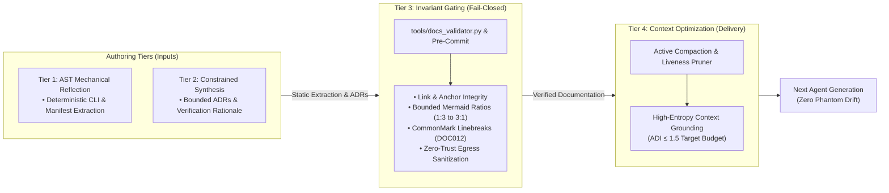

# Pattern: Multi-Tier Living Documentation Architecture

> **Pattern Class**: Architecture & Autonomous Governance
> **Problem**: Autonomous agent self-documentation drifts into phantom architectures, self-consistency traps, attention dilution, and format corruption
> **Solution**: A 4-tier living documentation architecture separating deterministic AST introspection from constrained narrative synthesis, enforced by fail-closed oracles and active compaction
> **Reference Implementation**: [`tools/docs_validator.py`](../tools/docs_validator.py)

---

## 1. Problem Statement

As autonomous AI agents assume primary responsibility for codebase maintenance, the speed of code modification outpaces human documentation authoring by multiple orders of magnitude. Delegating documentation creation directly to AI agents solves this velocity lag but introduces four critical failure modes:

1. **The Phantom Architecture Trap**: LLMs natively hallucinate idealized, enterprise-grade abstractions (e.g. distributed caching, multi-tier isolation) in documentation when underlying code contains only basic stubs, poisoning the context of downstream agents.
2. **The Circular Self-Consistency Trap**: When an agent authors code, tests, and documentation simultaneously, it achieves 100% internal semantic agreement while diverging completely from external physical runtime constraints ([Observation 19](../observations/systems/19-self-consistency-is-not-conformance.md)).
3. **The Attention Dilution & Invariant Extinction Trap**: Unconstrained, verbose narrative documentation bloats token depth, elevating the Attention Dilution Index ($ADI$) and pushing vital security and architectural constraints into the lost-in-the-middle attention valley ([Observation 23](../observations/systems/23-attention-dilution-context-rot-and-active-compaction.md)).
4. **Format & CommonMark Degradation**: Automated formatters strip intentional CommonMark hard line breaks (`  \n`), while agents accidentally introduce unclosed code fences, unquoted Mermaid special characters, or dead relative links.

Natural language instructions cannot prevent these pathologies. The system requires an architectural separation of concerns that treats documentation as **causal software**.

---

## 2. Core Mechanics

The Multi-Tier Living Documentation Architecture partitions documentation lifecycle management into four distinct operational layers:



### The Four Operational Tiers:

1. **Tier 1 (Deterministic Extraction)**: Interface-level facts (CLI commands, flags, parameter types, FastMCP tool schemas, public API signatures) are **never generated by language models**. They are extracted directly from code ASTs and runtime registries using deterministic generators.
2. **Tier 2 (Constrained Narrative Synthesis)**: LLMs author only high-level architectural decision records (ADRs), problem framing, design trade-offs, and empirical verification summaries, constrained to rigid markdown templates.
3. **Tier 3 (Fail-Closed Mechanical Gating)**: The documentation corpus is statically compiled and linted on every commit via `tools/docs_validator.py`. Broken links, unquoted Mermaid labels, unclosed fences, missing directory map entries, and CommonMark whitespace defects cause immediate, blocking pre-commit failures.
4. **Tier 4 (Active Compaction & Prompt Priming)**: When feeding documentation into agent system prompts, transient execution logs and historical task tracking are compacted via multi-scale summarization, preserving an optimal Attention Dilution Index ($ADI \le 1.5$).

---

## 3. Implementation Example

### 3.1 Deterministic Mechanical Extraction (Tier 1)

In [`devops-cli`](https://github.com/dan-petty/devops-cli), CLI reference documentation is generated by introspecting the Typer command registry directly, completely bypassing LLM hallucination:

```python
# Introspect Typer CLI registry deterministically into Markdown tables
def build_cli_reference(app: typer.Typer) -> str:
    lines = ["# CLI Command Reference\n"]
    for command in sorted(app.registered_commands, key=lambda c: c.name):
        lines.append(f"## `devops {command.name}`\n")
        lines.append(f"{command.help or 'No description provided.'}\n")
        lines.append("| Option | Type | Default | Description |")
        lines.append("|---|---|---|---|")
        for param in command.params:
            opt = f"`--{param.name}`" if param.is_flag else f"`--{param.name} <val>`"
            lines.append(f"| {opt} | `{param.type}` | `{param.default}` | {param.help or ''} |")
    return "\n".join(lines)
```

### 3.2 Mechanical Documentation Gate (`tools/docs_validator.py`, Tier 3)

The validator enforces CommonMark hard linebreak hygiene (`DOC012`), link resolution, Mermaid syntax, and zero-trust sanitization before commits are accepted:

```bash
# Validate the entire documentation corpus in under 250ms
$ python tools/docs_validator.py
[PASS] docs_validator: 112 documents audited, 0 errors, 0 warnings.
```

---

## 4. Guardrails & Anti-Patterns

| Anti-Pattern (What Fails) | Architectural Hazard | Prescriptive Guardrail (What Works) |
|---|---|---|
| **LLM-Authored API Tables** | Generates hallucinated options or outdated parameter defaults. | **Rule 1**: Never allow an LLM to generate what an AST or CLI registry can extract. |
| **Circular Internal Verification** | Agent creates code, test, and docs that agree with each other but violate real runtime constraints. | **Rule 2**: Ground assertions in external physical oracles (real exit codes, network responses, kernel signals). |
| **Unbounded Narrative Prose** | Context bloat triggers lost-in-the-middle invariant decay ($ADI > 3.0$). | **Rule 3**: Enforce strict token density; state intent and trade-offs concisely; prune completed task specs. |
| **Unchecked Whitespace Cleaners** | Formatter strips intentional two-space (`  \n`) CommonMark line breaks. | **Rule 4**: Configure pre-commit with `--markdown-linebreak-ext=md` and enforce `DOC012`. |
| **Unverified Mermaid Diagrams** | Unquoted parentheses in node labels trigger runtime rendering crashes on GitHub. | **Rule 5**: Always validate Mermaid syntax via headless jsdom AST engine (`verify_mermaid.mjs`). |

---

## 5. Cross-References

- [**Observation 27**: Agentic Project Self-Documentation & The Phantom Architecture Trap](../observations/systems/27-agentic-project-self-documentation-and-the-phantom-architecture-trap.md)
- [**Observation 19**: Self-Consistency Is Not Conformance](../observations/systems/19-self-consistency-is-not-conformance.md)
- [**Observation 23**: Attention Dilution, Context Rot & Active Compaction](../observations/systems/23-attention-dilution-context-rot-and-active-compaction.md)
- [**Observation 08**: Convention-to-Mechanical Enforcement Inversion](../observations/systems/08-convention-to-mechanical-enforcement-inversion.md)
- [**Observation 26**: Semantic Graph AST Code Memory & Persistent Symbol Indexing](../observations/systems/26-semantic-graph-ast-code-memory-and-persistent-symbol-indexing.md)
- [**Pattern**: Deterministic Mechanical Oracles & Feedback Inversion](./deterministic-oracles-and-feedback-inversion.md)
- [**Pattern**: Epistemic Hygiene & Context Pruning](./epistemic-hygiene-and-context-pruning.md)

