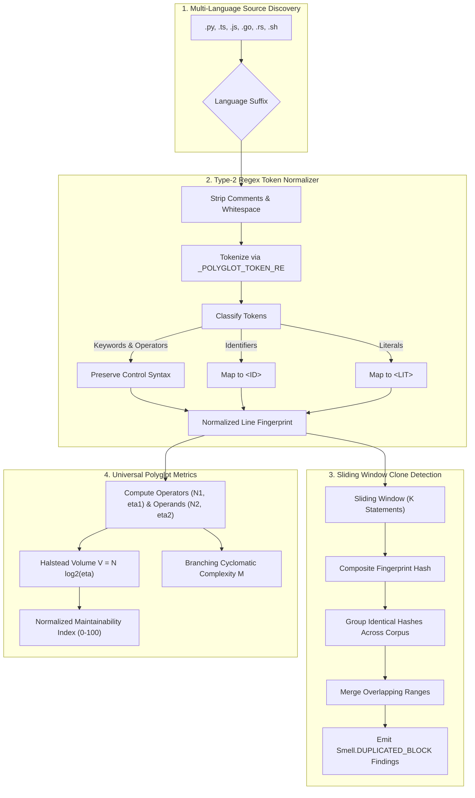

# Pattern: Polyglot Token Normalization and Clone Quantification

> **Pattern Class**: Multi-Language Static Analysis & Quality Measurement  
> **Problem**: Monoglot AST analyzers cannot inspect multi-language repositories, missing copy-paste duplication and structural decay across TypeScript, Go, Rust, and Bash modules without heavy foreign runtime dependencies  
> **Solution**: Standardize on a zero-dependency Type-2 regex token normalizer that strips comments, erases identifiers and literals to generic placeholders, slides statement windows across polyglot source trees, and computes language-agnostic Halstead volume and normalized maintainability indices  
> **Reference Implementation**: [`examples/code-smell-quantifier/smell_quantifier.py`](../examples/code-smell-quantifier/smell_quantifier.py)

---

## 1. Problem Statement: The Polyglot Decay Blindspot

Modern cloud architectures and AI agent worktree networks consist of polyglot service fleets. When static analyzers operate exclusively on single-language AST grammars:

1. **Cross-Language Duplicate Blindness**: Repeated algorithms duplicated across frontend TypeScript code, Go microservices, and Rust kernels cannot be compared or quantified.
2. **Type-1 vs. Type-2 Fragility**: Simple substring or hashing detectors only find byte-identical copies. Once an engineer or subagent renames local variables or constants, Type-1 detectors fail entirely.
3. **Runtime Dependency Proliferation**: Adopting separate monolithic linters for each language (such as `jscpd` via npm or SonarQube via Java) introduces heavy toolchain friction, divergent reporting schemas, and slow CI feedback loops.

---

## 2. The Architectural Pattern: Type-2 Polyglot Token Normalization

The **Polyglot Token Normalization Pattern** abstracts syntax into structural tokens, enabling unified clone detection and metric computation across languages:



---

## 3. Structural Token Classification Protocol

The normalization pipeline processes every non-empty line according to deterministic grammar rules:

1. **Comment Elimination**: Strips comments based on language conventions (`#` for Python/Bash/YAML, `//` for TypeScript/Go/Rust/C++).
2. **Control-Flow Preservation**: Keywords (`if`, `else`, `for`, `while`, `return`, `function`, `match`, `class`) and structural punctuation (`{`, `}`, `(`, `)`, `;`, `+`, `==`) are preserved unchanged to reflect the underlying algorithmic skeleton.
3. **Identifier Normalization**: All user-defined variable, function, and parameter identifiers are replaced with `<ID>`.
4. **Literal Normalization**: All numeric constants, string literals, and template strings are replaced with `<LIT>`.

This ensures that:
```typescript
function calculatePrice(baseRate: number, taxRate: number): number {
    if (baseRate <= 0) {
        return 0;
    }
    const finalAmount = baseRate * (1 + taxRate);
    return finalAmount;
}
```
and:
```typescript
function computeSalary(baseWage: number, bonusRate: number): number {
    if (baseWage <= 0) {
        return 0;
    }
    const totalPayout = baseWage * (1 + bonusRate);
    return totalPayout;
}
```
produce identical line-by-line structural token streams, enabling deterministic Type-2 copy-paste detection.

---

## 4. Key Engineering Trade-offs

| Dimension | Polyglot Token Normalization | Dedicated Per-Language Linters (e.g. `jscpd`) |
| :--- | :--- | :--- |
| **Toolchain Dependencies** | **Zero dependencies** (pure Python standard library) | Node.js, npm packages, or JVM runtimes |
| **Execution Speed** | Sub-second across hundreds of files | Multi-second runtime startup and compilation |
| **Detection Quality** | Accurate Type-2 structural clones | Accurate Type-2 clones |
| **Metric Portability** | Normalized to standard Radon 0–100 MI scale | Proprietary, non-comparable metric indices |
| **CI Integration** | Native execution in existing Python gates | Fragmented exit codes and report artifacts |
