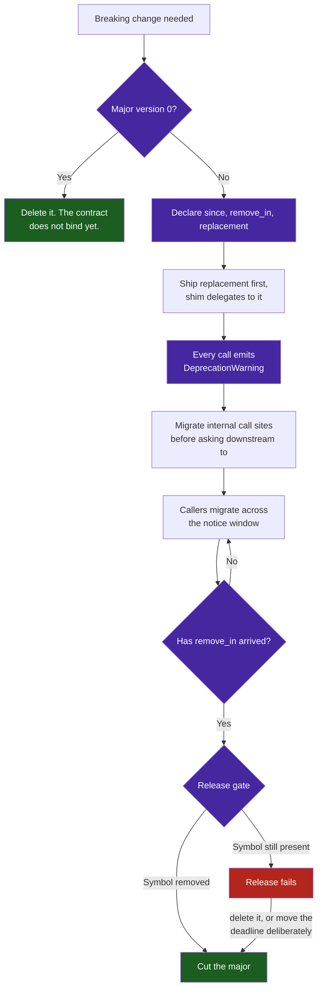

# Pattern: Post-1.0 Deprecation Lifecycle — Contracts With Deadlines, Not Reflexes

> **Pattern Class**: Release Engineering & Change Management
> **Problem**: After 1.0, both "delete on sight" and "never delete" are wrong, and agents apply whichever the instructions last emphasized
> **Solution**: Every deprecation is a dated contract — `since`, `remove_in`, `replacement` — enforced mechanically at release time
> **Reference Implementation**: [`examples/deprecation-lifecycle-sentinel/`](../examples/deprecation-lifecycle-sentinel/)

---

## Problem Statement

A pre-1.0 codebase has one rule: delete obsolete code immediately. It is unambiguous, mechanically checkable, and correct, because nothing external depends on the surface.

Crossing 1.0 silently invalidates that rule without replacing it. The instruction that previously produced clean code now produces broken callers, and the obvious correction produces something worse:

| Reflex | Local effect | Accumulated effect |
|---|---|---|
| **Delete on sight** | Clean tree, no shims | Downstream builds break without warning; trust in the version contract collapses |
| **Never delete** | Nothing breaks today | Every deprecated path stays live — tested, secured, reasoned about — forever |
| **Deprecate without a deadline** | Feels responsible | Strictly worse than both: the maintenance cost of keeping it *plus* a warning nobody acts on |

The third row is where most projects land, and it is the one that looks like diligence.

Autonomous agents sharpen every row. An agent operating under "keep the codebase free of legacy references" will delete a public API that a team pinned last week — the instruction is followed exactly and the outcome is a breaking change nobody requested. An agent under "preserve backwards compatibility" adds a shim beside every change and removes none, because removal is never the locally safe action and no single session is ever the one that should do it. Neither agent is malfunctioning. Both are executing a reflex where a policy was needed.

---

## Core Mechanics

A deprecation is a **contract with a deadline**. It carries three facts, and any one of them missing makes it unactionable:

1. `since` — the version where the obligation started, which bounds how long callers have had notice.
2. `replacement` — what to migrate to. Without it, the warning tells callers to stop without telling them where to go.
3. `remove_in` — the version that deletes it. Without this, the deprecation never ends.



The load-bearing edge is the last one. Removal must be **the condition of shipping**, not a chore someone remembers. A deadline that no gate reads is a comment.

---

## Implementation Example

```python
@deprecated(since="1.2.0", remove_in="2.0.0", replacement="render_report(fmt='json')")
def render_json_report(data):
    """Superseded by the unified renderer."""
    return render_report(data, fmt="json")
```

One declaration carries both halves: the metadata a static gate enforces, and the `DeprecationWarning` the caller experiences at runtime. The decorator refuses to construct an incomplete contract, so an under-specified deprecation fails at import rather than at the release that was meant to remove it.

At release time:

```bash
python3 deprecation_sentinel.py src --current-version "${RELEASE_VERSION}"
# ❌ [OverdueRemoval] src/report.py:88 — 'render_json_report' was scheduled for
#    removal in 2.0.0; the current version has reached it.
```

For behavioural changes too large for a shim, pair the contract with a **feature flag**, which converts an instantaneous break into a window where both paths are live and either can be selected. The flag inherits the same obligation: a flag without a removal version becomes permanent branching, and the number of reachable configurations doubles with each one that outlives its purpose.

---

## Guardrails & Anti-Patterns

> [!WARNING]
> **The deadline is the pattern.** `since` and `replacement` without `remove_in` produce the third row of the problem table — full maintenance cost, plus warning noise callers learn to filter, plus the illusion that the debt is being managed.

- **Do not deprecate what you have not replaced.** Shipping the warning before the replacement tells callers to leave with nowhere to go, and they correctly ignore it.
- **Do not deprecate internally and keep calling it.** An `UnmigratedCallSite` means the owner found migration too expensive at the exact moment they asked everyone else to pay for it.
- **Do not schedule removal inside a major.** The version contract is the only reason callers can upgrade minors without reading a changelog; a single minor-version removal teaches them they cannot, permanently.
- **Do not let an agent infer the policy from tree cleanliness.** State the major version in the agent's instructions, and gate the conclusion mechanically. Pre-1.0 and post-1.0 demand opposite behaviour from the same prompt, and nothing in the source tree announces which regime is in force.
- **Move deadlines deliberately, in the changelog.** Extending a window is a legitimate decision. Silently letting it lapse is how a project discovers it has been post-1.0 in name only.

---

## Cross-References

- **[Deprecation Lifecycle Sentinel](../examples/deprecation-lifecycle-sentinel/)**: The executable gate implementing this pattern.
- **[Gate Integrity & Total Input Coverage](./gate-integrity-and-total-input-coverage.md)**: Why the release gate must fail on unaudited input rather than certify it.
- **[Root Cause Hardening](./root-cause-hardening.md)**: Codifying the rule once the deadline has lapsed rather than fixing the instance.
