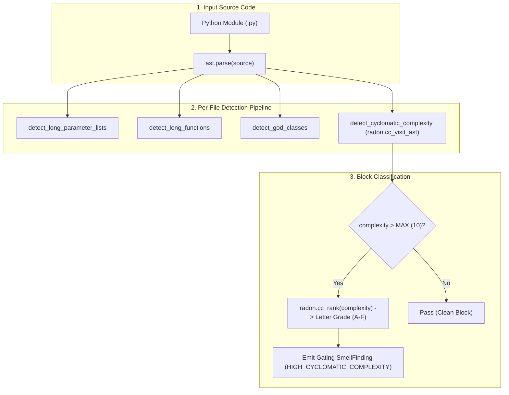

# Pattern: Radon Block Complexity Ranking and Smell Quantification

> **Pattern Class**: Code Quality Metrics & Static Analysis  
> **Problem**: Module-level maintainability metrics average out localized function complexity, hiding monolithic dispatchers and high-risk control flow spikes behind deceptive module-level Grade A scores  
> **Solution**: Integrate radon's reference AST visitor (`cc_visit_ast`) and grade ranker (`cc_rank`) directly into the code smell quantification engine, reporting block-level cyclomatic complexity alongside structural smells  
> **TLDR**: Measure McCabe cyclomatic complexity at individual block and function levels using AST visitors, preventing complex spikes from hiding behind module averages.
> **ELI:7b**: Check each individual function for complicated knots instead of averaging the whole file, so giant tangled functions can't hide.
> **Reference Implementation**: [`examples/code-smell-quantifier/`](../examples/code-smell-quantifier/)

---

## 1. Problem Statement: Aggregate Metric Blindspots

In structural software analytics, aggregate metrics (such as the Maintainability Index) incorporate lines of code, Halstead volume, and cyclomatic complexity into a single normalized score ($0$ to $100$). While useful for high-level repository health monitoring, module aggregates exhibit a dangerous masking effect:

- A 400-line module with twenty small helper functions ($M = 1$) and one deeply nested 80-line function ($M = 18$) produces an aggregate MI score of $\ge 35$ (Grade A).
- A developer or AI agent reviewing only module-level dashboards assumes the entire module is clean and well-factored.
- The monolithic function continues to accumulate nested branches until it triggers production regressions or fails strict gating sentinels.

To eliminate this blindspot, structural analyzers must evaluate cyclomatic complexity at the function and block level.

---

## 2. The Architectural Pattern: In-Memory AST Block Analysis

The **Radon Block Complexity Ranking Pattern** combines zero-IO AST reuse with upstream reference implementations:



---

## 3. Implementation Contracts

### 3.1 Direct AST Re-use Without File Re-reading

Rather than invoking external CLI binaries or re-tokenizing files from disk, the detector passes the in-memory Python AST directly to radon's `cc_visit_ast`:

```python
from radon.complexity import cc_rank, cc_visit_ast

MAX_CYCLOMATIC_COMPLEXITY: Final[int] = 10

def detect_cyclomatic_complexity(
    tree: ast.AST, path: Path, max_complexity: int = MAX_CYCLOMATIC_COMPLEXITY
) -> list[SmellFinding]:
    """Flag functions and methods exceeding the cyclomatic complexity ceiling."""
    try:
        blocks = cc_visit_ast(tree)
    except Exception:
        return []
    findings: list[SmellFinding] = []
    for block in blocks:
        if block.complexity > max_complexity:
            rank = cc_rank(block.complexity)
            findings.append(
                SmellFinding(
                    smell=Smell.HIGH_CYCLOMATIC_COMPLEXITY,
                    file_path=str(path),
                    line_number=block.lineno,
                    subject=block.name,
                    measured=float(block.complexity),
                    threshold=float(max_complexity),
                    detail=f"McCabe complexity {block.complexity} (rank {rank}); exceeds threshold {max_complexity}",
                )
            )
    return findings
```

### 3.2 Reference Implementation Fidelity

The metric must report radon's exact calculation and letter grade (`A` through `F`) rather than an ad-hoc approximation:
- Rank A: $1 - 5$ (low complexity)
- Rank B: $6 - 10$ (moderate complexity)
- Rank C: $11 - 20$ (more complex, consider refactoring)
- Rank D: $21 - 30$ (high complexity)
- Rank E: $31 - 40$ (very high complexity)
- Rank F: $41+$ (dangerous / untestable)

---

## 4. Verification & Operational Guidelines

1. **Shared Tree Optimization**: Pass `ast.AST` into `detect_cyclomatic_complexity` from the single parsing pass shared by all per-file detectors to avoid redundant parsing.
2. **Actionable Diagnostics**: Always include the function name, exact line number, measured McCabe number, and radon rank in the diagnostic finding.
3. **Gating Classification**: Classify high block complexity ($M > 10$) as a gating finding, ensuring it fails CI builds and surfaces in PR review bots.
