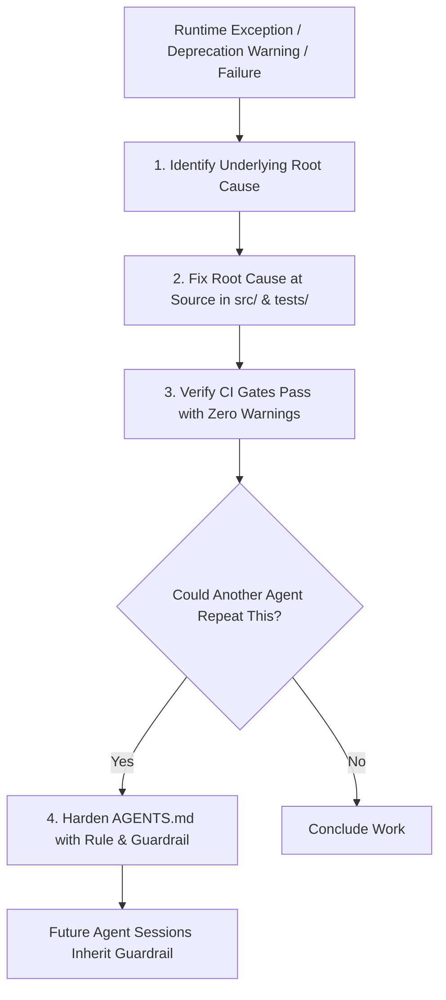

# Pattern: Root-Cause Remediation & Instruction Hardening

> **Pattern Type**: Meta-Cognitive Self-Improvement & Harness Resilience  
> **Target Audience**: AI Agents, System Prompt Designers & Engineering Leads  
> **Source Project**: `devops-cli`  

---

## 1. Problem Statement

In human development, an engineer who fixes a bug learns from it. In standard LLM setups, each agent session starts with a blank memory:
- If Agent A encounters a subtle bug (e.g. an unhandled deprecation in Pydantic v2 or a rate-limit error) and fixes it in code, Agent B in a future session may re-introduce the exact same mistake because the system instructions remain unchanged.
- This creates **cyclic regressions and repeated failure modes**.

---

## 2. Core Mechanics

The Root-Cause Hardening pattern couples every code fix with an **instruction hardening step**:

### The Dual-Remediation Rule

Whenever an agent encounters any unexpected failure, unhandled exception, CLI crash, or deprecation warning:
1. **Fix in Source Code**: Remediate the underlying root cause directly. Never apply superficial workarounds, mask exceptions (`except Exception: pass`), or suppress warnings.
2. **Harden the Instruction File (`AGENTS.md`)**:
   - If the failure was caused by an ambiguous convention, missing pre-flight check, or common antipattern, add an explicit rule to `AGENTS.md`.
   - The rule must clearly specify:
     - The prohibited behavior.
     - The required engineering replacement.
     - The rationale.

---

## 3. Implementation Example

### Real Incident from `devops-cli`
- **Issue**: An agent used `datetime.utcnow()`, which triggered a `DeprecationWarning` in Python 3.12+.
- **Step 1 (Source Fix)**: Replaced with `datetime.now(timezone.utc)`.
- **Step 2 (Instruction Hardening)**: Added the following guardrail to `AGENTS.md`:
  > *"Proactive Deprecation Remediation & Zero-Warning Mandate: Suppressing, ignoring, or tolerating deprecation warnings is strictly prohibited. Update deprecated calls immediately upon encounter. Use timezone-aware `datetime.now(timezone.utc)` across all modules."*
- **Outcome**: No subsequent agent in any session ever used `datetime.utcnow()` again.

---

## 4. Guardrails & Anti-Patterns

| Anti-Pattern | Why It Fails | Root-Cause Guardrail |
|---|---|---|
| **Symptom Masking** | Suppressing warnings with `@pytest.mark.filterwarnings("ignore")`. | Banned. Fix the deprecated call at the source. |
| **Silent Workaround** | Working around a broken CLI subcommand without logging an issue. | Banned. File a defect immediately and fix the underlying CLI tool. |
| **Instruction Bloat** | Adding long paragraphs of prose to instructions for trivial typos. | Keep additions concise, actionable, and rule-oriented. |

---

## 5. Cross-References
- [Observation 01: TDD as Living Contract](../observations/devops-cli/01-tdd-as-living-contract.md)
- [Pattern: CEGIS & Hypothesis Debugging](./cegis-and-hypothesis-debugging.md)
- [Canonical Agent Instructions](../AGENTS.md)
