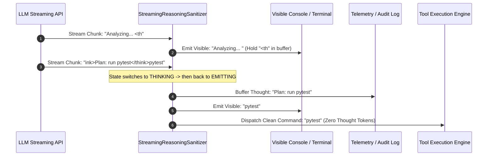

# Pattern: Streaming Reasoning Isolation & Token Budgeting

> **Pattern Class**: Operational Execution & Cognitive Stream Governance
> **Problem**: Reasoning tokens streamed into dispatchers and terminals leak chain-of-thought into tool parameters and user output
> **Solution**: A streaming finite-state sanitizer isolating reasoning channels, with an explicit budget for what reasoning may cost
> **Reference Implementation**: [`examples/streaming-reasoning-sanitizer/`](../examples/streaming-reasoning-sanitizer/)

---

## 1. Problem Statement

Modern reasoning models generate chain-of-thought tokens inside XML tags (`<think>...</think>`) or dedicated streaming channels. In agentic workflows, streaming these raw tokens directly into command dispatchers or user terminals leads to:

1. **Tool Execution Hijacking**: Internal reasoning fragments prepended to bash commands or SQL scripts cause immediate execution failure.
2. **Terminal Visual Corruption**: Thought traces flood developer interfaces, burying actionable progress.
3. **Memory Exhaustion (CWE-400)**: Unbounded thinking loops consume tens of thousands of tokens without yielding progress.
4. **Packet Boundary Fragmentation**: Streaming network chunks split tags (`<th` + `ink>`), bypassing naive substring searches.

---

## 2. Core Mechanics

The pattern deploys a **Streaming Finite State Machine (FSM)** with an out-of-band thinking accumulator and a bounded character cap:



### Operational Steps:
1. **Incremental Buffering**: Maintain a small trailing buffer for potential tag prefixes (`<`, `<t`, `<th`, `<thi`, `<thin`, `<think`).
2. **State Transition**:
   - `EMITTING`: All non-tag characters are yielded immediately to the visible output channel.
   - `THINKING`: All enclosed characters are routed exclusively to the private telemetry accumulator.
3. **Cap Enforcement**: Once accumulated thoughts reach `max_thought_chars` (e.g. 64KB), discard excess tokens and emit an alert to prevent memory bloat.
4. **EOF Flush**: On stream completion, flush remaining trailing buffer characters, verifying that unclosed tags flag an anomalous stream.

---

## 3. Implementation Example

```python
from sanitizer import StreamingReasoningSanitizer

sanitizer = StreamingReasoningSanitizer(
    open_tag="<think>",
    close_tag="</think>",
    max_thought_chars=65536,
)

visible_buffer = []

for chunk in model_stream:
    res = sanitizer.feed(chunk)
    if res.visible_chunk:
        # Route clean text directly to terminal / tool parser
        visible_buffer.append(res.visible_chunk)
        print(res.visible_chunk, end="", flush=True)

# Flush any trailing characters
flush_res = sanitizer.flush()
if flush_res.visible_chunk:
    visible_buffer.append(flush_res.visible_chunk)

clean_payload = "".join(visible_buffer)
internal_thoughts = sanitizer.get_accumulated_thoughts()

# Dispatch command safely
if not sanitizer.metrics.unclosed_stream:
    execute_agent_tool(clean_payload)
```

---

## 4. Guardrails & Anti-Patterns

- ❌ **Anti-Pattern: Post-Hoc Regex on Accumulated Strings**: Waiting for the entire completion to finish before running `re.sub(r"<think>.*?</think>", "")` destroys real-time streaming user feedback.
- ❌ **Anti-Pattern: Unbounded Thought Buffers**: Allowing models to accumulate unbounded reasoning strings in memory triggers Out-Of-Memory (OOM) kills on constrained agent hosts.
- ⚠️ **Guardrail: Zero Thought Leakage in Tool Payloads**: Always verify that strings passed to subprocess execution or JSON serializers contain zero open or closing reasoning tags.

---

## 5. Cross-References

- **Observation**: [`observations/devops-cli/13-streaming-reasoning-token-parsers-and-think-block-sanitization.md`](../observations/devops-cli/13-streaming-reasoning-token-parsers-and-think-block-sanitization.md)
- **Reference Implementation**: [`examples/streaming-reasoning-sanitizer/`](../examples/streaming-reasoning-sanitizer/)
- **Schema Manifest**: [`artifacts/schemas/fastmcp-agent-tool-manifest-spec.json`](../artifacts/schemas/fastmcp-agent-tool-manifest-spec.json)
