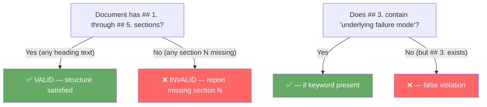

# Pattern: Structural Position Oracles — Validating Schema Slots by Position, Not Semantic Content

> **Pattern Class**: Documentation & Schema Validation
> **Problem**: Keyword matching against required section content fails on organically-varied vocabulary
> **Solution**: Validate required structural slots by position or key index, never by inferring identity from value content
> **Reference Implementation**: [`tools/docs_validator.py`](../tools/docs_validator.py) — `check_observation_structure`

---

## Problem Statement

When validating that a structured document, API response, or schema conforms to a required template, the first instinct is often **semantic content matching** — searching for key phrases that "should be present" in required fields.

This fails whenever the allowed vocabulary for a field is open or variable. Document authors naturally use synonyms, contextual subtitle additions, or creative reformulations:

```text
# Template requires:   "## 5. Verifiable Impact"
# Author may write:    "## 5. Quantitative Verification & Empirical Impact"
#                      "## 5. Key Takeaways for Autonomous Systems"
#                      "## 5. Closing the Feedback Loop"
```

All of these are structurally correct (section 5 is present) but semantically divergent (none contain the exact keyword `"verifiable impact"`). A keyword-based validator produces false violations on every one.

---

## Core Mechanics



### Step-by-Step

**1. Define required slots as a count or ordered key set, not as content keywords:**

```python
# ❌ Anti-pattern: semantic content keywords
REQUIRED_SECTIONS = ("executive context", "observed phenomenon", "verifiable impact")

# ✅ Correct: structural slot count
REQUIRED_SECTION_COUNT: Final[int] = 5
```

**2. Extract the presence of structural markers, not their content:**

```python
# Extract which numbered sections (## N.) are present
_NUMBERED_SECTION_RE = re.compile(r"^##\s+(\d+)\.")

def _extract_numbered_sections(lines: Sequence[str]) -> set[int]:
    found: set[int] = set()
    in_fence = False
    for line in lines:
        stripped = line.strip()
        if stripped.startswith(("```", "~~~")):
            in_fence = not in_fence
            continue
        if in_fence:
            continue
        m = _NUMBERED_SECTION_RE.match(stripped)
        if m:
            found.add(int(m.group(1)))
    return found
```

**3. Validate completeness against the required set:**

```python
def _missing_numbered_sections(found: set[int]) -> list[int]:
    return [n for n in range(1, REQUIRED_SECTION_COUNT + 1) if n not in found]
```

**4. Scope the validator correctly — exclude index/README files:**

```python
_OBS_FILENAME_RE = re.compile(r"^\d+-.+\.md$")

def _is_observation_file(path: Path) -> bool:
    return "observations" in path.parts and _OBS_FILENAME_RE.match(path.name) is not None
```

Index files (`README.md`, `CHANGELOG.md`) live in the same directory as observation documents and must be excluded from structure checking. The numbering convention (`01-foo.md`, `17-bar.md`) is itself a structural discriminator.

---

## Generalizations

This pattern applies beyond document validation anywhere a schema requires a set of mandatory **named slots** or **positional fields**:

| Context | Structural Slot Oracle | Semantic Content Oracle (Wrong) |
|---|---|---|
| JSON API response | `assert "id" in response and "status" in response` | `assert "success" in response["status"]` |
| Database row | `assert all(col in row for col in REQUIRED_COLS)` | `assert "active" in row["state"]` |
| GitHub Action matrix | Check that all required `jobs.<name>` keys exist | Check that step names mention "test" |
| Markdown template | Verify `## 1.` through `## 5.` headings exist | Search for "verifiable impact" text |
| Config YAML | `assert all(k in cfg for k in REQUIRED_KEYS)` | `assert "prod" in cfg["environment"]` |

---

## Guardrails & Anti-Patterns

**Never infer slot identity from content.** A section titled `## 5. Benchmark Results & Statistical Significance` is section 5 regardless of whether it contains the word "impact". The validator's concern is position; the author's concern is content.

**Always pair with filename/path predicates.** Structural validation must only fire on files that are supposed to conform to the template. Apply file pattern guards before running any structural check.

**Avoid conflating format validation with content linting.** Two separate validators are better than one monolithic validator:
- **Structural validator**: presence of required numbered sections (this pattern).
- **Content linter** (optional, advisory): lexical richness, word count per section, Flesch-Kincaid readability.

---

## Cross-References

- **[Observation 17](../observations/devops-cli/17-semantic-validators-vs-structural-position-oracles.md)**: The empirical case study that originated this pattern.
- **[Observation 06](../observations/devops-cli/06-rate-limits-and-anti-brittle-heuristics.md)**: The root prohibition on brittle partial pattern subsets.
- **[`tools/docs_validator.py`](../tools/docs_validator.py)**: Reference implementation of `check_observation_structure`.

