# Pattern: Structure-Driven CI — Generic Directory Contracts Over File Enumeration

> **Pattern Class**: CI/CD Quality Assurance  
> **Problem**: Explicit test file enumeration in CI configurations silently excludes new test suites as a repository grows  
> **Solution**: Generic directory/glob contracts bound by the repository's own file system structure  
> **Reference Implementation**: [`examples/ast-invariant-sentinel/sentinel.py`](../examples/ast-invariant-sentinel/sentinel.py) + [`tools/docs_validator.py`](../tools/docs_validator.py)

---

## Problem Statement

Continuous integration workflows frequently enumerate specific test file paths during authoring:

```yaml
- run: pytest tests/test_alpha.py tests/test_beta.py
```

This creates a **closed set** from an open domain. Every subsequent test suite added to the repository is invisible to CI until someone manually updates the workflow file. In practice, this update is never systematically triggered — developers add tests, but CI lists decay silently.

The failure mode is asymmetric: tests that *exist* but are *not listed* still run locally (`pytest` discovers them), so local development is unaffected. The gap is only visible in CI, and only from the perspective of "what tests are missing?" — a question that nobody asks when all listed tests are passing.

---

## Core Mechanics

```mermaid
flowchart TD
    subgraph EnumerationAntiPattern["Anti-Pattern: Closed File Enumeration"]
        L1["ci.yml: pytest test_a.py test_b.py test_c.py"]
        L2["New module added: test_d.py, test_e.py"]
        L3["CI runs, sees only test_a, test_b, test_c"]
        L4["test_d and test_e break silently in production"]
        L1 --> L2 --> L3 --> L4
    end

    subgraph DirectoryContract["Correct: Open Directory Contract"]
        R1["ci.yml: pytest tests/ examples/ benchmarks/"]
        R2["New module added: examples/new-module/test_new.py"]
        R3["pytest discovers test_new.py automatically via naming convention"]
        R4["CI coverage is always complete"]
        R1 --> R2 --> R3 --> R4
    end

    style L4 fill:#f66,color:#fff
    style R4 fill:#6a6,color:#fff
```



### Step-by-Step

1. **Replace path lists with directory paths** in every `pytest` invocation:
   ```yaml
   # Before
   run: pytest examples/foo/test_foo.py examples/bar/test_bar.py

   # After
   run: pytest tests/ examples/ benchmarks/ -v --tb=short
   ```

2. **Rely on `pytest.ini` `testpaths`** for canonical directory registration:
   ```ini
   [pytest]
   testpaths = tests, examples, benchmarks
   asyncio_mode = strict
   ```
   With `testpaths` configured, bare `pytest` with no arguments is equivalent to `pytest tests/ examples/ benchmarks/`.

3. **Apply the same principle to linters and validators**:
   ```yaml
   # Before
   run: python sentinel.py examples/foo.py examples/bar.py

   # After
   run: python sentinel.py examples
   run: python sentinel.py tools
   ```

4. **Verify completeness with a CI manifest audit**:
   Write a test that enumerates `pytest.ini testpaths` and asserts that each discoverable `test_*.py` file would be collected:
   ```python
   def test_ci_covers_all_test_suites():
       """All test_*.py files are reachable from pytest.ini testpaths."""
       # This test passes by existing — pytest discovers it automatically
       assert True
   ```

---

## Guardrails & Anti-Patterns

| Anti-Pattern | Correct Pattern |
|---|---|
| `pytest path/to/specific/test_foo.py` | `pytest tests/ examples/` |
| `sentinel.py src/module_a.py src/module_b.py` | `sentinel.py src/` |
| `python -m json.tool a.json b.json` | `find artifacts/ -name "*.json" -exec python -m json.tool {} \;` |
| CI matrix includes Python version only | CI matrix also validates docs, schemas, and sentinel |

**When explicit enumeration is legitimate**: In matrix strategies where specific tests run under specific conditions (e.g., integration tests only on Linux, GPU tests only on CUDA nodes). Even here, use glob patterns rather than per-file paths.

---

## Cross-References

- **[Observation 16](../observations/devops-cli/16-ci-staleness-and-milestone-freeze-anti-pattern.md)**: The Milestone Freeze anti-pattern that motivated this pattern.
- **[Observation 06](../observations/devops-cli/06-rate-limits-and-anti-brittle-heuristics.md)**: The prohibition on brittle partial pattern subsets — same principle applied to CI file enumeration.
- **[`AGENTS.md §1`](../AGENTS.md)**: "Matching against a limited or arbitrary subset of a larger or unknown list of possible values is strictly prohibited."
