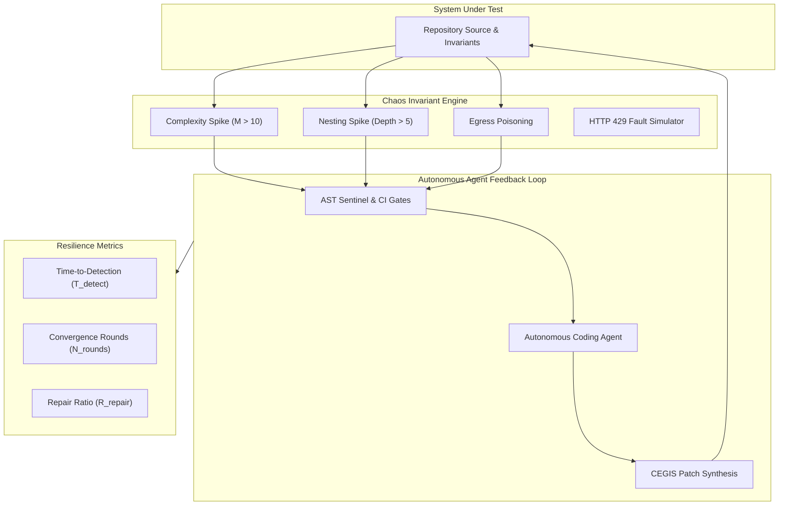

# Pattern: Synthetic Chaos and Invariant Convergence Testing

> **Pattern Class**: Autonomous Resilience & Self-Healing Architecture
> **Problem**: Sterile benchmarks mask agent vulnerability to real-world complexity creep, assertion drift, and transient failures
> **Solution**: Deterministic chaos injection perturbing mechanical invariants with rollback safety and automated repair ratio telemetry
> **Reference Implementation**: [`examples/chaos-invariant-monkey/`](../examples/chaos-invariant-monkey/)

---

## 1. Problem Statement

Autonomous AI coding agents perform reliably when evaluated against isolated, static benchmark suites. However, production software development exposes agents to chaotic environmental friction:
- **Structural Invariant Drift**: Edits that inadvertently inflate cyclomatic complexity ($M > 10$) or nest control flow past architectural limits ($> 5$).
- **Test Assertion Fragmentation**: Replacement of robust structural tuple assertions with linear assertion sequences that trigger complexity gates.
- **Accidental Egress Contamination**: Inclusion of internal hostnames or private RFC 1918 IPs in mock data.
- **Transient Network & Quota Throttling**: Sporadic HTTP 429 rate limits from LLM providers or external API servers.

Without empirical resilience testing, developers cannot predict how effectively an agent will diagnose, isolate, and remediate unexpected invariant breaches.

---

## 2. The Architectural Pattern

The **Synthetic Chaos and Invariant Convergence Testing** pattern subjects autonomous agent loops to **controlled, reversible perturbation vectors**, measuring the agent's convergence velocity and repair fidelity.

---

## 3. Core Operational Mechanisms

### 3.1 Targeted Invariant Vectors
Rather than injecting random bit-flips or generic syntax garbage, the chaos engine targets the specific architectural invariants enforced by the repository:
1. **McCabe Complexity Invasions**: Inserts branching ladders (`if/elif`) into target functions to drive $M > 10$.
2. **Nesting Depth Escalation**: Inserts deeply nested indentation scopes ($> 5$ levels) to trip indentation gates.
3. **Assertion Sprawl Induction**: Converts consolidated tuple equality assertions (`assert (a, b) == (1, 2)`) into linear assert cascades.
4. **Egress Poisoning**: Introduces simulated private network IP strings into comments or mock fixtures to verify that zero-trust egress sentinels actively catch leaks.

### 3.2 Quantitative Resilience Telemetry
The benchmark tracks three essential metrics:
- **Time-to-Detection ($T_{\text{detect}}$)**: Latency between mutation injection and oracle identification.
- **Convergence Rounds ($N_{\text{rounds}}$)**: The number of self-correction turns required to restore all invariants.
- **Repair Ratio ($R_{\text{repair}}$)**: The percentage of injected mutations successfully resolved without human intervention:

$$R_{\text{repair}} = \frac{N_{\text{repaired}}}{N_{\text{injected}}}$$

### 3.3 Atomic Rollback Safety
Every injection records the exact byte-level state of the target file prior to mutation. If an agent fails to converge or times out, the harness atomically reverts all files to their pristine baseline.

---

## 4. Key Takeaways for Agentic Systems

1. **Test Recovery, Not Just Creation**: Evaluating how an agent fixes broken invariants is as vital as evaluating how it writes new code.
2. **Make Chaos Reversible**: Never run destructive benchmarks without guaranteed atomic rollback.
3. **Use SARIF Telemetry**: Output all benchmark findings into standardized SARIF 2.1.0 to integrate directly with GitHub Code Scanning.

