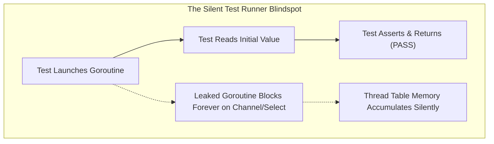
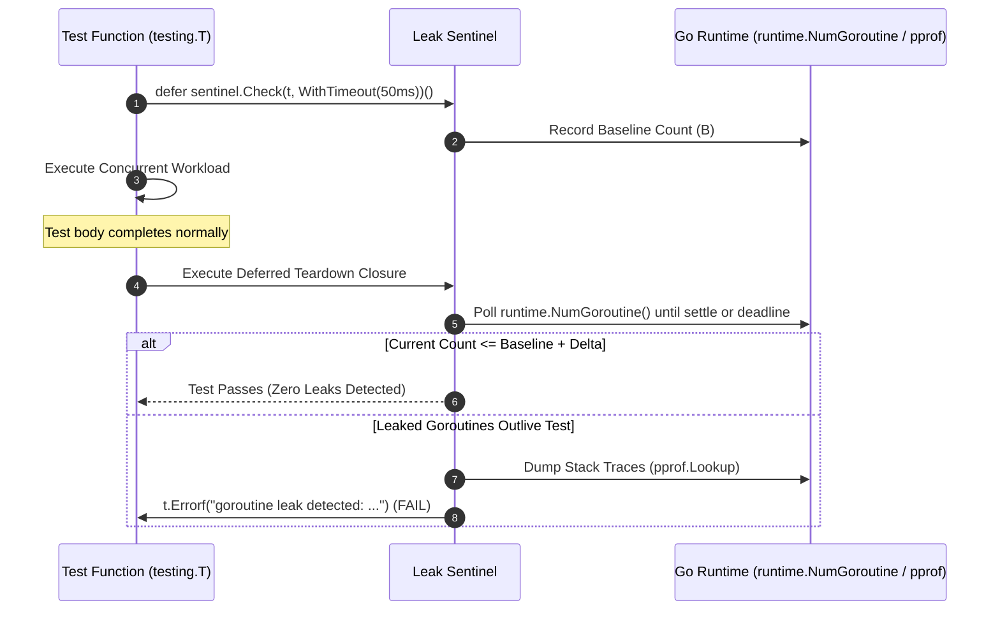

# Pattern: Test Harness Concurrency Leak Sentinel

> **Pattern Class**: Polyglot Systems Invariant Enforcement  
> **Problem**: Standard test runners (`go test`, `pytest`) silently pass when concurrent worker goroutines outlive tests, accumulating thread table entries and leaking resources until production failure  
> **Solution**: Integrate deterministic baseline calibration and teardown assertions directly into standard test functions (`defer sentinel.Check(t)()`, `verify_test_run(fail_on_leak=True)`) to fail tests on leaked goroutines  
> **TLDR**: Embed goroutine and thread baseline tracking directly in test teardowns, failing tests immediately when background workers outlive the suite.
> **ELI:7b**: Fail the test immediately if a background worker or thread is left running after the test finishes, preventing memory leaks.
> **Reference Implementation**: [`examples/go-leak-sentinel/`](../examples/go-leak-sentinel/)

---

## 1. Problem Statement: The Test Runner Blindspot

In concurrent systems programming (Go, Rust, Python asyncio), asynchronous workers communicate via channels, mutexes, and cancellation tokens. Autonomous coding agents frequently introduce subtle concurrency flaws:
- Unbuffered channel sends where the caller abandons reading before the worker completes.
- Worker loops omitting `select` guards against context cancellation (`<-ctx.Done()`).
- Orphaned background goroutines spawned without lifecycle wait-groups.

When these flawed workers run inside standard unit tests, the test harness exercises the happy path, asserts on return values, and exits. Because the main test thread returns successfully, **the test runner reports a green pass**, even though background threads remain permanently blocked in the runtime thread scheduler:



---

## 2. The Architectural Pattern: In-Harness Teardown Verification

Instead of requiring external analysis tools or asynchronous log scrapers, the **Test Harness Concurrency Leak Sentinel** drops directly into existing test routines. It records an initial baseline of active goroutines, executes the test workload, and enforces an automated teardown gate before the test completes:



---

## 3. Implementation Contracts

### 3.1 Go Idiomatic Integration
```go
func TestWorkerConcurrecy(t *testing.T) {
    // Fails the test if any goroutine outlives this scope
    defer sentinel.Check(t, sentinel.WithTimeout(50*time.Millisecond))()

    ch := SafeChannelWorker(42)
    val := <-ch
    if val != 42 {
        t.Fatalf("expected 42, got %d", val)
    }
}
```

### 3.2 Python Test Runner Integration (`pytest`)
```python
from go_leak_sentinel import assert_no_goroutine_leaks, verify_test_run

def test_service_worker():
    # Execute workload and capture runtime stack
    report = verify_test_run(raw_trace, fail_on_leak=True)
    assert report.leaked_goroutines == 0
```

---

## 4. Key Invariants & Guarantees

1. **Zero External Orchestration**: Verification is invoked from inside the test process itself, requiring no separate CI infrastructure.
2. **Deterministic Triage**: Leaks include exact goroutine IDs, blocked states (`chan send`, `select`), and line-level stack traces.
3. **Daemon Immunity**: Well-known runtime background threads (e.g. `runtime.gopark`, `gcBgMarkWorker`, `scavenger`) are automatically excluded from leak tallies.
