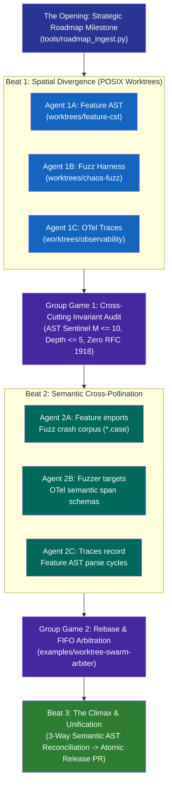

# Pattern: The Harold — Multi-Agent Swarm Orchestration via Long-Form Improv

> **Pattern Class**: Multi-Agent Concurrency & Swarm Topologies  
> **Problem**: Multi-agent swarms editing shared repositories collapse into git index lock contention, SQLite write collisions, thundering-herd rebase live-locks, or fragmented uncoordinated feature silos  
> **Solution**: A long-form improvisational swarm topology coordinating agents across three structured phases: (1) spatial worktree isolation, (2) cross-cutting group invariant sweeps, and (3) 3-way AST semantic reconciliation  
> **Reference Implementation**: [`examples/worktree-swarm-arbiter/worktree_arbiter.py`](../examples/worktree-swarm-arbiter/worktree_arbiter.py), [`examples/ast-semantic-reconciler/ast_reconciler.py`](../examples/ast-semantic-reconciler/ast_reconciler.py), [`examples/ast-crdt-collaborative-editor/ast_crdt.py`](../examples/ast-crdt-collaborative-editor/ast_crdt.py)

---

## 1. Problem Statement

When multiple autonomous agents operate concurrently on a single repository without coordination, execution degrades into severe spatial and temporal contention:
1. **Workspace & Lock Contention**: Concurrent agents sharing a single working tree trigger `.git/index.lock` contention, clobber uncommitted diffs, and corrupt SQLite cache databases ([Observation 06](../observations/systems/06-multi-agent-concurrency-shared-workspace-hazards-and-swarm-coordination.md)).
2. **Thundering Herd Rebase Live-Locks**: When multiple agents race to merge pull requests, every accepted PR invalidates all competing branches, forcing continuous rebases that burn compute without progressing.
3. **Thematic Fragmentation**: Completely decoupled agents operate in total isolation, generating incompatible abstractions, duplicate utilities (`utils2.py`), and divergent API contracts.

---

## 2. Core Mechanics

Inspired by Del Close's theatrical Harold structure, swarm execution is coordinated as a multi-threaded improvisational narrative:



### The Three Harold Swarm Beats:

### 1. Beat 1: Spatial Divergence via POSIX Worktrees
* The central orchestrator ingests a roadmap milestone and partitions deliverables into orthogonal streams.
* Each agent is allocated an isolated POSIX git worktree (`git worktree add ../worktrees/<name> -b feat/<name>`).
* Each worktree binds a private data tier (`.data/agent/<agent-id>`), eliminating SQLite locking contention and file unlinking races.

### 2. Group Game 1: Cross-Cutting Invariant Sweep
* Before agents proceed to integration, the harness halts individual synthesis and executes a unified invariant sweep:
  - AST Invariant Sentinel: Verifying all new functions maintain $M \le 10$ and depth $\le 5$.
  - Zero-Trust Sanitization: Enforcing zero RFC 1918 IP addresses or internal hostnames.
  - Test Coverage Floor: Verifying all branches clear the $\ge 90.0\%$ coverage threshold.

### 3. Beat 2: Semantic Cross-Pollination
* Rather than staying permanently isolated, agents exchange typed, verified outputs:
  - The feature agent imports the fuzzing harness's generated regression fixtures (`*.case`).
  - The fuzzing agent targets the OpenTelemetry telemetry attributes.
  - The telemetry agent instruments cycle counts across the feature parser.

### 4. Beat 3: The Climax via 3-Way AST Reconciliation
* Merging is not performed via naive text line matching (which causes syntax breakage).
* The arbiter performs **3-Way Semantic AST Reconciliation** ([Observation 35](../observations/systems/35-3-way-ast-semantic-reconciliation-and-worktree-collision-arbitration.md)), resolving node collisions at the AST statement and symbol level, producing a unified, mathematically validated release diff.

---

## 3. Implementation Blueprint

### Step 1: Worktree Fleet Allocation (`examples/worktree-swarm-arbiter/worktree_arbiter.py`)

```python
import subprocess
from pathlib import Path

def allocate_worktree(repo_root: Path, branch_name: str, agent_id: str) -> Path:
    """Allocate an isolated spatial git worktree with dedicated data tier."""
    worktree_path = repo_root.parent / "worktrees" / f"swarm-{agent_id}"
    subprocess.run(
        ["git", "worktree", "add", str(worktree_path), "-b", branch_name],
        check=True,
        cwd=repo_root,
    )
    # Isolate data directory to prevent SQLite lock races
    agent_data_dir = worktree_path / ".data" / "agent" / agent_id
    agent_data_dir.mkdir(parents=True, exist_ok=True)
    return worktree_path
```

### Step 2: 3-Way Semantic AST Collision Resolution (`examples/ast-semantic-reconciler/ast_reconciler.py`)

```python
import ast

def reconcile_ast_symbols(base_tree: ast.AST, branch_a: ast.AST, branch_b: ast.AST) -> ast.AST:
    """Reconcile independent symbol additions without text merge conflicts."""
    # When branch_a adds function A() and branch_b adds function B(),
    # AST reconciliation merges them cleanly at the module body level:
    symbols_a = {n.name: n for n in branch_a.body if isinstance(n, ast.FunctionDef)}
    symbols_b = {n.name: n for n in branch_b.body if isinstance(n, ast.FunctionDef)}

    merged_body = list(base_tree.body)
    for name, node in symbols_a.items():
        if name not in {n.name for n in merged_body if isinstance(n, ast.FunctionDef)}:
            merged_body.append(node)
    for name, node in symbols_b.items():
        if name not in {n.name for n in merged_body if isinstance(n, ast.FunctionDef)}:
            merged_body.append(node)

    base_tree.body = merged_body
    return base_tree
```

---

## 4. Guardrails & Anti-Patterns

| Anti-Pattern | Swarm Failure Mode | Theatrical Analogy | Corrective Action |
|---|---|---|---|
| **Shared Index Clobbering** | Multiple agents editing in `.` | Actors shouting over each other in one microphone | Allocate isolated POSIX git worktrees (`worktree add`). |
| **Thundering Herd Rebasing** | Agents racing to push to `main` | Actors pushing each other off stage | Enforce FIFO PR shepherding with atomic rebase queues. |
| **Context Leaks Across Agents** | Dumping raw agent logs to peers | An actor telling another actor's backstory unprompted | Pass minimal, typed epistemic seams with AST symbol anchors. |
| **Text-Based Merge Breakage** | `git merge` resolving mid-AST | Two actors finishing each other's sentences incorrectly | Execute 3-way AST semantic reconciliation before commit. |

---

## 5. Cross-References

- [Observation 06 (Systems): Multi-Agent Concurrency, Shared Workspace Hazards & Swarm Coordination](../observations/systems/06-multi-agent-concurrency-shared-workspace-hazards-and-swarm-coordination.md)
- [Observation 35 (Systems): 3-Way AST Semantic Reconciliation & Worktree Collision Arbitration](../observations/systems/35-3-way-ast-semantic-reconciliation-and-worktree-collision-arbitration.md)
- [Observation 37 (Systems): Real-Time AST CRDTs and Concurrent Multi-Agent Swarms](../observations/systems/37-real-time-ast-crdts-and-concurrent-multi-agent-swarms.md)
- [Observation 48 (Systems): The Improv Axiom, Counterexample Acceptance & Generative Headroom Elevation](../observations/systems/48-the-improv-axiom-and-generative-headroom-elevation.md)
- [Pattern: Collision-Free Worktree Fleet Allocation](./collision-free-worktree-fleet-allocation.md)
- [Pattern: 3-Way AST Semantic Reconciliation](./3-way-ast-semantic-reconciliation.md)
- [Pattern: FIFO Pull Request Shepherding](./fifo-pull-request-shepherding.md)
